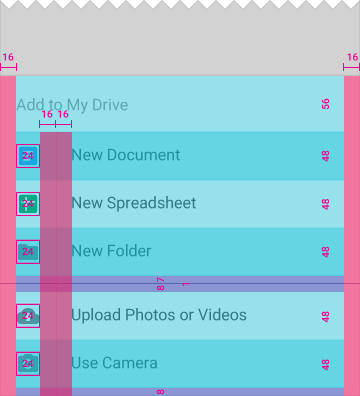
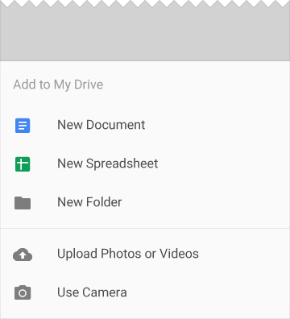
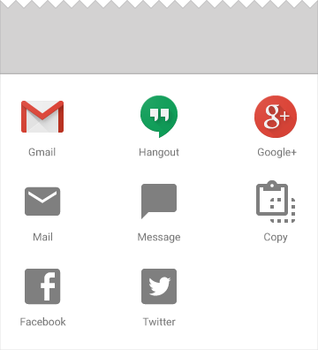

# 底部窗口

底部窗口（bottom sheets）是一个从屏幕底部边缘向上滑出的一个对话框，使用这种方式向用户呈现一组功能。底部窗口呈现了简单、清晰、无需额外解释的一组操作。

#使用#

底部窗口（bottom sheets）特别适合有三个或者三个以上的功能需要展示给用户选，并且不需要对动作有额外解释的情景。如果只有两个或者更少的功能，或者需要详加描述的，可以考虑使用菜单（menu）或者对话框替代。

底部窗口（bottom sheets）可以是列表样式的也可以是表格样式的。表格布局可以增加视觉的清晰度。

你可以使用底部窗口（bottom sheets）展示和其他app相关的功能，比如做为进入其他app的入口（通过app的icon进入）。

#内容#

在一个标准的列表样式的底部窗口（bottom sheets）中,每一个功能应该有一个文本描述和一个左对齐的icon。如果需要的话，也可以使用分隔符对这些功能进行逻辑分组，也可以使用子标题或者标题供上下选择。

一个可以滚动的表格样式的底部窗口，可以用来包含标准的分享功能。

#行为#

显示底部窗口的时候应该是从屏幕底部边缘向上的动画。根据之前的内容会给用户一个继续走下去的模式。点击灰色区域会使得底部窗口关闭掉，并且伴随下滑的动画。如果这个窗口包含的功能超出了初始的显示区域，这个窗口应该可以滑动。可以向上滑动窗口，甚至窗口可以覆盖整个屏幕。当窗口覆盖整个屏幕的时候，需要在上部的标题栏左手测增加一个关闭按钮。

#规格#

下面的字体和颜色规格，区域规格都是提供给手机app使用的。

（上图）列表样式的底部窗口规格设计

（上图）带头部的列表样式的底部窗口规格设计

（上图）表格样式的包含标准的跳转到其他程序功能的底部窗口规格设计
