#卡片
卡片是包含一组特定数据集的纸片，数据集含有各种相关信息，例如，关于单一主题的照片，文本，和链接。卡片通常是通往更详细复杂信息的入口。卡片有固定的宽度和可变的高度。最大高度限制于可适应平台上单一视图的内容，但如果需要它可以临时扩展（例如，显示评论栏）。卡片不会翻转以展示其背后的信息。
***
##用途
卡片是用来显示由不同种类对象组成的内容的便捷途径。它们也适用于展示尺寸或操作相当不同的相似对象，像带有不同长度标题的照片。

**注意:**即使外观相近，Now卡片是卡片的一个带有唯一表现和格式要求的独特子集。

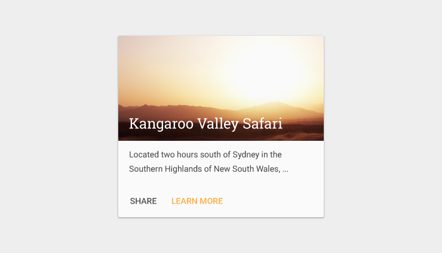

**卡片集**是**卡片**的一个平面布局。

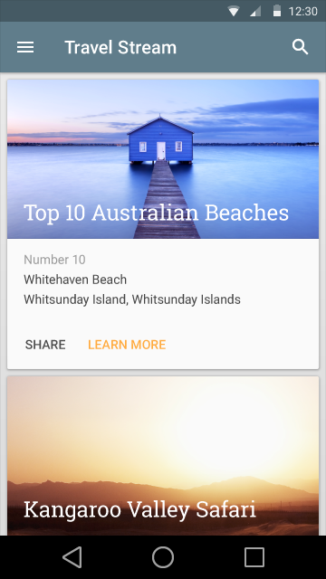

这些卡片每张包含一组特定数据集：带操作的确认表，带操作的笔记，带照片的笔记。

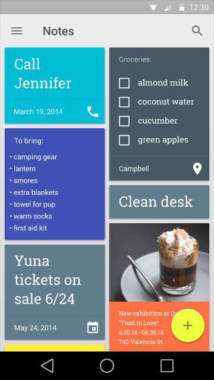

显示这些内容时使用卡片布局：

*作为一个集合，由多种数据类型组成（例如，卡片集包含照片，电影，文本，图像）
*不要求直接比较（用户不直接与图像或字符串比较）
*包含可变长度内容，例如评论
*由富内容或互动操作组成，例如+1按钮，滑块，或评论
*如果使用列表需要显示超过三行文本
*如果使用网格列表需要显示更多文本来补充图像

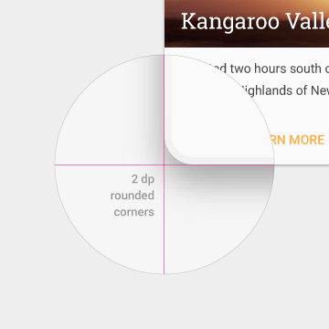
**正确。**
1. 卡片带圆角。
2. 卡片带多种操作。
3. 卡片可以忽略和重排。

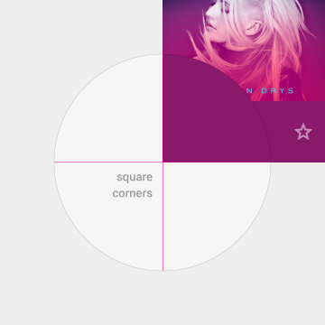
**错误。**
这是瓷砖，不是卡片。
1. 瓷砖带直角。
2. 瓷砖少于两种操作。

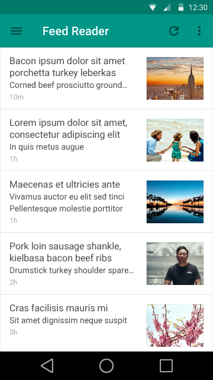
**正确。**
可快速扫描的列表，用来代替卡片，是表现没有许多操作的同类内容的合适方法。

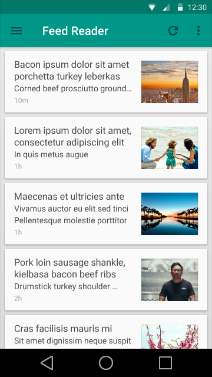
**错误。**
这里卡片的使用分散了用户注意力，不能快速扫描。这些列表项也不能忽略，所以把它们放在不同的卡片上是难以理解的。

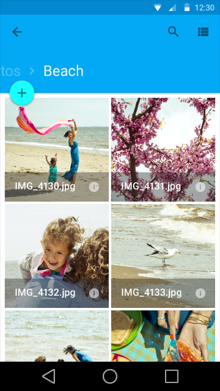
**正确。**
网格瓷砖是表现图片库的干净轻量的方法。

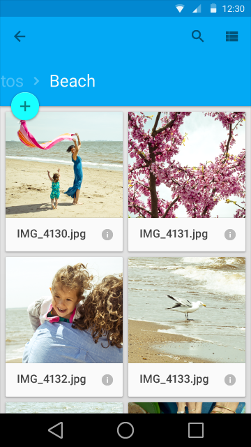
**错误。**
卡片在图片库中没有必要（同类内容）。

###卡片布局准则

####字体设计
正文：14 sp 或 16 sp
标题：24 sp 或更大
扁平按钮：Roboto Medium, 14 sp, 10 sp 字间距
####移动设备上的卡片间距
屏幕边界与卡片间留白：8 dp
卡片间留白：8 dp
####内容留白
16 dp

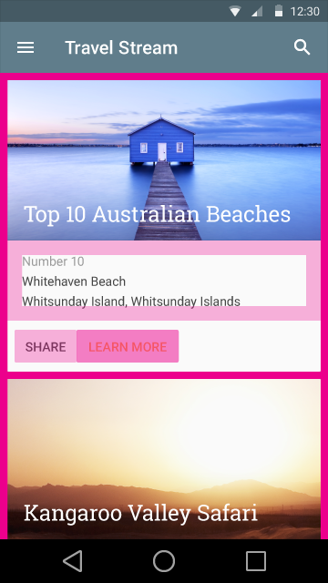

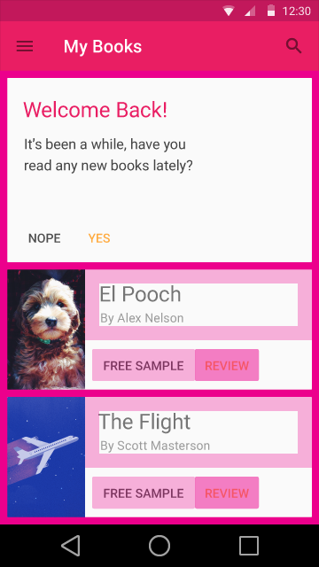

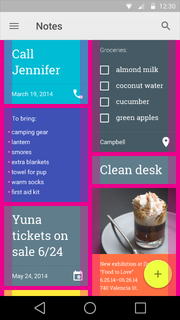

***
##内容
卡片内容类型和数量可以很大程度上根据传递的内容变化。卡片提供上下文及通往更复杂信息与视图的入口；确保不要滥用带有无用信息或操作的卡片。

放置主要内容在卡片顶部。使用层级结构来引导用户注意到卡片上最重要的信息。

***
##操作
卡片中的主要操作通常是卡片本身。

追加操作可以在一组卡片间根据内容类型和期望结果变化，例如，播放电影和打开书籍。一组卡片中，始终有定位操作。
####追加操作
卡片的追加操作通过图标，文本，和UI控制准确地呼出，这些通常放置在卡片底部。

放置在主要内容中的行内UI控制可以调整主要内容的外观，例如，滑块来选择日期，星星来给内容评分，或者分段的按钮来选择日期范围。

除弹出菜单外，限制追加操作在两项。
####弹出菜单
弹出菜单（可选）通常放置在卡片的右上角，但它也可以放置在右下方，如果这样安排改善内容布局和易读性。

注意不要滥用带过多操作的弹出菜单。
####注意事项
强烈不推荐文本内容的行内链接。

尽管卡片可以提供多种操作，UI控制，和弹出菜单，谨慎使用并且记得卡片是通往更复杂详细信息的入口。

***
##表现
####手势
支持单张卡片基准上的滑动手势。卡片手势表现应该始终在卡片组中实现。

按住并拖动手势可行。然而，考虑对用户能够在集合中排序卡片是否重要，或者如果按要求筛选/排序内容可以提供更好的体验。
####卡片集筛选，排序，和重组
卡片集可以按要求排序或按日期，文件大小，字母表顺序，或其他参数筛选。集合中的第一项定位于集合的左上角，其余的从左至右从上至下延续。
####滚动
卡片集只会竖直滚动。超过最大卡片高度的卡片内容将被截断且不可滚动。

带截断内容的卡片可以扩展，这样卡片高度可以超过视图的最大值。这种情况下，卡片将与卡片集一起滚动。
####卡片焦点
对于取决于连续焦点遍历用于导航的界面（方向键，键盘），单张卡片应该仅有基本操作或打开一个带基本和可用追加操作的新视图。
