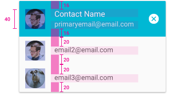
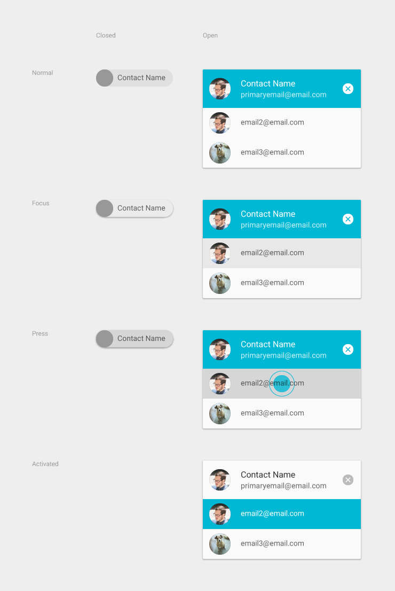

#纸片(Chips)

Chips(我们暂时叫他纸片视图)是一种小块的用来呈现复杂实体的块，比如说日历的事件和联系人。它可以包含一张图片，一个短字符串（必要时可能被截取的字符串），或者是其它的一些与实体对象有关的简洁的信息。Chips可以非常方便的通过托拽来操作。通过按压动作可以触发悬浮卡片（或者是全屏视图）中的Chip对应实体的视图，或者是弹出与Chip实体相关的操作菜单。

##联系人纸片

联系人的纸片视图用于呈现联系人的信息。当用户在输入框（收件人一栏）中输入一个联系人的名字时，联系人纸片视图就会被触发，用于展示联系人的地址以供用户进行选择。而且联系人的纸片可以被直接添加到收件人一栏中去。

联系人的纸片视图主要用于帮助用户高效的选择正确的收件人。

**关闭状态的联系人纸片视图**

*  联系人名字使用的字体为：Toboto，常规，14ap

*  当点击关闭状态下的联系人纸片视图，它就会展开并且显示出联系人的地址

**打开状态的联系人纸片视图**

* 默认状态下，最顶的联系方式被激活并选中

* 联系人名字的字体为：Toboto，常规，16ap

* 地址文本的字体为： Toboto，常规，14ap

* 当用户选择后，纸片视图被关闭

