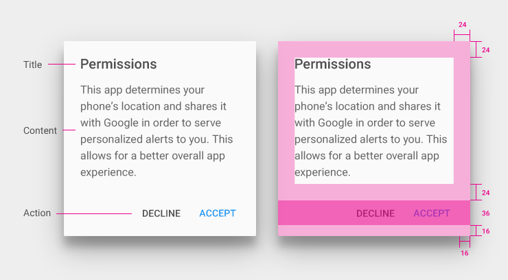

# 提示框(Dialogs)

Dialogs(提示框)用于提示用户作一些决定，或者是完成某个任务时需要的一些其它额外的信息。 Dialog可以是用一种 取消/确定 的简单应答模式，也可以是自定义布局的复杂模式，比如说一些文本设置或者是文本输入 。

##用途

Dialog最典型的应用场景是提示用户去做一个些被安排好的决定 ，而这些决定可能是当前任务的一部分或者是前至条件。 Dialog可以用于告知用户具体的问题以便他们作用重要的决定（话外音：起到一个确认作用），或者是用于解释
接下来的动作的重要性及后果 。（话外音kri：起到一个警示作用）。

一些复杂的操作，尤其是每个决策都需要相关解释说明的情况下是不适合使用Dialog形式的。

    

Dialog包含了一个标题（可选），内容 ，事件。

**标题**：主要是用于简单描述下选择类型。它是可选的，要需要的时候赋值恳即可。

**内容**：主要是描述要作出一个什么样的决定 。

**事件**：主要是用于开始用户所作的决策。

    

###按钮的宽度及边框示例

    

    

    

###加宽型竖排按钮（Stacked full-width buttons）

当按钮的文本超过了通常的按钮宽度时，你就可以使用这种竖向叠加加宽型模式来呈现我们的按钮文字信息。

    

###并排按钮（Side-by-side buttons）
在每个按钮的文本信息都没有超过通常的按钮宽度时，推荐使用并排模式。比如说最常用的 确定/取消 按钮 

    

    

##内容

###提示框标题
提示框的标题是可选的，用于说明提示的类型。可以是与之相关的程序名，或者是选择后会影响到的内容 。例如：设置

提示框标题是作为提示框的一部分被显示出来的。

###提示框内容

提示框的内容是变化多样的。但是通常情况下由文本 和(或) 其它UI元素组成的，并且主要是用于聚焦于某个任务或者是某个步骤。比如说"确认"、"删除"或选择某个选项。

    
    

##事件
###提示框事件

提示框呈现的是一组聚焦和限定的事件，通常是一个肯定的事件和否定（与肯定的事件对立）的事件组成。

肯定的事件是放于提示框的右边并且可以继续接下来的步骤。肯定的事件可以是据有破坏性的，比如:"删除"，"移除"。（Kris语：肯定的事件主要是指产品期望用户的一个决策。与按钮文字呈现的语意无关）

否定的事件是放于提示框的左边。用于返回用户原始的屏幕或者是步骤。（Kris语：一般就是关闭提示框作用）

事件的按钮排列类型可以是并列的，也可以是竖向叠加加宽型的。这取决于事件按钮里面的文字长短。

肯定事件和否定事件除了可以使用"确认"/"取消"外，也可以是其它一些动词或者是动词短语来表明决策后的结果。
    

##表现(Behavior)

###滚动

提示框是与父视图是分隔开的。不会随着父视图滚动。

如果可以，请尽量保持提示框里面的内容不需要滚动 。如果滚动的内容太多了，那么可以考虑使用其它的容器或者是呈现方式。然而，如果内容是滚动的，那么请使用较明显的方式来提示用户。比如说被让文字或者是控件露一截出来。
    

###手势

触摸提示框外面的区域可以关闭提示框 

###提示框焦点
 
 提示框的焦点是整个屏幕。提示框在关闭前或者是用户选择了一个事件（比如说选择了一个选项）前都会持有焦点。
