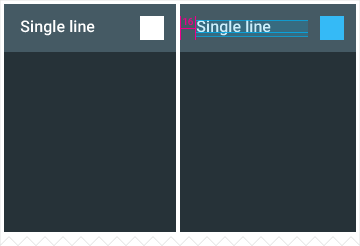
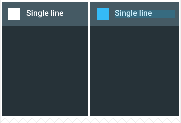
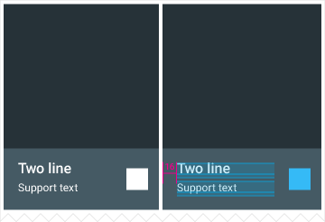

# 网格 #

网格列表是一种标准列表视图的可选组件。网格列表与应用于布局和其他可视视图中的网格有着明显的区别。

## 用法 ##

网格列表最适合用于同类数据（homogeneous data type），典型的如图片，并且对可视化理解（visual comprehension ）和相似数据类型的区别进行了优化。

  

网格列表是一个连续元素（continuous element），该元素由棋盘式、规律性的小格子构成，通常称这些格子为单元格（cells）,单元格中包含有瓦片（tiles）。

单元格在网格中以垂直和水平的方式排列。

瓦片用以存放内容，并且可以跨越一个或者多个垂直或者水平的单元格。

  

  

如果瓦片中的文本需要与其他主要内容有着足够显著的区别，可以考虑使用一个容器，比如列表（Lists）或者卡片（Cards）。这样可以优化文本显示、增强阅读理解的便利性。

Lists：增强阅读理解的便利性，尤其是在比较一组具有多种数据类型的数据时。

Cards：用于不同格式的内容，比如带有不同长度标题的图片;用于不同类内容的数据集合中，比如具有图片、视频和图书的混合式数据集。

## 内容 ##

### 瓦片中的内容 ###

瓦片内容包括主要内容（primary content）和次要内容(secondary content)。主要内容是有着重要区别的内容，典型的如图片。次要内容可以是一个动作按钮或者文本。

为瓦片内容提供一个默认图片。

  

### 瓦片中的动作 ###

主要内容和次要内容中的动作--比如播放、放大、删除或者选择--是一种瞬时性动作，通常不会在网格列表中弹出选项子菜单（动作溢出列表，action voerflow）。

动作可以打开一个随后的视图，比如卡片或者悬浮卡片（hovercard）。

**主要动作**

- 充满整个瓦片，因此不会通过图标或者文本呈现。
- 在指定的网格中，所有瓦片的动作是一致的。比如，在单个网格中，对于所有瓦片的主要动作可以用于查看图片的详细信息。

**次要动作或者内容**

- 通过图标或者文本呈现出来。
- 在指定的网格中，所有瓦片的动作是一致的。
- 在指定网格的瓦片中放置的位置是一致的，但是位置可能会在不同的网格（边角或者边界， corners or edges）间有变化。比如，所有网格中的标题可以放置在左下角。

  

## 行为 ##

### 滚动 ###

网格典型的滚动只有垂直滚动。

水平滚动的网格是不鼓励使用的，这通常与用户的阅读习惯有关，影响阅读上的理解。

砍去网格瓦片来通知内容未结束。

    
要  
（图片用来）说明砍去网格瓦片提示内容未结束   

  
不要   

### 手势 ###

不允许使用轻扫(swipe)手势。选中并移动(pick-up-and-move)动作不鼓励使用。

### 瓦片过滤与排序 ###

网格列表中的内容可以编程实现其过滤和排序，比如通过数据类型、文件大小、字母顺序或者其他参数等。

网格中的第一个条目置于网格的左上角，并且其顺序为从左到右，自上而下。

### 维度与重置尺寸 ###

重置网格列表的尺寸会导致瓦片在有水平空间可用时重新排序。但是瓦片并不会缩放以填充可用的水平空间。

当水平空间受限时，网格列表不会转换为列表。网格列表与列表在强调不同数据类型的不同结构：图片优于文本与文本优于图片的区别。   

## 边框 ##

### 网格列表表头/表尾（header/footers）###

**单行表头/表尾**

高： 48dp

文本内边距： 16dp

默认字体大小： 16sp

次要动作与尾右对齐

**两行表头/表尾**

高： 68dp

文本内边距： 16dp

每行的默认字体大小： 16sp/12sp或者14sp/14sp

  

  

### 仅有图片的网格列表 ###

网格内边距： 4dp

网格列表中的瓦片可以跨多列。

仔细考虑网格列表中的次要文本是否需要使用多列瓦片，因为大的瓦片可能会造成很大的空间浪费。

  
元素    

  
  

### 单行网格列表 ###

**仅有文本**

高: 48dp

文本内边距： 16dp

默认字体大小： 16sp

网格内边距： 4dp

  

  
元素   

  

**带图标的文本**

高： 48dp

文本内边距： 16dp

默认字体大小： 16sp

网格内边距： 4dp

网格列表表尾或者表头的中的次要文本可以右对齐或左对齐。

  

   
元素    

  

  

  

### 两行网格列表 ###

**仅有文本**

高： 68dp

文本内边距： 16dp

每行的默认字体大小： 16sp/12sp或14sp/14sp

网格内边距： 4dp

  

  
元素    

    
内容     

**带有图标的文本**

高： 68dp

文本内边距： 16dp

每行的默认字体大小： 16sp/12sp或14sp/14sp

网格列表表尾或者表头中的次要文本可以右对齐或左对齐。

网格内边距是4dp

  

     
元素     

    

   

   
内容   

原文:[Grids](https://www.google.com/design/spec/components/grids.html#grids-grids-keylines) 翻译: [CodeDiving](https://github.com/codediving) 校对: [huanglizhuo](https://github.com/huanglizhuo)