## 用法 ##
列表控制被归类为下面四种:

* 状态
* 主操作(包括文本字符)
* 次要操作
* 次要信息

分辨列表标题的元素，我们首先关注的是阅读顺序，所以，**状态**和**主动作**放在标题列表的左边。列表里面的文本内容在这里也被认为是主要操作的一部分。
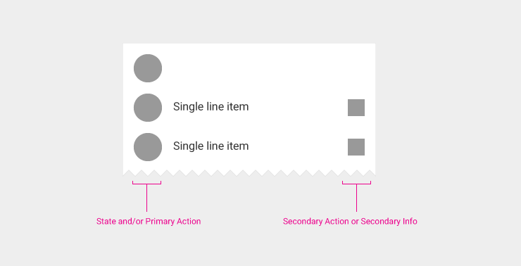

不要把两个展示图标和操作图标放在一起，比如**复选框**和**头像**

如果列表的主动作是做引导作用的，那么就不用**icon**。列表它本身以及它的上下文就已经可以让用户明白这个列表的用处是什么。

次要擦做以及信息应该放在标题的右边，次要动作通常都是和主要操作分开的，因为越来越多的用户希望每个图标都能触发一个动作。

---

## 列表控制的类型 ##

** 复选框(Checkbox) **

复选框既可以被定义成是主动作也可以是附属动作。

类型: 主动作/状态

分割号（与次要操作分离）

Desktop on hover only

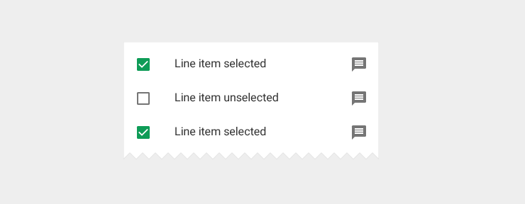
(在这个列表中，复选框是主要操作和状态标志符)

类型: 次要操作

分割号（与主要操作分离）

当控制一系列的变量而不仅仅只是控制一个变量的情况下，考虑使用开关控件来替换。
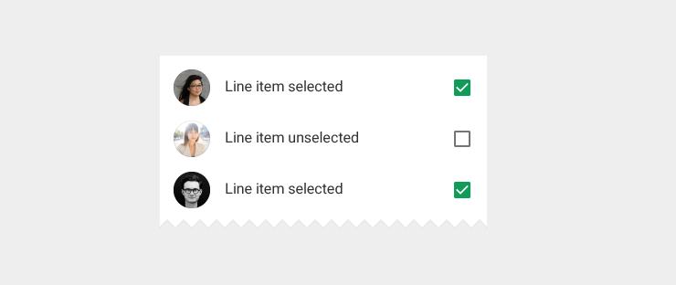
(在这个列表中，复选框是次要操作)

---
** 开关 **
类型: 次要操作

分割号（与主要操作分离）
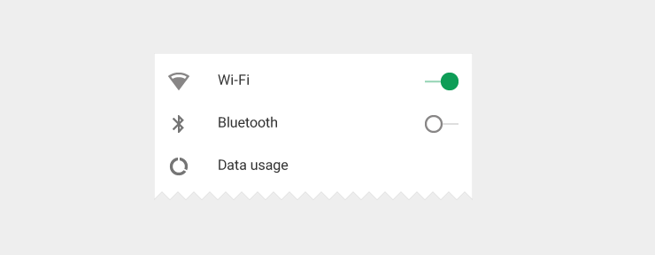

** 重新排序 **
类型:  附属动作

通常它都是独立的，依赖于当前列表所处的模式。

这个动作允许用户把一个列表项拖到列表的其他位置。通常，这个按钮是在编辑的模式下会出现。

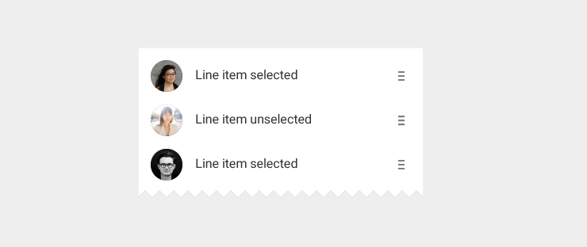

** 展开/折叠 **
类型: 附属动作

垂直展开或者折叠列表来显示或者隐藏当前列表

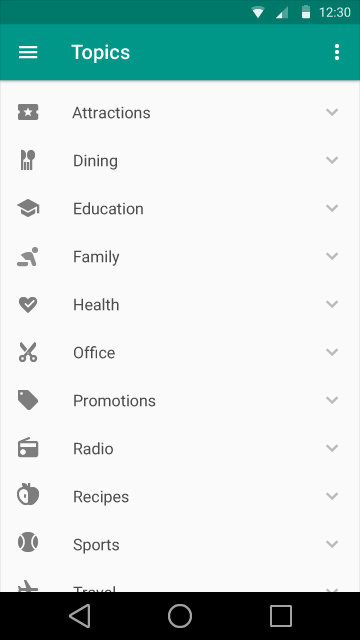
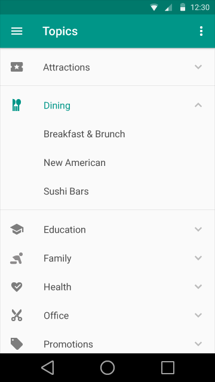
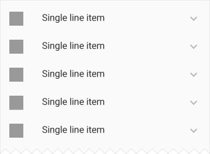
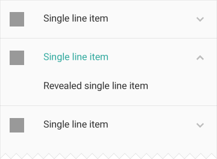

** Leave Behinds **
类型: 其他

Leave-bihind 是在当某一项列表被滑开之后的操作提示。Leave-behind可以被转换成一项操作。

无论从哪个方向滑动列表，都会出现操作图标。滑动了之后，操作图标就会出现列表空白处的中间。

** 不推荐的做法:导航列表控制 **
通常情况下，列表本身的内容就已经隐含了导航信息，因此，列表里面就不需要额外的图标。

** 查看更多 **

类型: 主要操作（连同其他行）

不需要跟其他次要操作分离

点击之后跳转到与当前列表相关详细信息的页面，通常这都是一个新的页面或者面板
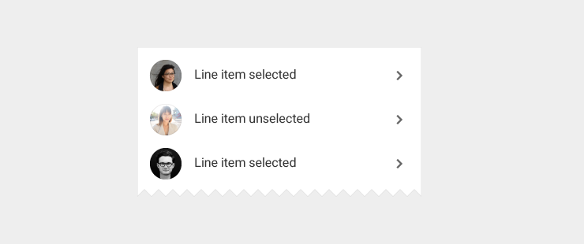

---

## 菜单控制的类型

** 选中 ** 

类型: 状态

不需要跟其他状态分离

仅适用于菜单。用来表示当前列表是否通过不同的操作之后被选中。
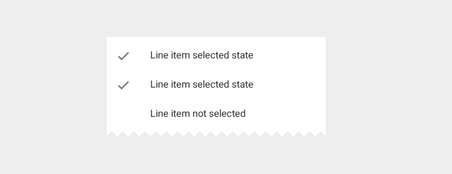

** 内联信息 **
类型: 次要信息

不需要跟其他信息分离

仅适用于菜单。内联信息是列表中一小段文字用来提供当前标题相关的信息或者提示，比如快捷键。它是不能被删除。
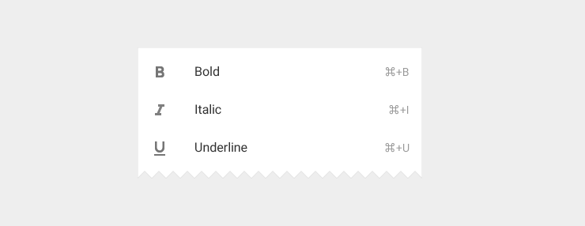

