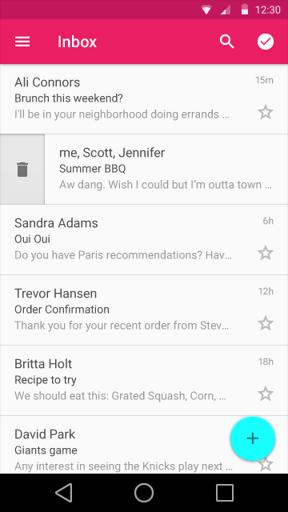
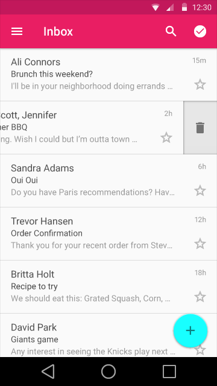
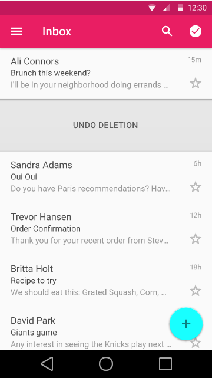

# 列表控制

## 用法 ##
列表控制分为如下四种:

* 状态
* 主操作(包括文本字符串)
* 次要操作
* 次要信息

列表标题的元素要容易分辨，首先要注意阅读顺序，所以，**状态**和**主操作**放在标题列表的左边。在这里，列表里面的文本内容也被认为是主操作的操作目标的一部分。  

      

不要把两个展示图标和操作图标放在一起，比如**复选框**和**头像**

如果列表的主操作是做导航作用的，那么就不要使用**icon**。列表它本身以及它的上下文就已经可以让用户明白这个列表的用处是什么。

次要操作以及信息应该放在标题的右边，次要操作通常要和主要操作分开单独可点击，因为越来越多的用户希望每个图标都能触发一个动作。  

## 列表控制的类型 ##

### 复选框(Checkbox)

复g选框既可以被定义成是主操作也可以是次要操作。

类型: 主动作/状态

单独可点击

Desktop on hover only

      
在这个列表中，复选框是主要操作和状态标志符    

类型: 次要操作

单独可点击

当控制一系列的变量而不仅仅只是控制一个变量的情况下，考虑使用开关控件来替换。   

      
在这个列表中，复选框是次要操作   

### 开关

类型: 次要操作

单独可点击  

     

### 重新排序

类型:  次要动作

通常都是单独可点击，视当前列表所处的模式而定。

该动作允许用户给列表中项通过拖动变换位置。通常，这个按钮出现在列表编辑的模式下。

  

### 展开/折叠

类型: 次要动作

单独可点击

垂直展开或者折叠列表来显示或者隐藏当前列表

     

  

  

  

### Leave Behinds

类型: 其他

Leave-behind 是在当某一项列表被滑开之后的操作提示。Leave-behind可以被转换成一项操作。

无论从哪个方向滑动列表，都会出现操作图标。滑动了之后，操作图标就会居中显示于列表空白处。

    

    

    

### 不推荐的做法:导航列表控制

通常情况下，列表本身的内容就已经隐含了导航信息，因此，列表里面就不需要额外的图标。

### 查看更多

类型: 主要操作（连同行内其他内容）

非单独可点击

点击之后跳转到与当前列表相关详细信息的页面，通常这都是一个新的页面或者面板。  

    

## 菜单控制的类型

### 选中

类型: 状态

非单独可点击

仅适用于菜单。用来表示当前列表是否通过不同的操作之后被选中。  

  

### 内联信息  

类型: 次要信息

非单独可点击

仅适用于菜单。内联信息是列表中一小段文字用来提供当前标题相关的信息或者提示，比如快捷键。不能被删除。  

    

