# 菜单 #

## 用法 ##

菜单是临时的一张纸（paper），由按钮（button）、动作（action）、点（pointer）或者包含至少两个菜单项的其他控件触发。

每一个菜单项是一个离散的选项或者动作，并且能够影响到应用、视图或者视图中选中的按钮。

菜单不应该用作应用中主要的导航方法。

  

  

触发按钮或者控件的标签（label）可以简明准确的反映出菜单中包含的菜单项。菜单栏通常使用一个单词作为标签，像“文件”，“格式”，“编辑”和“视图”，然后其他内容或许有更冗长的标签。

菜单显示一组一致的菜单项，每个菜单项可以基于应用的当前状态来使能。

  

上下文菜单（Contextual menus）能够基于应用的当前状态动态的改变菜单项的可用性和让菜单项使能。

通常，移除与当前上下文不相干的菜单项，禁用那些需要满足特定条件才能使用的相关的菜单项（比如，当文本选中后“复制”变得可用）。

特定的应用状态可能使得上下文菜单只包含一个菜单项。比如，当在网页上高亮文本时，Android只显示“复制”，所以用户不能使用“剪切”和“粘贴”文本。

  

菜单依赖于它们距屏幕边的距离垂直和水平的调整位置。

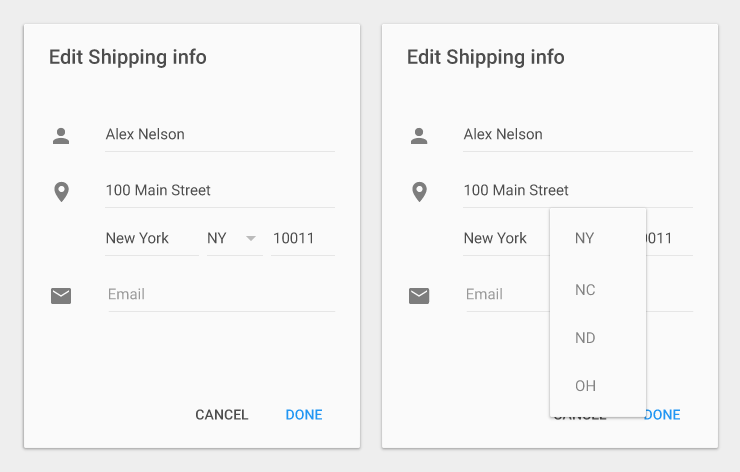  

如果菜单的高度使得菜单项不能完全显示，那么菜单会支持内部滚动。一个典型的例子是在手机横屏状态下查看菜单。

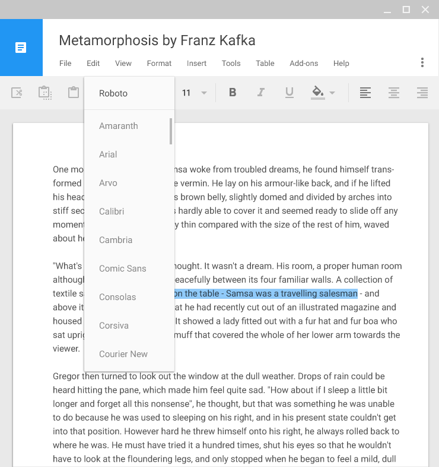  

菜单可以是级联的。

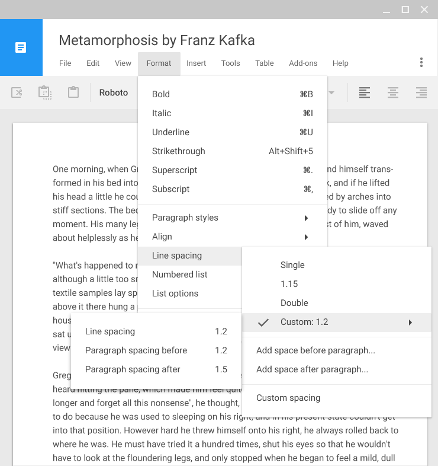  

下面这些动画演示了菜单的滚动和级联。

<video width="720" height="270" src="http://materialdesign.qiniudn.com/videos/components-menus-menus-textfield_toolbar_large_xhdpi.webm" controls="controls"></video>  
下拉

<video width="720" height="270" src="http://materialdesign.qiniudn.com/videos/components-menus-menus-textfield_dropdown_spec_large_xhdpi.webm" controls="controls"></video>  
文本框下拉

<video width="720" height="270" src="http://materialdesign.qiniudn.com/videos/components-menus-menus-appbar_dropdown2_spec_large_xhdpi.webm" controls="controls"></video>  
应用工具条下拉

<video width="720" height="270" src="http://materialdesign.qiniudn.com/videos/components-menus-menus-cascading_dropdown_spec_large_xhdpi.webm" controls="controls"></video>  
级联下拉

## 菜单项 ##

每一个菜单项限制为单行文本，并且能够说明在菜单项项选中时所发生的动作。

菜单项的文本一般是单个单词或者短语，但是也可能包含了图标和帮助文本，比如快捷方式，同时也可包含像复选标记之类的控件来标识多选条目或状态。可以参考[列表控件](list-controls.html)。

带有静态文本的菜单应当在菜单的上部放置最常使用的菜单项。

带有动态文本的菜单可能具有其它行为，比如在菜单上部放置预先使用的字体。顺序可以根据用户的动作而改变。

菜单项可以内嵌自己的子菜单。尝试着将菜单层级限制在一级，因为导航多级内嵌子菜单是困难的。

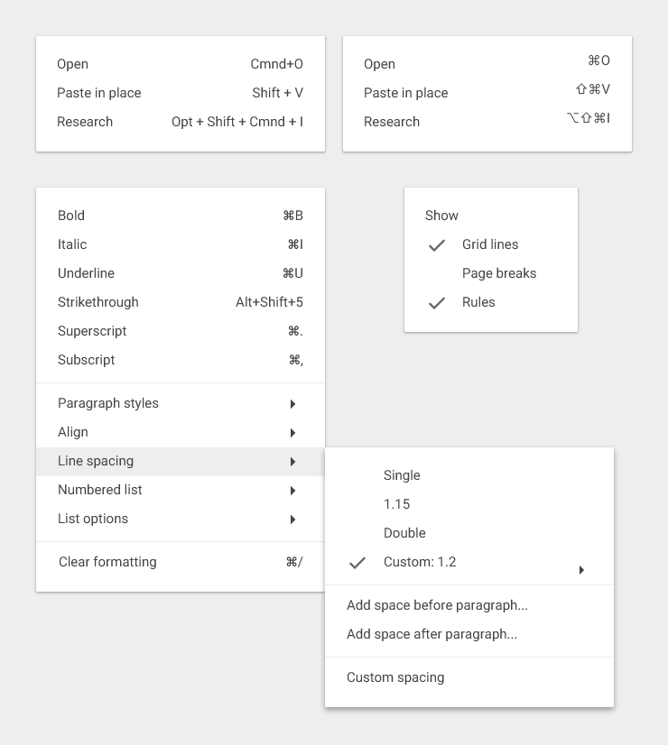  

将动作菜单项显示为禁用状态，而不是移除它们，这样可以让用户知道在正确条件下它们是存在的。

比如，当没有重做任务时禁用重做（Redo）动作。当内容被选中后，剪切（Cut）和复制（Copy）动作可用。

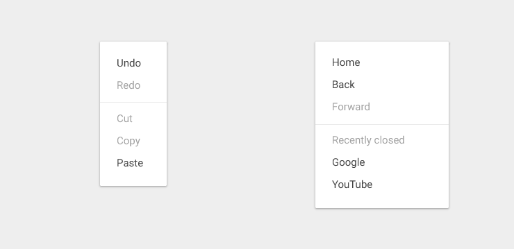  

## 行为 ##

菜单出现在所有的应用内部的UI元素之上。

通过点击菜单以外的部分可以让菜单消失，或者点击触发按钮（如果按钮可见）。

通常，选中一个菜单项后也会让菜单消失。一个特例是当菜单允许多选时，比如使用复选标记。

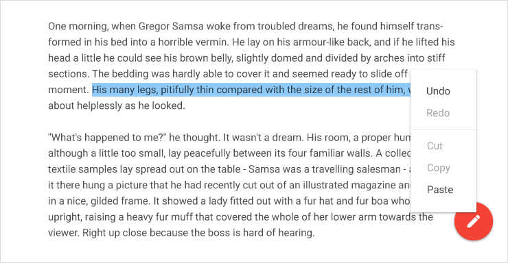  

菜单显示在触发它的元素处，比如当前选中的菜单项现在在触发元素的顶部。

不要显示选中的菜单项的副本。

    
要（Do）

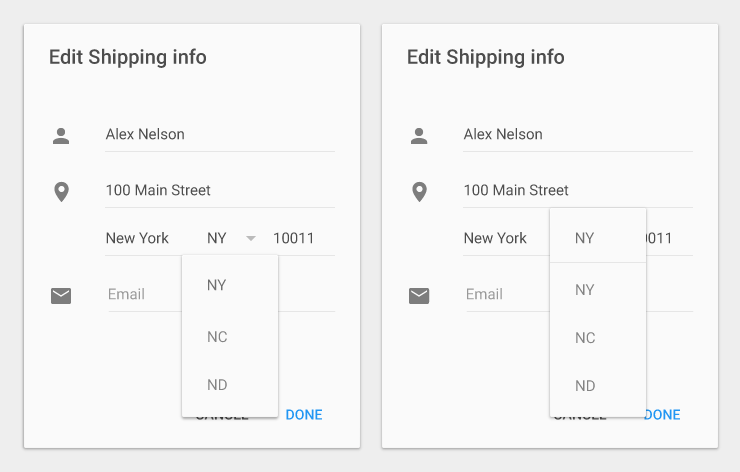    
不要（Don't)

菜单不要与触摸的位置水平对齐。

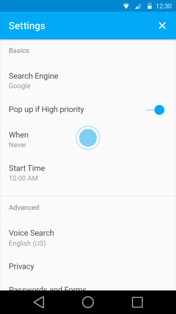    
要（Do）

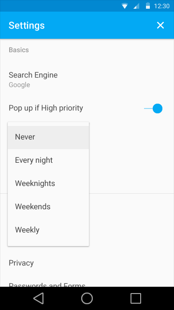    
要（Do）

    
不要（Don't)

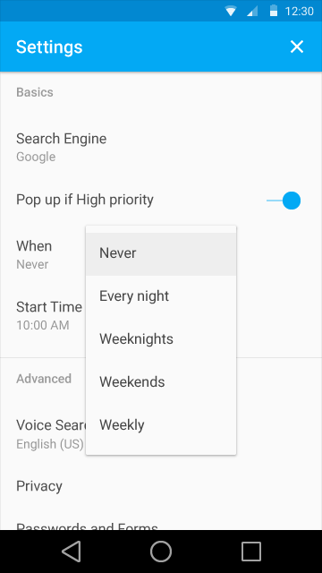    
不要（Don't)

## 度量 ##

度量提供了多样的尺寸和类型菜单以及不同的平台。

### 移动设备 ###

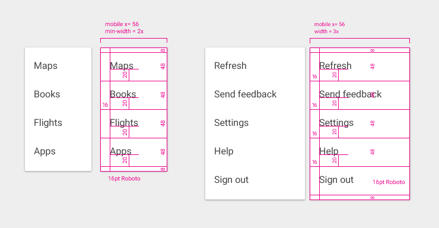  

### 不同的宽度 ###

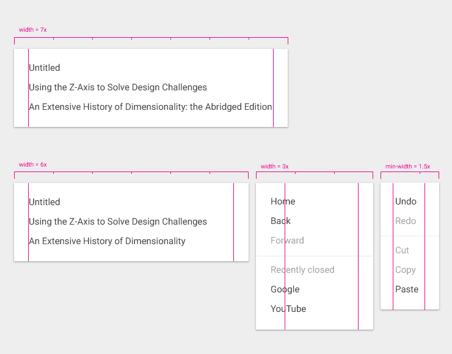  

### 级联菜单 ###

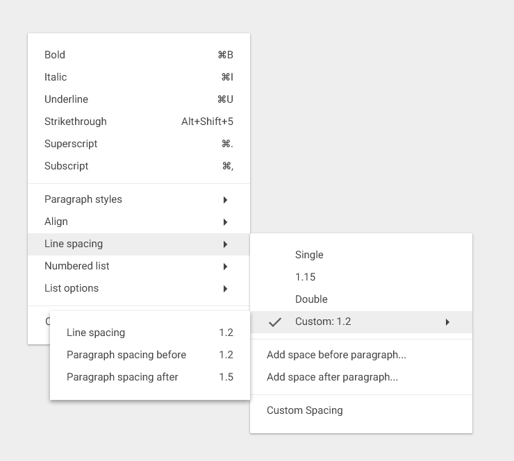  

### 级联红线（Cascading redlines） ###

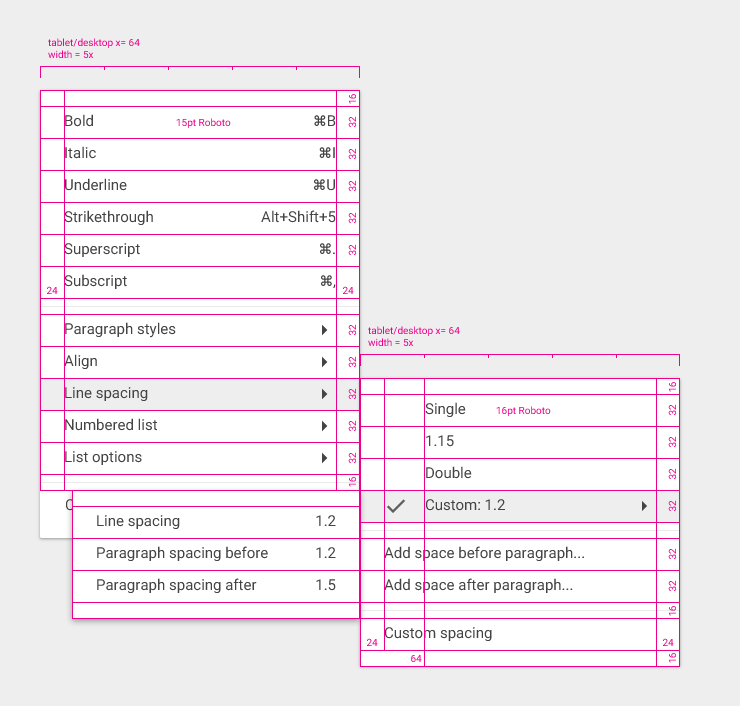  