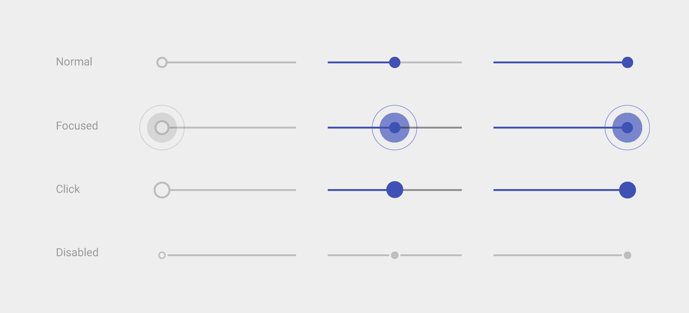

## 滑片(Sliders)

滑片(Sliders)可以让我们通过在连续或间断的区间内滑动锚点来选择一个合适的数值。区间最小值放在左边，对应的，最大值放在右边。滑片(Sliders)可以在滑动条的左右两端设定图标来反映数值的强度。这种交互特性使得它在设置诸如音量、亮度、色彩饱和度等需要反映强度等级的选项时成为一种极好的选择。

> **接下来的内容**
> 无缝滑片(Continuous Slider)
> 离散滑片(Discrete Slider)

###无缝滑片(Continuous Slider)

在不要求精准、以主观感觉为主的设置中使用无缝滑片，这样可以使得使用者做出更加符合主观感觉的调整。

  
Light Theme
