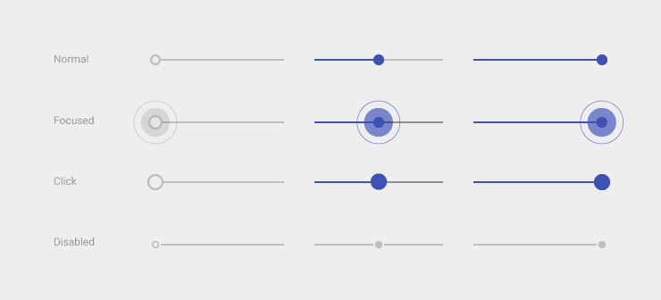
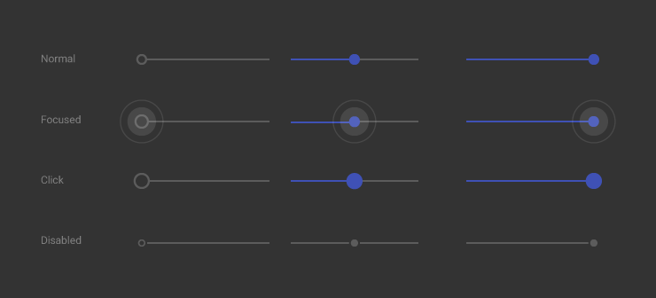
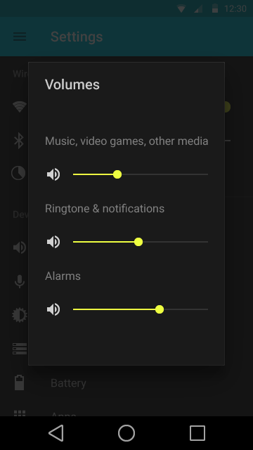
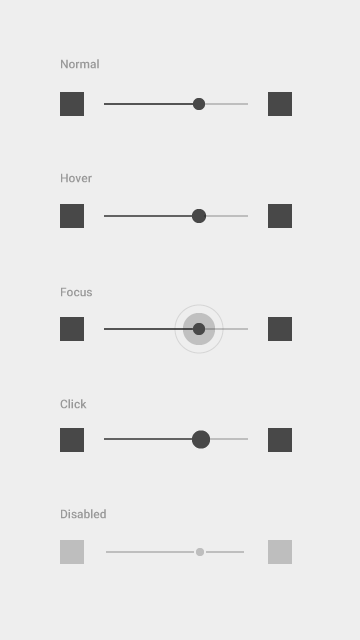
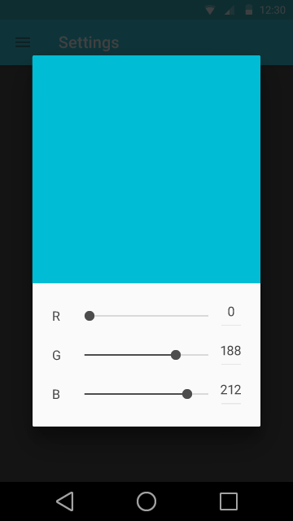
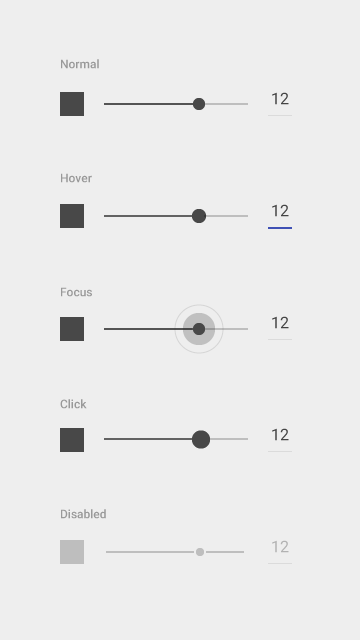
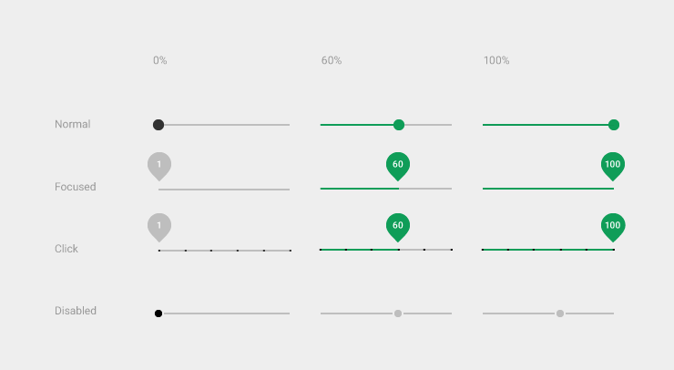
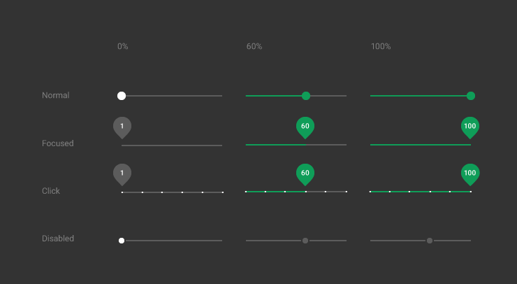

# 滑片控件(Sliders)

滑片控件(Sliders，简称滑片)可以让我们通过在连续或间断的区间内滑动锚点来选择一个合适的数值。区间最小值放在左边，对应的，最大值放在右边。滑片(Sliders)可以在滑动条的左右两端设定图标来反映数值的强度。这种交互特性使得它在设置诸如音量、亮度、色彩饱和度等需要反映强度等级的选项时成为一种极好的选择。

> **接下来的内容**  
> 无缝滑片(Continuous Slider)  
> 间续滑片(Discrete Slider)

### 无缝滑片(Continuous Slider)

在不要求精准、以主观感觉为主的设置中使用无缝滑片，让使用者做出更有意义的调整。

  
亮色主题(Light theme)

  
暗色主题(Dark theme)

<video crossorigin="anonymous"  loop  controls width="370" height="301">
<source src="http://materialdesign.qiniudn.com/videos/components-sliders-continuous_large_xhdpi.webm" type="video/webm">
</video>

在滑动条(Bar)上图标相对于左边和/或右边的间距的呈现。

&nbsp;&nbsp;

**带有可编辑数值的滑片**

用于使用者需要设定精确数值的设置项，可以通过点触缩略图、文本框来进行编辑。

&nbsp;&nbsp;

---

### 间续滑片(Discrete Slider)

间续滑片会恰好咬合到在滑动条上平均分布的间续标记(tick mark)上。在要求精准、以客观设定为主的设置项中使用间续滑片，让使用者做出更有意义的调整。间续标记(tick mark)应当设定一定的等级区间进行分割，使得其调整效果对于使用者来说显而易见。这些生成区间的值应当是预先设定好的，使用者不可对其进行编辑。

**附带数值标签的滑片**

用于使用者需要知晓精确数值的设置项。

  
亮色主题(Light theme)

  
暗色主题(Dark theme)

<video crossorigin="anonymous"  loop  controls width="360" height="305">
<source src="http://materialdesign.qiniudn.com/videos/components-sliders-discrete_large_xhdpi.webm" type="video/webm">
</video>
