# Snackbars 与 Toasts

Snackbar 是一种针对操作的轻量级反馈机制，通常出现在手机屏幕或者桌面端左下方，以浮动弹出框的形式存在。它们会在屏幕所有层的最上方，包括浮动操作按钮。

它们会在超时或者用户在屏幕其他地方触摸之后自动消失。Snackbar可以在屏幕上滑动关闭。当它们出现时，不会阻碍用户在屏幕上的输入，也不会显示输入光标（receive input foucs）。

Android也提供了一种弹出提示框 Toast，主要用于提示系统消息。Toast同Snackbar非常相似，但是Toast并不包含交互也不能从屏幕上滑动删除。

## 用法（Usage）

### 很短的文本流（Very short text strings）

通常Snackbar会调整高度至足以容纳所有的文本，而文本应该与执行的操作相关联。Snackbar中不能包含图标，只能以纯文本的形式存在。

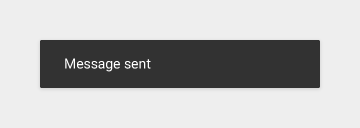

要

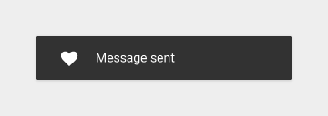

不要

### 暂态过程（Transient）

为了保证可用性，Snackbar 不应该成为通往核心用例的唯一方式。作为被置于顶层的元素，Snackbar不应该持续存在并且相互堆叠。

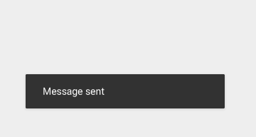

要

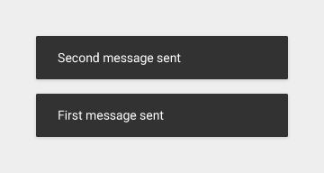

不要

### 保留0-1个操作，不要用取消（Dismiss 或者Cancel）

当一个动作发生的时候，应当符合提示框（Dialog）规格与预设的规则（affordance rules）。当有2个或者2个以上的操作出现时，应该使用提示框（Dialog）而不是Snackbar，即使其中的一个提示内容是取消某个操作。如果Snackbar中提示的操作重要到需要打断屏幕上正在进行的操作，那么理当使用提示框（Dialog）而非Snackbar。

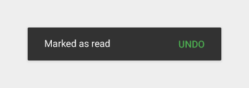

要

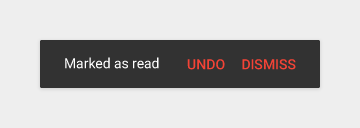

不要

### 不要阻挡了浮动操作按钮（floating action button）

垂直移动浮动操作按钮到Snackbar的上方。

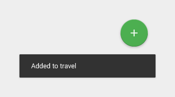

要

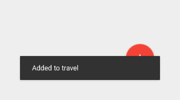

不要

## 规格（Spces）

### 手机端 Snackbar

- 单行 Snackbar 高度: 48 dp
- 多行 Snackbar 高度: 80 dp
- 文本： Roboto Regular 14 sp
- 操作按钮: Roboto Medium 14 sp, 大写文本
- 默认背景填充色: #323232 100%

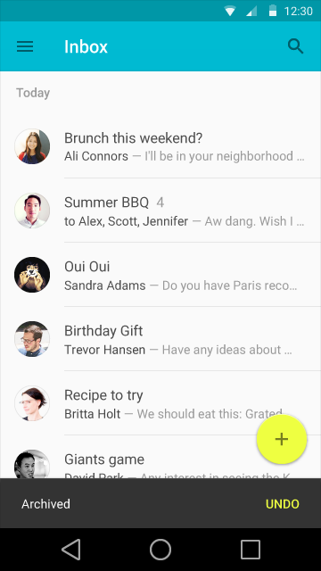
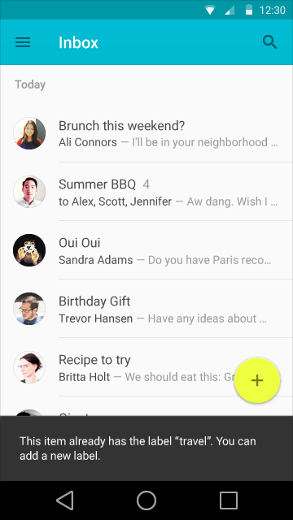

<video crossorigin="anonymous"    controls >
<source src="http://materialdesign.qiniudn.com/videos/components-snackbars-and-toasts-specs-snackbar.single.line-dismissal_large_xhdpi.webm" type="video/webm">
</video>

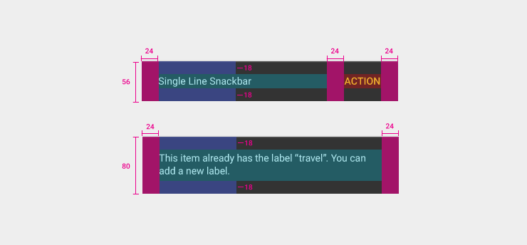

 
### 平板/桌面端 Snackbar

- 单行 snackbar 高度: 48 dp tall
- 最小宽度: 288 dp
- 最大宽度: 568 dp
- 2 dp 圆角
- 文本: Roboto Regular 14 sp
- 操作按钮: Roboto Medium 14 sp, 大写文本
- 默认背景填充色: #323232 100%

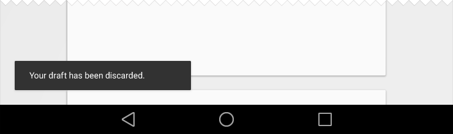

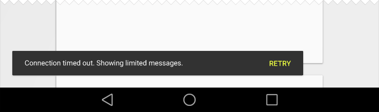

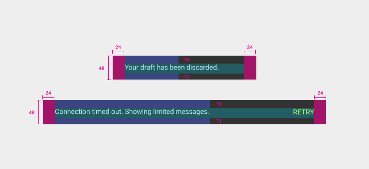

<video crossorigin="anonymous"    controls >
<source src="http://materialdesign.qiniudn.com/videos/components-snackbars-and-toasts-specs-snackbar.tablet-time.out_large_xhdpi.webm" type="video/webm">
</video>

### Android toast

Developers can create custom toasts and/or custom screen placements for them. If making a custom toast, you are strongly encouraged to adhere to the snackbar style provided above.

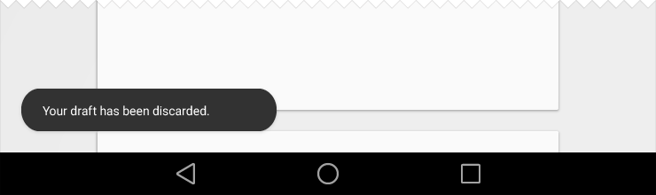

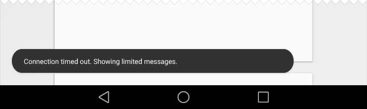

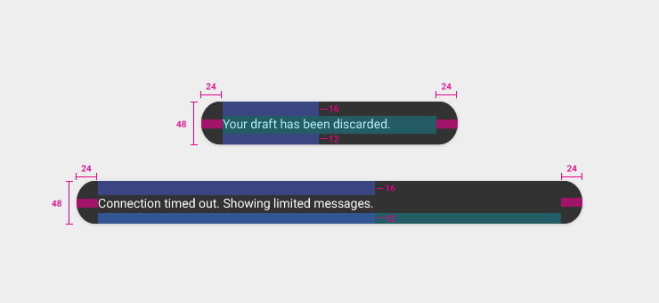
