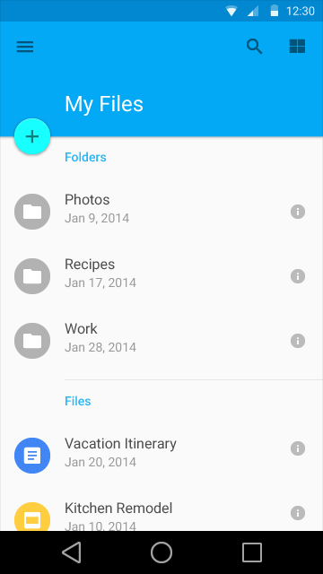

# 副标题

副标题是特殊的列表区块，它描绘出一个列表或是网格的不同部分，通常与当前的筛选条件或排序条件相关。

副标题可以内联展示在区块里，也可以关联到内容里，例如，关联在相邻的分组列表里。

在滚动的过程中，副标题一直固定在屏幕的顶部，除非屏幕切换或被其他副标题替换。

为了提高分组内容的视觉效果，可以用系统颜色来显示副标题。

## 列表副标题

区块高度是48dp。

副标题字体为 Roboto Medium 14sp。

副标题应该跟列表中头像或是图标左对齐，除非那个地方有进阶操作（promoted action）。

如果有跟列表中的头像或图标左对齐的进阶操作（promoted action），副标题则需要和列表中的文字左对齐。

## 网格副标题

区块高度是48dp。

副标题字体为 Roboto Medium 14sp。

副标题跟左边缘距离为16dp。

> 原文：[Subheaders](http://www.google.com/design/spec/components/subheaders.html)  翻译：[marshluca](https://github.com/marshluca)  校对：[PoppinLp](https://github.com/poppinlp)
