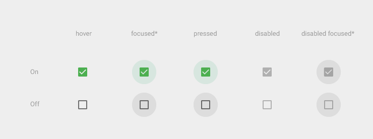
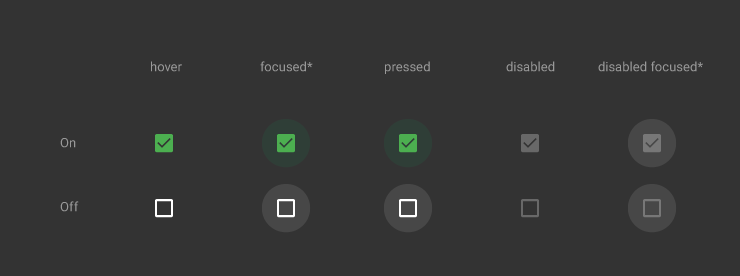
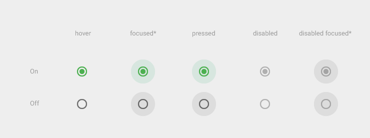
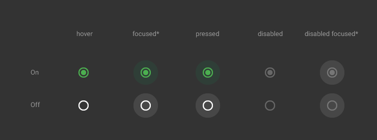
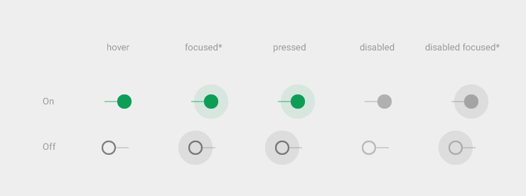
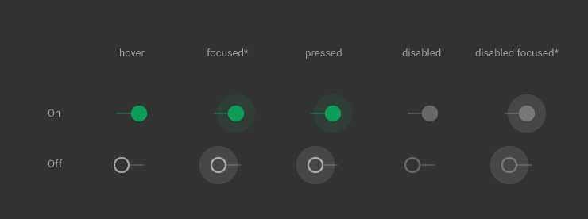
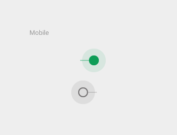
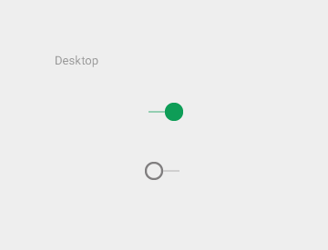

# 开关

开关允许用户选择选择项。一共有三种类型的开关：复选框、单选按钮和 on/off 开关。

注释：下面示例中所示的图形环代表一个动画，并不是实际按钮的外观。

## 复选框 

复选框允许用户从一组选项中选择多个。 

如果需要在一个列表中出现多个 on/off 选项，复选框是一种节省空间的好方式。

如果只有一个 on/off 选择，不要使用复选框，而应该替换成 on/off 开关。

通过主动将复选框换成勾选标记，可以使去掉勾选的操作变得更加明确且令人满意。

复选框通过动画来表达聚焦和按下的状态。

<video crossorigin="anonymous" loop controls width="360" height="640">
<source src="http://materialdesign.qiniudn.com/videos/components-switches-checkbox-spec_checkbox_large_xhdpi.webm" type="video/webm">
</video>  
复选框动作

## 单选按钮

单选按钮只允许用户从一组选项中选择一个。如果你认为用户需要看到所有可用的选项并排显示，那么请为排他选择使用单选按钮。

否则，考虑相比显示全部选择更节省空间的下拉。

单选按钮通过动画来表达聚焦和按下的状态。

<video crossorigin="anonymous" loop controls width="360" height="640">
<source src="http://materialdesign.qiniudn.com/videos/components-switches-radiobutton-spec_radio_large_xhdpi.webm" type="video/webm">
</video>  
单选框动作

## 开关

On/off 开关切换单一设置选择的状态。开关控制的选项以及它的状态，应该明确的展示出来并且与内部的标签相一致。开关应该单选按钮呈现相同的视觉特性。

开关通过动画来传达被聚焦和被按下的状态。

开关滑块上标明 "on" 和 "off" 的做法被弃用，取而代之的是下图所示的开关。

<video crossorigin="anonymous" loop controls width="360" height="640">
<source src="http://materialdesign.qiniudn.com/videos/components-switches-switch-switches_spec_03_large_xhdpi.webm" type="video/webm">
</video>

仅在支持触屏操作的情况下，对在交互中被完全遮挡的元素使用外部径向扩张效果。桌面使用的是鼠标，你不需要这个额外的指示。

> 原文：[Switches](http://www.google.com/design/spec/components/switches.html)  翻译：[vincent4j](https://github.com/vincent4j)  校对：[PoppinLp](https://github.com/poppinlp)
