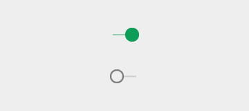

# 开关

开关允许用户选择选择项。一共有三种类型的开关：复选框、单选按钮和 on/off 开关。

注释：下面示例中所示的图形环代表一个动画，并不是实际按钮的外观。

## 复选框 

复选框允许用户从一组中选择多个选项。 

如果在一个列表中出现多个 on/off 选择， 复选框是一种很好节省空间的方式。

如果只有一个 on/off 选择，不要使用复选框，而应该替换成 on/off 开关。

// TODO 差一段  
By actively transforming from a box into a checkmark, the action of checking something off feels more fulfilling and directly manipulated.

复选框通过动画来传达被聚焦和被按下的状态。

// TODO 差个视频

复选框通过动画来传达被聚焦和被按下的状态。

// TODO 差个视频  
复选框动作  

## 单选按钮

单选按钮只允许用户从一组中选择一个选项。如果你认为用户需要看到所有可用的选项并排显示，那么请为排他选择使用单选按钮。

否则，考虑相比显示全部选择更节省空间的下拉。

单选按钮通过动画来传达被聚焦和被按下的状态。

// TODO 差个视频  
单选框动作

## 开关

On/off 开关切换单一设置选择的状态。The option that the switch controls, as well as the state it’s in, should be made clear from the corresponding inline label. 开关将和单选按钮起到相同的视觉特性。

开关通过动画来传达被聚焦和被按下的状态。

The on/off slide toggle with the words “on” and “off” baked within the asset is deprecated. Use the switch shown here instead.

// TODO 视频

仅在有利于手指触摸的形式因素下，对在交互中被完全遮挡的元素使用外部径向扩充。桌面使用的是鼠标，你不需要这个额外的指示。

