# Tabs

在一个 app 中，tabs 使在不同的视图和功能间探索和切换以及浏览不同类别的数据集合起来变得简单。

## 用法

tab 用来显示有关联的分组内容。tab标签用来简要的描述内容。

### 移动设备的 tabs

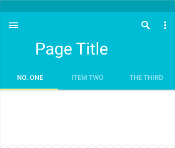  
扩展的 app bar + tab bar  

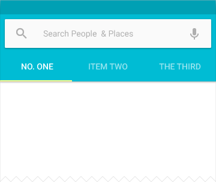  
加入检索 + app bar + tab bar

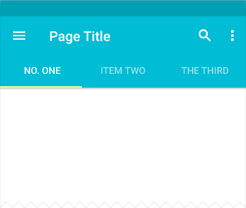  
默认的 app bar + tab bar  

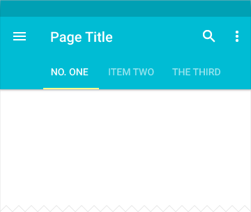  
默认的 app bar + 可滚动的 tab bar

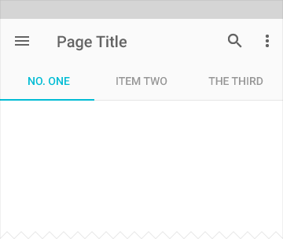  
和 tab 指示器一样的字体颜色

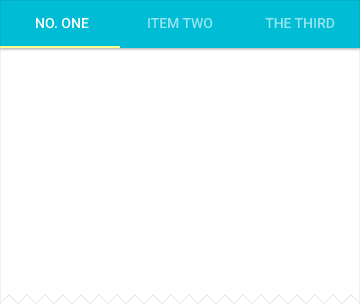  
被锁定滚动的 tab bar 

### 桌面环境的 tabs

  
默认的 app bar + tab bar

  
附加“更多”溢出下拉菜单

  
Tab 溢出标识码，第一步

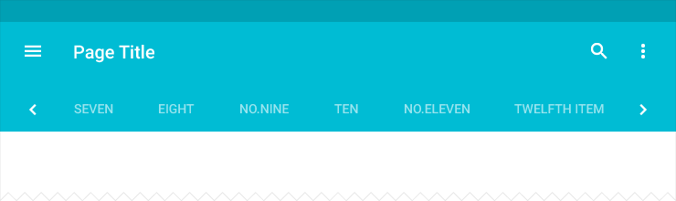  

  
展开的菜单

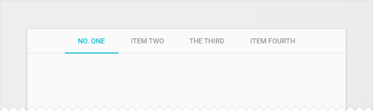  
居中的 tab bar

### 何时使用

使用 tabs 将大量关联的数据或者选项划分成更易理解的分组，可以在不需要切换出当先上下文的情况下，有效的进行内容导航和内容组织。

仅管 tab 的内容让人自然的联想到导航（例如：道路选项可以切换地图的视图，搜索结果引导到其他网站），但 tabs 本身并不是用来导航的。

Tabs 也不是用于内容切换或是内容分页的（例如：应用中页面之间的切换）。

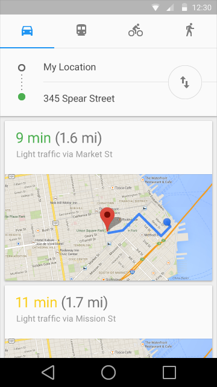  
要

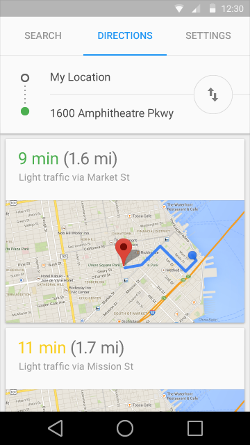  
不要

### Tab 特性

Tabs 应该显示在一行内。

Tabs 不应该被嵌套。也就是说，一个 tab 里的内容不应包含另一组 tabs。

一组 tabs 至少包含 2 个 tab 并且不多于 6 个 tab。

Tabs 控制的显示内容的定位要一致。

Tab 中当前可见内容要高亮显示。

Tabs 应该归类并且每组 tabs 中内容顺序相连。

保持 tabs 和他们的内容相邻，可以明确两者间的关系，距离太远会让人误解。

  
要

  
不要

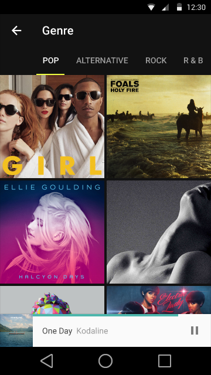  
要

  
不要

## 内容

### Tab 的内容

即使是两个 tabs 之间，tab 中呈现的内容可以有很大的差别。比如，不同年份的 tab 组合或者是不同类型的设置。

一组 tabs 中的所有内容应该互相关联并且在同一个主题下（例如：设置、指南），但是每个 tab 又是相互独立的。

Tab 标签应该逻辑的组织相关内容，并提供有意义的区分。

Tab 标签可能是图标或者文字并且不能省略。

避免进行跨 tab 的内容比较。如果一个跨 tab 的内容比较是有必要的，那么也许应该换一种内容的组织和呈现方式。

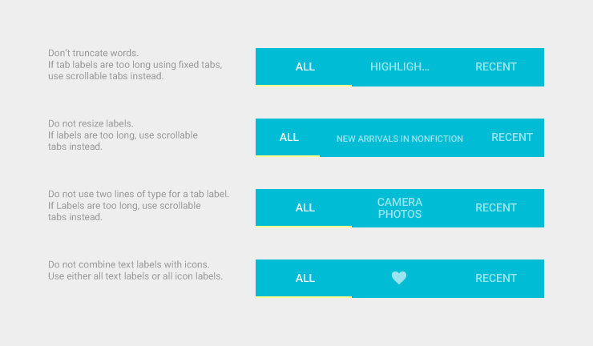

## Tabs 的类型

根据平台和使用环境，tab 的内容可以表现为固定的 tabs 或者是滚动（滑动）的 tabs。

### 固定的 tabs

固定的 tabs 同时显示所有 tabs，最适合用于快速相互切换的 tabs （例如，在地图中切换线路的交通方式）。

视图的宽度限制了 tabs 的最大数量。在固定的 tabs 中每个 tab  宽度相等，都是最宽的 tab 标签的宽度。可以通过点击 tab 或者是在内容区域中左右滑动来在固定的 tabs 间进行导航。

### 滚动的 tabs

滚动的 tabs 用于显示 tabs 的子集，可以在任何时候使用，并且可以包含更长的 tab 标签和更多的 tabs 数量，最适合用于触摸操作的浏览环境并且用户不需要直接比较 tab 标签。
 
可以通过点击 tab 、在 tab 上左右滑动或者在内容区域中左右滑动来在滚动的 tabs 间进行导航。

## 规格

### 固定并且全屏宽度

- Tab 宽度：屏幕的 1/3
- 激活的Tab的指示器高度：2 dp
- 文本：14 sp Roboto Medium
- 文本在 tab 中居中
- 激活的文字颜色：#fff 或颜色选择中的次要颜色（详情可见[Color](http://design.1sters.com/material_design/style/color.html)）
- 不可用的文字颜色：#fff 60%

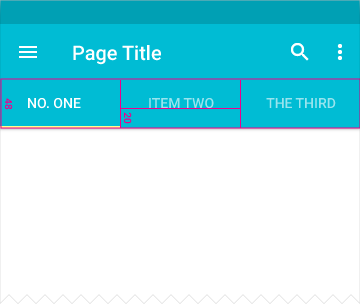

### 可滚动的

- Tab 宽度：12 dp + 文本宽度 + 12 dp
- 激活的Tab的指示器高度：2 dp
- 文本：14 sp Roboto Medium
- 激活的文字颜色：#fff 或颜色选择中的次要颜色（详情可见[Color](http://design.1sters.com/material_design/style/color.html)）
- 不可用的文字颜色：#fff 60%

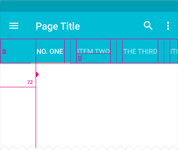

### 桌面/平板

- Tab 宽度：24 dp + 文本宽度 + 24 dp
- 激活的Tab的指示器高度：2 dp
- 文本：平板 14 sp 桌面 13 sp Roboto Medium
- 激活的文字颜色：#fff 或颜色选择中的次要颜色（详情可见[Color](http://design.1sters.com/material_design/style/color.html)）
- 不可用的文字颜色：#fff 60%

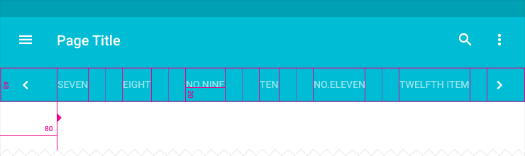

### 按下 tab 时的动画

<video crossorigin="anonymous" loop controls width="456" height="115">
<source src="http://materialdesign.qiniudn.com/videos/components-tabs-spec-tabtouch-example_large_xhdpi.webm" type="video/webm">
</video>

> 原文：[Tabs](http://www.google.com/design/spec/components/tabs.html)  翻译：[vincent4j](https://github.com/vincent4j)  校对：[PoppinLp](https://github.com/poppinlp)
