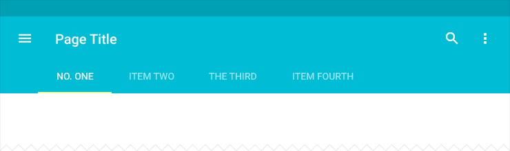

# Tabs

在一个 app 中，Tabs 使在不同的视图或功能方面探索和切换起来变得简单，或者浏览不同类别的数据集合变得简单。

## 用法

一个 tab 为显示内容相关的分组提供启示。一个 tab 标签简要地描述了相关分组的内容。

### 移动领域的 tabs

  
扩展的 app bar + tab bar  

  
加入检索 + app bar + tab bar

  
默认的 app bar + tab bar  

  
默认的 app bar + 可滚动的 tab bar

  
和 tab 指示器一样的字体颜色

  
被锁定滚动的 tab bar 

### 桌面领域的 tabs

  
默认的 app bar + tab bar

  
附加“更多”溢出下拉菜单

  
Tab 溢出标识码，第一步

  

  
展开的菜单

  
居中的 tab bar

### 何时使用

使用 tabs 将大量的关联数据或选择划分地更容易理解，专注在有助于内容导航或内容
结构为目标的组，而不需要导航出当前的上下文。

虽然被指定的内容可能是自然的导航(例如，道路选项可以改变地图的视图，检索结果引导到其他网站)，
但 tabs 本身没有被用于导航。  

Tabs 也不被用于旋转或者是分页（比如：页面之间的滑动）。

      
要

    
不要      

### Tab 特性

Tabs 代表一行。

Tabs 不应该被嵌套。也就是说，一个 tab 里的内容不应该包括另外一组被 tab 化的内容。

一组 tabs 至少包含 2 个 tabs 并且不多于 6 个 tabs。

Tabs 控制的显示内容的定位要一致。

Tab 相对应可见内容要高亮显示。

Tabs 归类并且每组 tabs 是依次与他们的内容连接起来。

保持 tabs 与内容相邻，可以帮助维护两者之间的关系，过大的分离会引起歧义。

向下箭头表示内容已经被收起，向上箭头表示内容已经被展开。

  
要  

  
不要  

  
要  

  
不要  

## 内容

### Tab 的内容

即使是两个 tabs 之间，tab 中呈现的内容可以有很大的差别。比如，不同年份的 tab 组合或者是不同类型的设置。

一组 tabs 中的所有内容应该是相关联的，但是每个 tab 又是相排斥的（例如，设置和指南）。

Tab 标签应该在逻辑组织相关的内容上，提供有意义的区分。

Tab 标签可能是图标或者文字并且不能被省略。

避免 cross-tab comparison 内容的需求；显著 cross-tab comparison 可能暗示内容将受益于不同的组织或表现。

   

## Tabs 的种类

根据平台和使用的上下文，tabbed 内容可以表现为固定的 tabs 或者是滚动（滑动）的 tabs。

### Fixed tabs

Fixed tabs 最适合用于同时显示所有 tabs，优势是利于 tabs 之前快速切换（例如，在地图中切换线路的交通方式）。

Tabs 的最大数量是要以视图的宽度为限制。Fixed tabs 以最宽的 tab 标签的宽度为基础设置每个 tab 的宽度。在 fixed tabs 之间导航，点击 tab 或者是左右滑动内容区域。

   

### 可滚动的 tabs

可滚动的 tabs 在任何给定的时刻，显示 tabs 的一个子集，并且可以包含更长的 tab 标签和更多的 tabs 最适合用于在用户不需要直接比较 tab 标签时浏览上下文。
 
可滚动的 tabs 之间通过点击 tab，左右滑动 tabs 或者左右滑动内容区域来导航。

  

  

## 规格

### Fixed 和全屏的宽度

Tab 宽度: 屏幕的 1/3     
Tab Indicator: 2 dp 高度    
Text: 14 sp Roboto 中号   
文本在 tab 单元中居中   
Active text color: #fff 或间色(secondary color)     
Disabled text color: #fff 60%      

  

### 可滚动的

Tab 宽度: 12 dp + 文本宽度 + 12 dp    
Tab Indicator: 2 dp 高度    
文本: 14 sp Roboto 中号    
Active text color: #fff 或间色(secondary color)   
Disabled text color: #fff 60%   

      

### 桌面/平板

Tab Width: 24 dp + Word length + 24 dp   
Tab Indicator: 2 dp height    
文本: 14 sp 平板, 13 sp 桌面 Roboto 中号    
Active text color: #fff 或间色(secondary color)    
Disabled text color: #fff 60%    

   

### 按下 tab 时的动画

<video crossorigin="anonymous"  loop  controls width="456" height="115">
<source src="http://materialdesign.qiniudn.com/videos/components-tabs-spec-tabtouch-example_large_xhdpi.webm" type="video/webm">
</video>

