# 文本框

文本框可以让用户输入文本。它们可以是单行的，带或不带滚动条，也可以是多行的，并且带有一个图标。点击文本框后显示光标，并自动显示键盘。除了输入，文本框可以进行其他任务操作，如文本选择（剪切，复制，粘贴）以及数据的自动查找功能。详情见 [模式 > 选择](../patterns/selection.html) 文本选择的设计。   

文本框可以有不同的输入类型。输入类型决定文本框内允许输入什么样的字符，有的可能会提示虚拟键盘并调整其布局来显示最常用的字符。常见的类型包括数字，文本，电子邮件地址，电话号码，个人姓名，用户名，URL，街道地址，信用卡号码，PIN码，以及搜索查询。  

## 单行文本框

当文本输入光标到达输入区域的最右边，单行文本框中的内容会自动滚动到左边。  
  
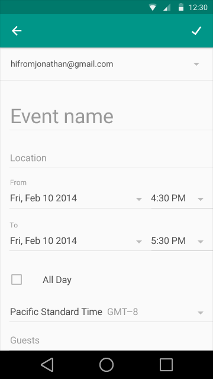   

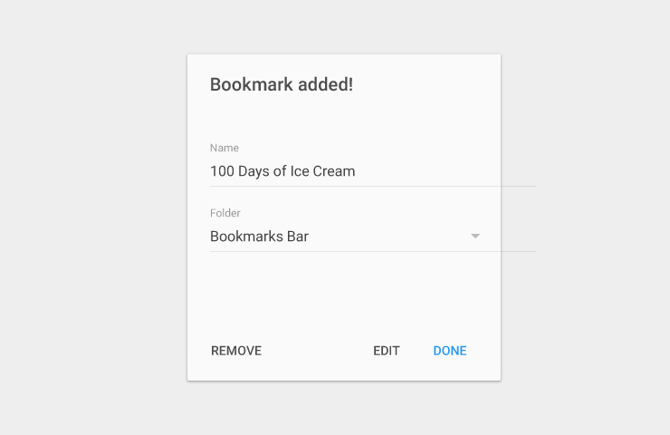   

### 浅色主题

- 提示和输入字体：Roboto Regular 16 sp 
- 输入框高度：48 dp 
- 文本顶部和底部填充：16 dp
- 文本字段分隔填充：8 dp   

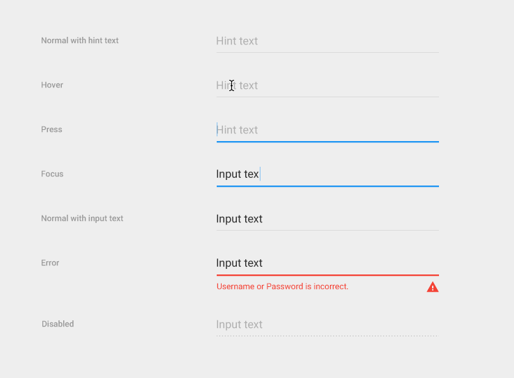  

### 暗色主题 

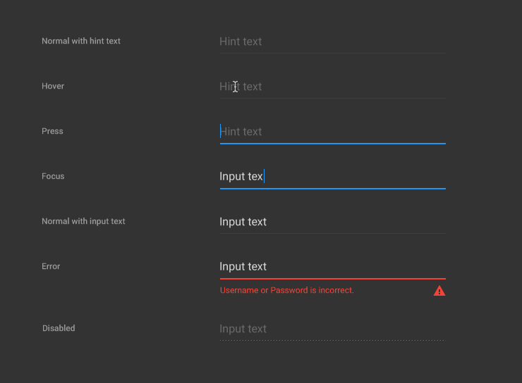  

### 红色标线

   

### 带有图标的浅色主题

- 提示和输入字体：Roboto Regular 16 sp 
- 输入框高度：48 dp 
- 文本顶部和底部填充：16 dp 
- 文本字段分隔填充：8 dp   

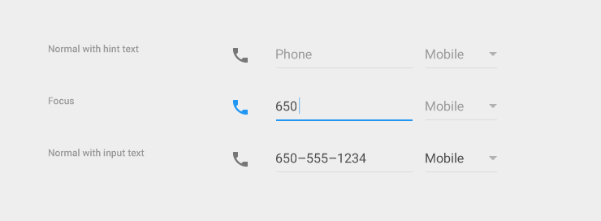  

### 带有图标的暗色主题

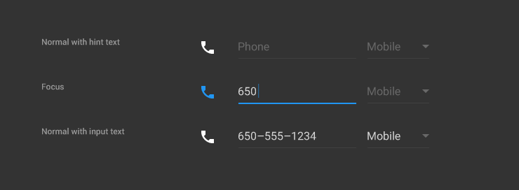  

### 红色标线

  

## 带有滚动条的单行文本框

### 带有滚动条的单行文本框

当单行文本框的输入内容很长并需跨越多行的时候，则文本框应该以滚动形式容纳文本。   

在滚动文本框中，一个图形化的标志出现在标线的下面。点击省略号，光标返回到字符的开头。

### 浅色主题

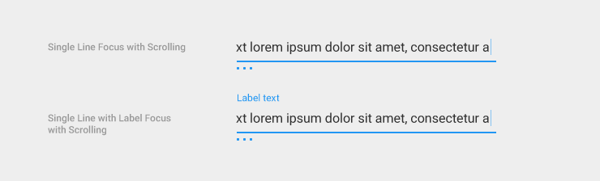  

### 深色主题

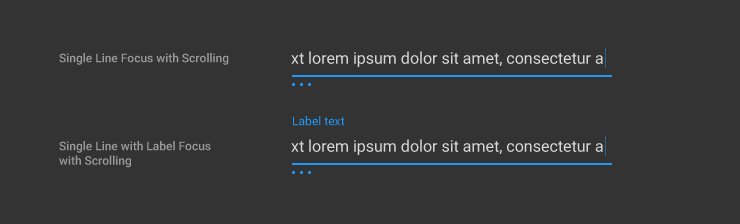  
 
## 浮动标签 

### 浮动标签 

浮动内嵌标签，当用户在输入文本时，标签会浮动到输入内容的上方。 

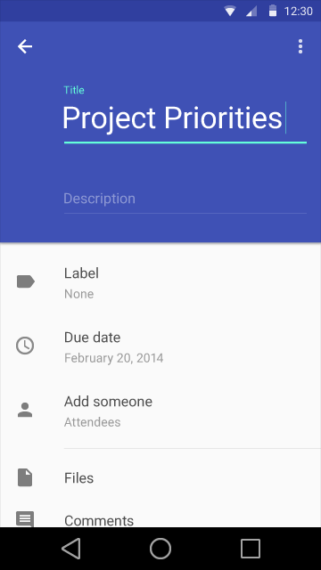    

### 浅色主题

- 提示和输入字体：Roboto Regular 16 sp 
- 标签字体：Roboto Regular 12 sp 
- 输入框高度：72 dp 
- 文本顶部和底部填充：16 dp 
- 文本字段分隔填充：8 dp  

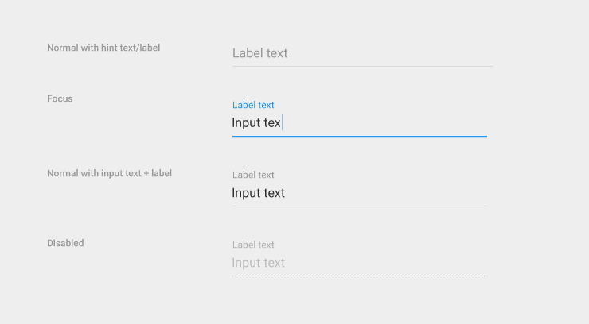    

### 深色主题

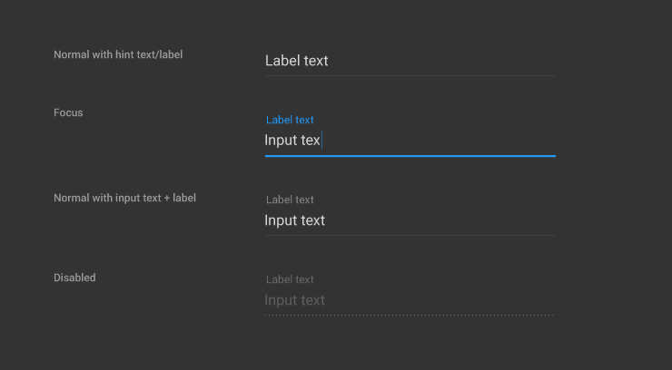    

### 红色标线

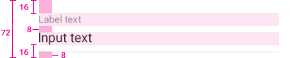     

## 多行文本框
 
当光标到达最下缘，多行文本框会自动让溢出的的文字断开并形成新的行，使文本可以换行和垂直滚动。   

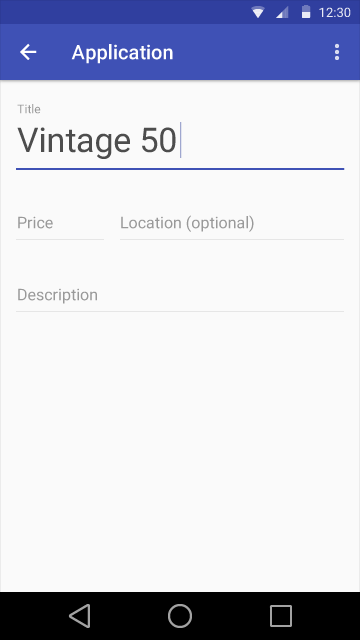      

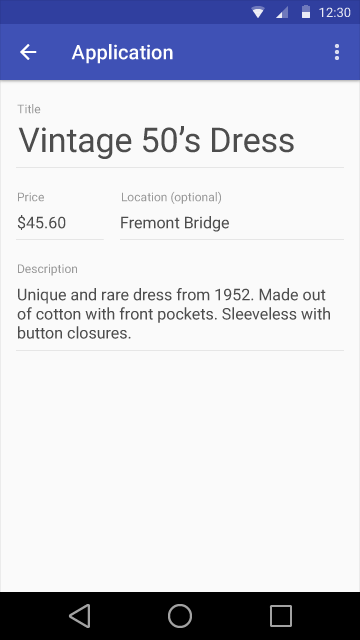      

### 浅色主题

- 提示和输入字体：Roboto Regular 16 sp 
- 标签字体：Roboto Regular 12 sp 
- 文本顶部和底部填充：16 dp 
- 文本字段分隔填充：8 dp   

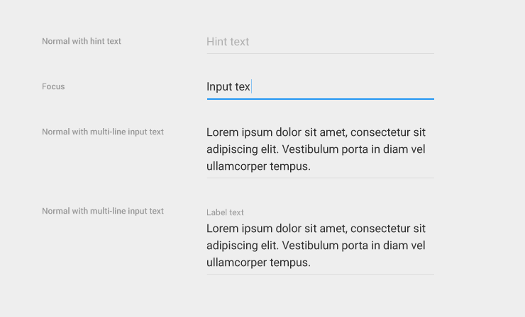      

### 深色主题 

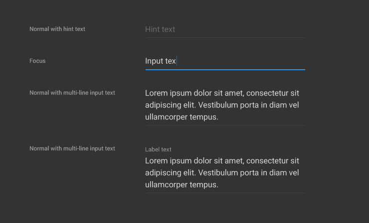      

### 红色标线

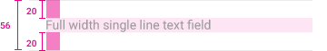      

## 全宽文本框

全宽文本框适用于更深入的工作。   

      

    

### 单行和多行文本框

- 提示和输入字体：Roboto Regular 16 sp 
- 顶部和底部填充文本：20 dp   

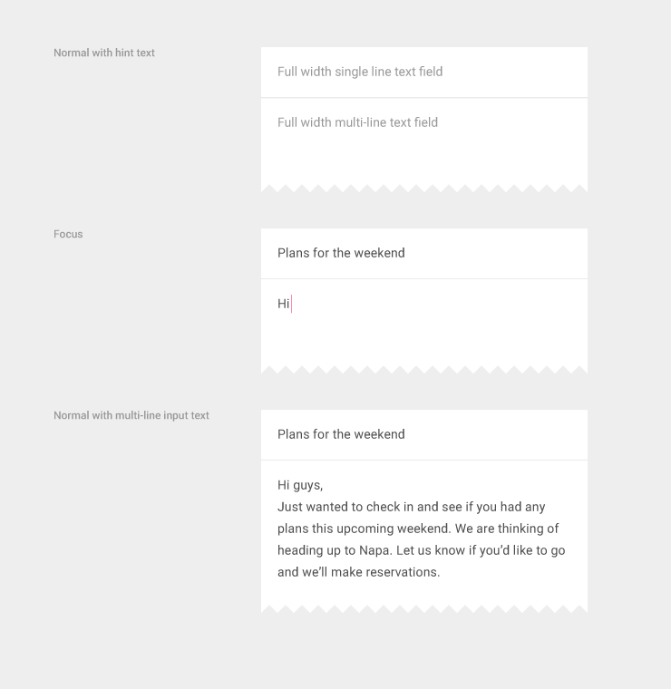    

### 红色标线

    
 
## 字符计数器 

当要是当地限制字符时可在文本框中使用字符计数器。  

### 单行字符计数器 

计数器文本：Roboto Regular 12 sp  

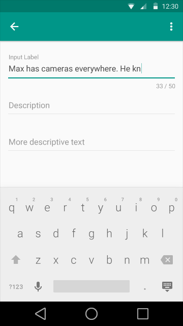    

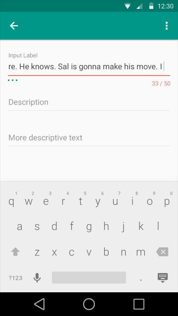    

### 多行文本框的字符计数器

计数器文本：Roboto Regular 12 sp  

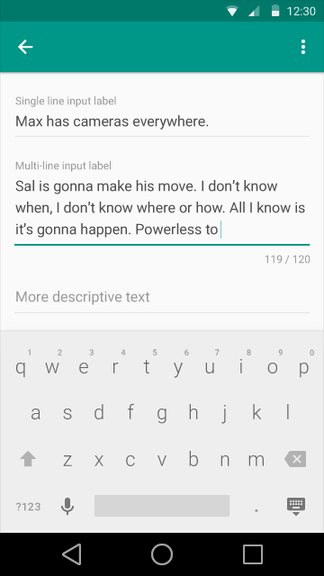    

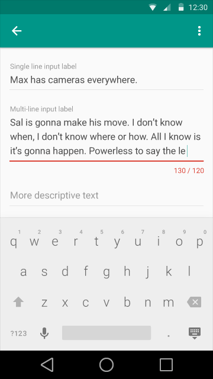    

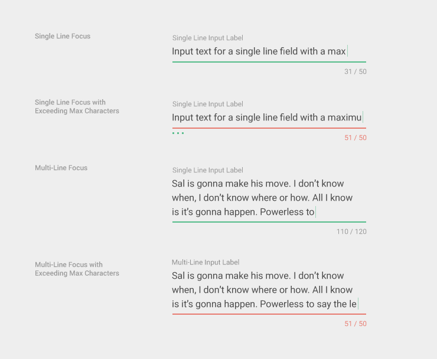    

### 全宽文本框的字符计数器

    

    

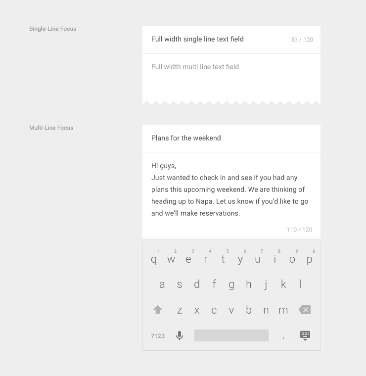    

## 自动补全文本框 

使用自动补全的文本框去呈现即时建议或补全弹出窗口，可让用户更准确，更高效地输入信息。

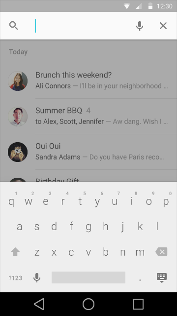    

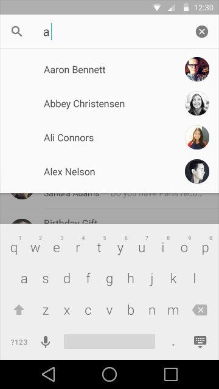    

### 全宽文本框的自动补全

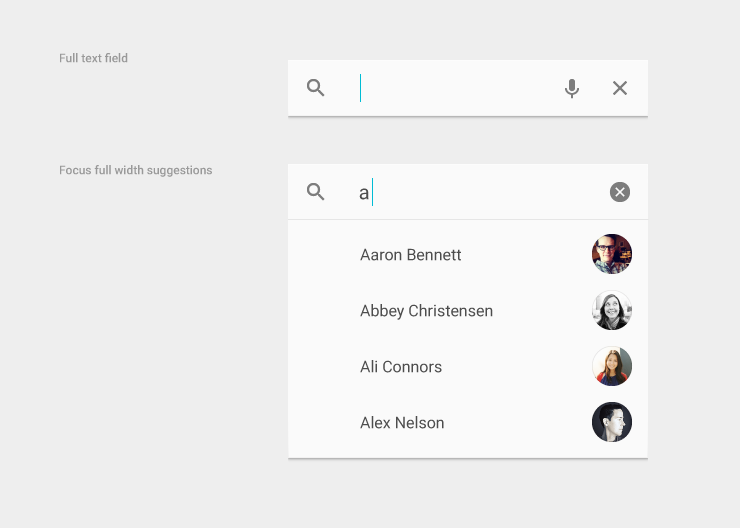    

### 插入自动补全

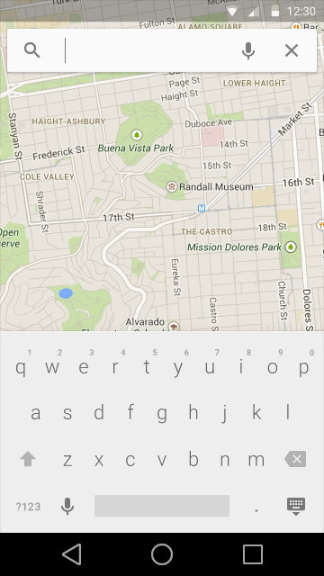    

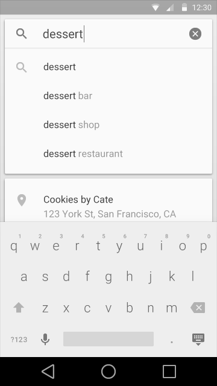    

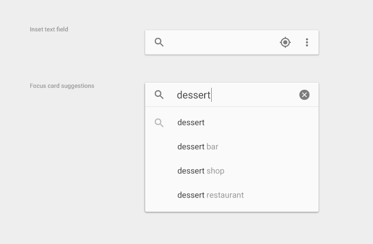    

### 全宽文本框的内嵌自动补全

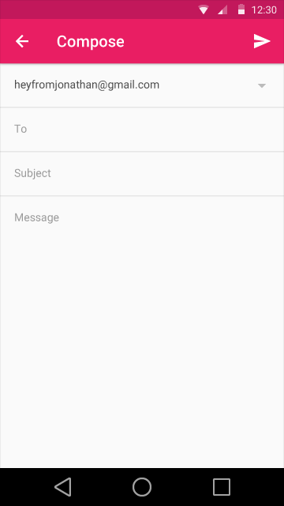    

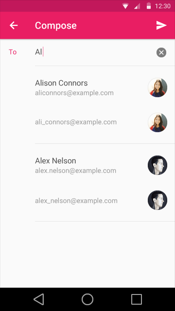    

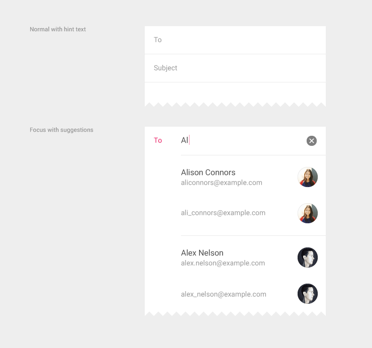    

### 内嵌自动补全

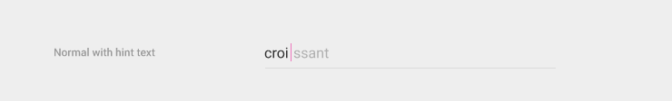    

## 搜索过滤器 

应用栏可以作为一个文本框。当用户输入时，文本框下方会显示已过滤和排序的内容。   

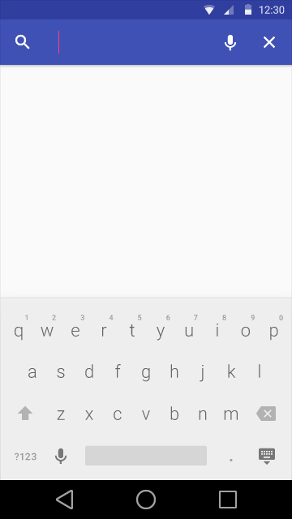    

      

### 在应用程序栏中的全宽文本框

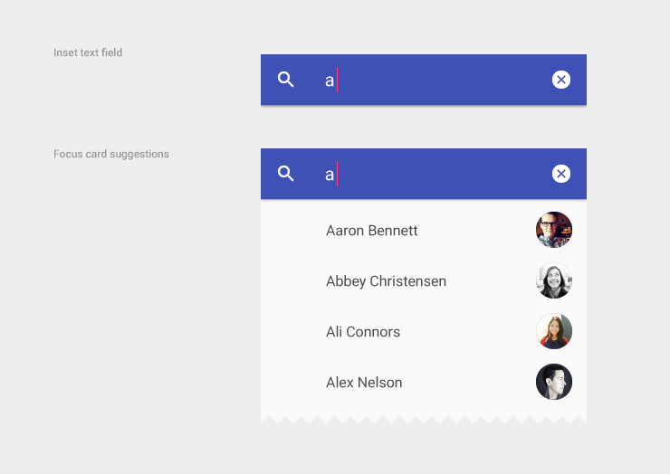    
