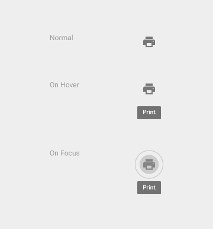
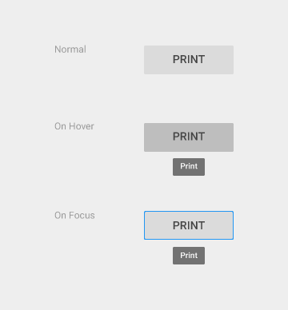
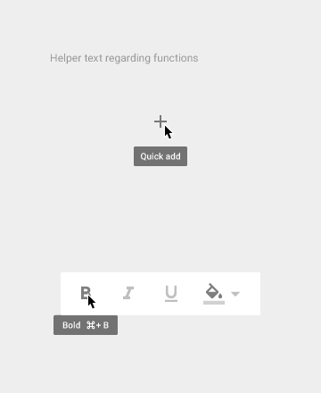
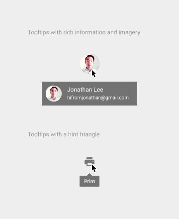
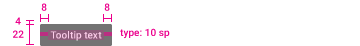
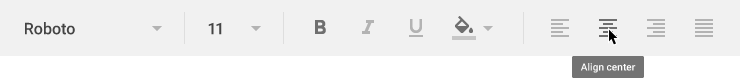
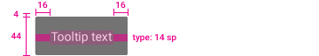
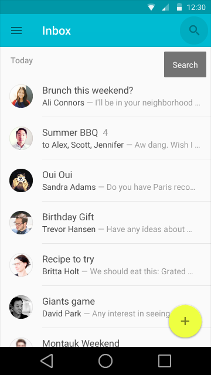
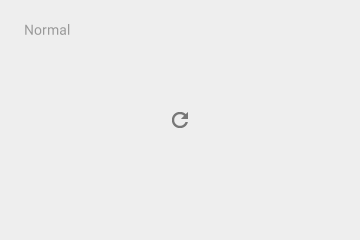
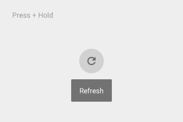

**工具提示(Tooltips)**

> **目录**

> [用法](#tooltips_usage)

> [光标和键盘的工具提示](#tooltips_cursor_keyboard)

> [触摸UI的工具提示](#tooltips_touch)

<h3 id=tooltips_usage">用法</h3>

对同时满足以下条件的元素使用工具提示(Tooltips)：

1.交互元素。

2.非文本的主要图形元素。

要(Do)

不要(Don't)

工具提示(Tooltips)不同于浮动卡(hovercards),后者用来显示图片和格式化字符串等更为丰富的信息。

工具提示(Tooltips)也不同于ALT属性，后者用来提示静态图片的主旨。

要(Do)

不要(Don't)

----------

<h3 id=tooltips_cursor_keyboard">光标和键盘的工具提示</h3>

文本: Roboto Medium 10 sp

背景填充: 90% opaque

工具提示(Tooltips)运动

<video width="720" height="270" loop="true" controls="controls"
src="http://materialdesign.qiniudn.com/videos/components-tooltips-cursorkeyboardtooltips-tooltips_005_large_xhdpi.webm" ></video>

----------

<h3 id=tooltips_touch">触摸UI的工具提示</h3>

文本: Roboto Medium 14 sp

背景填充: 90% opaque

