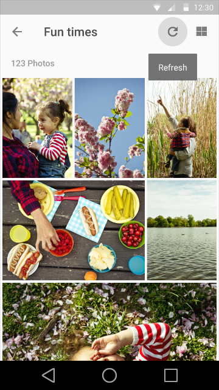

# 工具提示(Tooltips)

## 用法

对同时满足以下条件的元素使用工具提示：

1. 具有交互性
2. 主要是图形而非文本

  
要

  
不要

工具提示不同于悬浮卡片，后者用来显示图片和格式化的文本等更为丰富的信息。

工具提示也不同于`ALT`属性，后者用来提示静态图片的主旨。

  
要(Do)

  
不要(Don't)

## 光标和键盘的工具提示

文本：Roboto Medium 10 sp

背景填充：90%不透明度

工具提示动画

<video width="720" height="270" loop="true" controls="controls"
src="http://materialdesign.qiniudn.com/videos/components-tooltips-cursorkeyboardtooltips-tooltips_005_large_xhdpi.webm" ></video>

## 触摸屏UI的工具提示

文本：Roboto Medium 14 sp

背景填充：90%不透明度

> 原文：[Tooltips](http://www.google.com/design/spec/components/tooltips.html)  翻译：[lhyqy5](https://github.com/lhyqy5)  校对：[PoppinLp](https://github.com/poppinlp)
