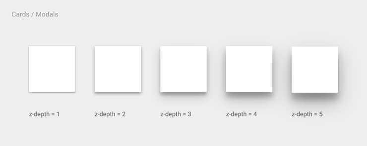

# 准则

Material Design 使用的基本工具来源于印刷设计，例如通用于所有页面的基准线和删格。布局排版能够按比例横跨不同尺寸的屏幕，促进UI开发和从根本上帮助你做可扩展的apps。

布局指南也通过使用相同的视觉元素，结构网格，和通用的行距规则，让app在不同平台与屏幕尺寸上拥有一致的外观和感觉。结构和视觉上的一致创造了一个可识别的跨平台产品的用户环境，它给用户提供高度的熟悉感和舒适性，让产品更便于使用。

在深入的研究布局细节之前，再一次细想什么是Material Design：一种基于纸页质感的设计。了解纸页的行为和如何制作是很重要的。

## 页面制作

**在Material Design里，每一个像素点都是由应用程序在一个页面上画出来的**。页面有一个平滑背景颜色并可以作用于各种目的。一个典型的布局就是由多层页面组成的。

系统可能会为很多元件绘制像素，比如状态或者系统栏，但这些都不属于页面。可以这样想象那些系统元件，他们是被贴在显示器玻璃背面的，另外存在于一个在app内容下方的层级。

### 布置页面

两个页面有一条共用的，长度相同的边就会产生缝合线。有缝合线的两张纸通常会一起移动。

    

两张Z轴位置不同的纸片在重叠会产生层阶[step]，因此他们通常是彼此独立移动。

  

### 页面工具栏

**工具栏**是一个主要展示操作的条状页片。这些操作通常聚集在工具栏的左边缘和右边缘。与导航相关的操作（一个抽屉菜单[ drawer menu ] ，一个向上的箭头[ up arrow ]）呈现在左边，而适用于当前情境的操作呈现在右边。

  

在工具栏左边和右边的操作不会被另一个页面分离。然而，工具栏的宽度被限制到小于页片的宽度。

  
要  
限制宽度要小于整个页片的宽度。    

  
不要   
绝对不允许一个页面被另一个页面隔开。   

工具栏经常的在别的页面上形成一个叠层用来显示与工具栏操作相关的内容。当页面工
具栏的下方滚动时，工具栏卡在页面的入口点，阻止该页面完全穿过另一端。

  

工具栏也可以与另一个页面由开始的缝合状态演变成叠起来之后形成的层阶[step]。这种叠加形式上的变形称为**瀑布**。

  

同样的，这个工具栏也可以保持它本身的缝合线，就像两个页面一起移动一样**推离**出屏幕。

  

最后，另一个页面在移动时也可以覆盖这个工具栏。

  

工具栏有一个标准的高度，但也可以更高。当更高的时候，操作键可以放在工具栏的最顶端或最低端。

  

工具栏在被压住时可以动态改变其高度。当改变尺寸的时候，他们会在最大和最小（标准）的高度之间调整（界定阈值）。

  

### 浮动操作

浮动操作是一个与工具栏分离的圆形页片。

浮动操作代表在当前情境下的独立提升操作。当与产生这个层阶[step]的页面内容相关联时，它可以跨越这个层阶。

  

浮动操作在与产生这个叠合线的两个页面内容相关联时，可以跨越这个缝合线。

永远不要仅仅为了给操作提供一个支撑点而引入一条装饰性的缝合线。

  

## 自适应准则

当设计跨设备布局的时候，我们为网格行为结合了固定的，粘性的和流畅的策略。

这里有一些简单的指导：

1. 遵循人的习惯。
2. 更大的屏幕  ≠  更大的认知能力。
3. 线条长度应该是适宜的。
4. 考虑到角距离。
5. 把家具从墙上取下来：允许空白，不要把局限于固定的工具栏。

在多重层次等级结构中使用策略，例如屏幕层级和卡片层级。

桌面模版演示了应用了这些网格规则的几个自适应界面。

[Desktop Template](http://materialdesign.qiniudn.com/downloads/Layout_Desktop_Whiteframe.ai) - 100 MB(.ai)  

  

## 维度

在dps中深度是可被测量的，就像x轴和y轴。然而，在z坐标空间里去考虑元素的**优先级**是更有效的，而不只是依据绝对的，固定的位置。

### 一个概念模型

在一个高层次级别上，每个app都可以被认为是放置在一个独特的空间或容器。

这样就意味着一个应用软件里的页面不能在Z轴空间插入另外一个页面。

这也意味着操作和元件是独立在app中:例如,在一个软件里让一个列表滑动消失不会导致那个列表穿过另一个不相关app的空间。

多容器允许多个app被同时看到，例如，在多种浏览器标签里。

  

在一个特定的app里，根据z轴主要和次要的层阶[step]，很多元素都是相对放置的。例如，一个按钮的聚焦状态是次要的层阶，而它的按下状态是一个主要的层阶。

其他元素在app的Z轴里有固定的优先级，意味着不管那些元素相对于Z轴的位置,他们总是位于其他元素上面或者下面。比如，浮动操作按钮总是在内容和工具栏之上，不管这个app可能会用到多少个页面。

  

系统元件，比如状态栏和系统对话框，存在于一个单独的系统空间里，在所有app容器的上方和下方。

取决于情境， 系统元素有可能不出现在某一个app里（比如在熄灯模式中），但当系统元素存在时，他们在空间上具有相对的优先权。这可确保，比如，一个系统对话框总出现在当前app的上面。

  

### 布局注意事项

深度不仅仅是装饰。

优先考虑元素的z轴空间，不是绝对的位置。

app中的深度应该表达层级和其重要性，并且帮助用户关注手头的任务。

  

### 阴影

阴影有两部分组成：顶端表达深度的阴影和底端表达边界的阴影。

  

  
 
  

  

  

  

  

  

  

  
 
  
 
  

  

> 原文：[Principles](http://www.google.com/design/spec/layout/layout-principles.html)  翻译：[lightlz](https://github.com/lightlz) 校对：[Jingsha](https://github.com/Jingsha)
