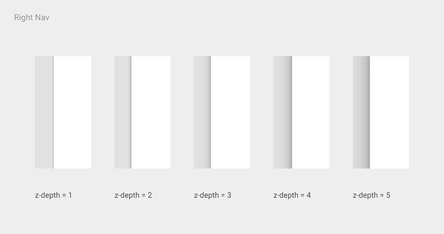

# 准则

Material Design 使用的基本工具是来自大量的印刷设计，像基线网格和一组工作在各个页面的结构网格。布局设计能够按比例横跨不同尺寸的屏幕，促进UI开发和从根本上帮助你做可扩展的apps。

布局指南也能让app支持一致的外观和感觉，通过相同的视觉元素，结构网格，和常规的间隙规则来横跨不同平台与屏幕尺寸。结构和视觉上的一致创造了一个可识别的跨平台产品的用户环境，它给用户提供高层次的熟悉感和舒适，让产品更便于使用。

在深入的研究布局细节之前，再一次细想什么是Material Design：一种基于页面的品质设计。了解页面的行为和如何制作是很重要的。

## 页面制作

**在Material Design里，每一个像素点都是由应用程序在一个页面上画出来的**。页面有一个平滑背景颜色并可以作用于各种目的。一个典型的布局就是由多层页面组成的。

系统可能会为很多元素绘制像素，比如状态或者系统栏，但这些都不属于页面。想象那些被贴在显示器背面玻璃上的系统要素和那些独立于app内容的表面是很有帮助的。

### 布置页面

两个页面共用相同长度的一边就会产生叠合线。加入了叠合线的两张纸通常会一起移动。

    

两张纸在不同的Z轴位置重叠就会产生层阶[step]，因此通常是彼此独立移动。

  

### 页面工具栏

**工具栏**是一个专注于展示操作的页面。这些操作通常聚集在工具栏的左边缘和右边缘。与导航相关联的操作（一个抽屉菜单[ drawer menu ] ，一个向上的箭头[ up arrow ]）呈现在左边，然而适用于当前上下文的操作呈现在右边。

  

在工具栏左边和右边的操作不会被另一个页面分离。然而，工具栏可以强制它的宽度小于页面的全长。

  
要  
限制宽度要小于整个页面的长度。    

  
不要   
绝对不允许一个页面被另一个页面分离。   

工具栏经常的在另一个页面上形成一个叠层用来显示与工具栏操作相关的内容。当页面滚动到工
具栏的底部，工具栏围绕在页面的入口点，防止它通过相反的一面。

  

工具栏也可以与第二个页面结合作为最初的显示，但是推起来之后就形成一个层阶[step]。这种极好的转换称为**瀑布**。

  

交替地，这个工具栏可以保持它本身的叠合线，当两个页面一起移动的时候就**推离**出屏幕。

  

最后，当它移动的时候第二个页面可以覆盖这个工具栏。

  

工具栏有一个标准的高度，但其实可以更高。当更高的时候，这个操作可以压住工具栏的最顶端或最低端。

  

一旦它被压住，工具栏可以动态改变高度。当改变尺寸的时候，他们会在最大和最小（标准）的高度之间调整（界定阈值）。

  

### 浮动操作

浮动操作是一个与工具栏分离的圆形页面。

浮动操作代表对上下文单一的提升操作。它可以跨越一个叠层，如果它与产生这个层阶[step]的页面内容相关联。

  

浮动操作可以跨越一个叠合线，如果它与产生这个叠合线的两个页面内容相关联。

永远不要引用一个装饰性的叠合线仅仅为了给操作提供一个支撑点。

  

## 自适应准则

当设计跨设备布局的时候，我们为网格行为结合固定的，粘性的和流畅的类型。

这里有一些简单的指导：

1. 遵循人的习惯。
2. 更大的屏幕  ≠  更大的认知能力。
3. 线条长度应该是可伸缩的。
4. 说明角的距离。
5. 把家具从墙上取下来：允许空白，不要把自己局限在固定的工具栏。

在多重层次等级结构中使用策略，就类似于屏幕层级和卡片层级。

桌面模版演示了几个响应屏幕的所有网格规则应用。

[Desktop Template](http://materialdesign.qiniudn.com/downloads/Layout_Desktop_Whiteframe.ai) - 100 MB(.ai)  

  

## 维度

在dps中深度是可被测量的，就像x轴和y轴。然而，在z坐标空间里去考虑元素的**优先级**是更有效的，而不只是依据绝对的固定的位置。

### 一个概念模型

在一个高层次级别上，每个app都可以被认为是放置在一个独特的空间或容器。

这样就意味着一个应用软件里的页面不能在Z轴空间插入另外一个页面。

这也意味着操作和物体是独立在app中:例如,在一个软件里让一个列表消失将不会导致那个列表穿过另一个不相关app的空间。

容器允许多种app视图同步化，例如，在多种浏览器标签里。

  

在一个特定的软件里，根据z轴主要和次要的层阶[step]，很多元素都是相对放置的。例如，一个按钮的聚焦状态是次要的层阶，而它的按下状态是一个主要的层阶。

其他元素在app的Z轴里有固定的优先级，意味着他们位于其他元素上面或者下面，不管那些元素是否处于Z轴相关的位置上。比如，浮动操作按钮在内容和工具栏之上，不管这个app可能会用到多少个页面。

  

系统元素，比如状态栏和系统对话框，它们存在于单独的系统空间里，在所有app容器的上方和下方。

取决于内容， 系统元素有可能不出现在一个app里（比如在熄灯模式中），但当系统元素存在时，系统空间建立系统元素的相对优先权。这可确保，比如，一个系统对话框总出现在当前app的上面。

  

### 布局注意事项

深度不仅仅是装饰。

优先考虑元素的z轴空间，不是绝对的位置。

app中的深度应该沟通层级和发挥重要作用，并且帮助用户关注手头的任务。

  

### 阴影

阴影有两部分组成：顶层的深度阴影和底层的清晰度阴影。

  

  
 
  

  

  

  

  

  

  

  
 
  
 
  

  

> 原文：[Principles](http://www.google.com/design/spec/layout/layout-principles.html)  翻译：[lightlz](https://github.com/lightlz) 校对:[Jingsha](https://github.com/Jingsha)
