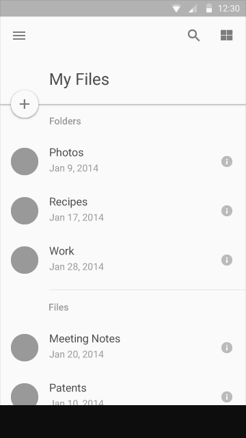
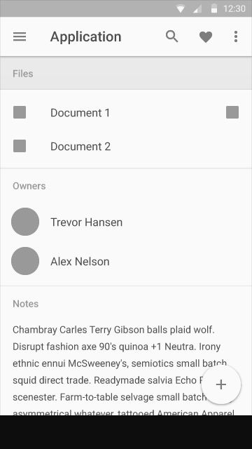
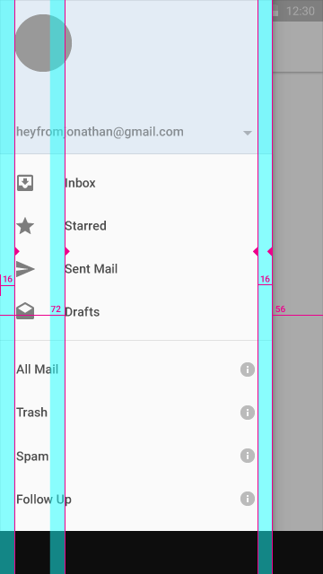
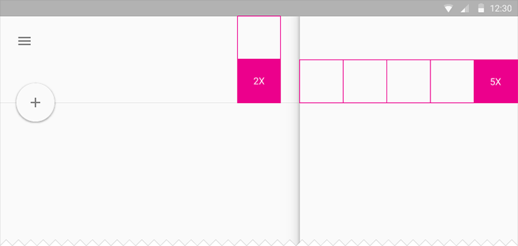

# 度量与边框 #

## 基准网络 ##

所有组件都以一个8dp\*8dp的基准网格对齐。排版（Type）以一个4dp\*4dp的基准网格对齐。在工具条中的图标同样以一个4dp\*4dp的基准网格对齐。这些规则适用于移动设备、平板设备以及桌面应用程序。

有关详细信息请参见[组件](../components/bottom-sheets.html)一节。

有关详细信息请参见[字体排版](../style/typography.html)一节。

----------

## 边框与间距 ##

#### 移动设备 ####

移动设备布局模板包含了多种多样的屏幕和信息，这些信息描述了边框与间距如何应用于屏幕边界和元素。下面是一个有关屏幕的实例，这个实例可以通过如下的链接获得。

[移动设备布局模板 - 2.4 MB(.ai)](http://materialdesign.qiniudn.com/downloads/Layout_Mobile_Whiteframe.ai)

**内容**

该屏幕演示图标、头像和一个2行文本的列表如何左对齐，以及一个56dp的浮动动作按钮和文本如何右对齐。

**垂直边框和水平外边距**

左右各有16dp的垂直边框。带有图标或者头像的内容有72dp的左边距。

在移动设备上有16dp的水平外边距。

**垂直边距**

1. 24dp
2. 56dp
3. 48dp
4. 72dp

**内容**

该屏幕演示图标、头像、2行文本列表、子标题和40dp的浮动动作按钮如何左对齐。小图标右对齐。

**垂直边框和水平边距**

图标（大小图标）有16dp的左右垂直边框。带有图标或者头像的内容有72dp的左边距。

在移动设备上有16dp的水平外边距。

**垂直边距**

1. 24dp
2. 56dp
3. 72dp
4. 48dp
5. 8dp

**内容**

该屏幕演示图标如何左对齐，以及图标和一个56dp的浮动动作按钮如何右对齐。

**垂直边框和水平边距**

图标有16dp的左垂直边框。带有图标或头像的内容有72dp的左边框。另外有32dp的边框添加到了右边，与56dp的圆形浮动动作按钮的边框有重叠。这样做是允许在浮动动作按钮下的图标对齐的。

在移动设备上有16dp的外边距。

**垂直边距**

1. 24dp
2. 56dp
3. 8dp
4. 72dp

**内容**

该屏幕演示图标、头像和文本如何左对齐，浮动动作按钮、图标和文本如何右对齐。

**垂直边框和水平边距**

图标有16dp的左右垂直边框。带有图标或头像的内容有72dp的左边框。

在移动设备上有16dp的水平边距。

**垂直边距**

1. 24dp
2. 56dp
3. 48dp
4. 8dp

**内容**

该屏幕演示了侧边导航菜单的宽度，以及图标、头像和文本如何左对齐，小图标如何右对齐。

**垂直边框和水平边距**

图标有16dp的左垂直边框和距侧边导航菜单16dp的右垂直边框。带有图标或者头像的内容距侧边导航菜单72dp的左垂直边框。侧边导航菜单的宽度等于屏幕的宽度减去动作条的高度，即在本例中距屏幕右侧56dp的宽。

在移动设备上有16dp的水平外边距。

**垂直边距**

1. 48dp
2. 8dp
3. 56dp

#### 平板设备 ####

平板设备布局模板包含了14种不同的屏幕，显示了边框和边距如何应用于屏幕的边界和元素。下面的实例是14种模板的两个，可以通过下面的链接获取。

[平板设备布局模板](http://materialdesign.qiniudn.com/downloads/Layout_Tablet_Whiteframe.ai)

1. 24dp
2. 64dp
3. 8dp
4. 72dp

1. 24dp
2. 64dp
3. 8dp
4. 48dp
5. 80dp

#### 桌面应用程序 ####

桌面应用程序布局模板包含了4个不同的屏幕，每一个屏幕右板块了4个不同的窗口尺寸，显示了边框和边距如何应用于窗口和元素。下面是一个屏幕的实例，可以通过下面所示的链接下载。基于不同的窗口尺寸，边框和边距块会继承自平板设备和移动设备的网格规则。

[桌面应用程序布局模板](http://materialdesign.qiniudn.com/downloads/Layout_Desktop_Whiteframe.ai)

## 比率边框 ##

应用于移动设备屏幕的宽度和移动设备、平板设备以及桌面应用程序的UI元素的宽度。

屏幕的宽度

示例

元素的宽度

示例

----------

## 增量边框 ##

### 增量边框 ###

增量边框定义了一个增量，比如动作条的高度，然后使用几倍于这个增量的数字来决定应用中其它元素的尺寸和位置。

大多数应用于桌面应用程序，有些也适用于平板设备，很少应用在移动设备中。增量的大小会根据窗口的尺寸来改变。

   

## 触摸目标尺寸 ##

最小的触摸目标尺寸是48dp。在布局中，当为图标（24dp）或者头像（40dp）设置边距时，这一点要时刻记得。

