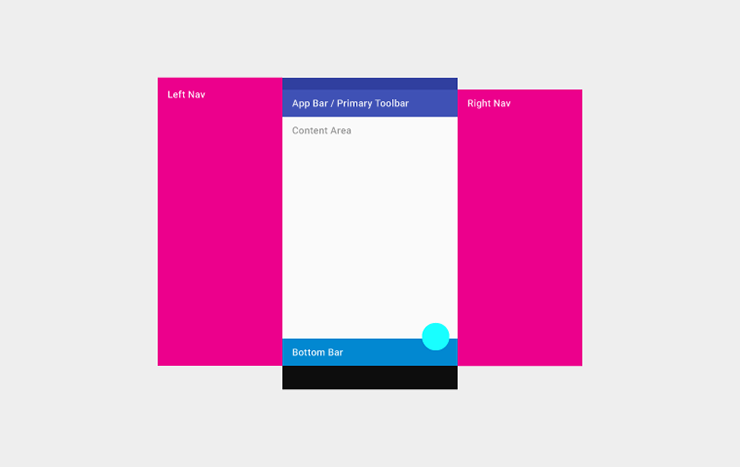

佈局結構
===============

#### 本章內容
* 用戶界面區域和指南
* 工具欄
* 選單
* 側導航欄
* 白框

## 用戶界面區域和指南

這章涵蓋了從移動應用到桌面應用的高層次佈局結構和包含幾點指引。

不同種類的應用需要處理不同的需求。例如：

* 單一屏幕只聚焦一個Activity的應用程式（如 計算器，相機和遊戲）
* 主要用來切換兩個Activity而不需要更深一層進行瀏覽的應用程式（如 語音撥號，最喜愛，最近電話歷史和聯繫人）
* 糅合廣泛數據視圖，並要深層瀏覽的應用程式（如 一個擁有不同文件夾的郵件應用程式或一個擁有商品分類的購物應用程式）

你的應用程式架構將會極大依賴於你所呈現給用戶的內容及任務。

### 從最頂層開始
你需要特別關注你應用程式的啟動頁面。這是用戶打開你應用程式所看到的第一個頁面，所以對於新用戶或者頻繁使用的用戶來說，啟動頁面都應該給這些用戶很正的體驗。

問一下自己：“通常是哪一類的用戶可能想用我的應用程式呢?” 根據這個問題，設計出啟動頁面的體驗效果。

#### 呈現應用程式的內容

很多應用程式關注所顯示的內容。 請避免應用程式只能瀏覽一堆屏幕，相反，通過把最核心的內容放到你的啟動頁面可以讓用戶了解你的應用最核心的功能和內容。

#### 內嵌式導航和操作。

正如任何的工具欄，選單可以組織重要的那些操作。它的位置在屏幕的上方，這樣使它理想地呈現出導航控制操作，如切換欄標（tab）或者打開左側的邊選欄。如果應用的內容是可以查找的，在選單上放置一個查找操作，這樣能讓用戶直接訪問他們想看的內容。

#### 堅持應用的功能

當你的應用程式有大量的內容或者功能時，你應該讓用戶關注到你產品最為重要的功能上。在內容區域內高亮這些目標功能。把最有特色的操作鏈接的凸出操作按鈕上。減少在應用程式內不必要的操作路徑。

### 頂層視圖策略
通過向用戶介紹主要的功能區域，頂層與應用功能通信。有些應用程式具有。其他應用程式裡，頂層會包含多個視圖，你必須保證用戶能夠高效地瀏覽這些不同的視圖。

選擇最適合你應用瀏覽需要的方法。

#### 關注一個內嵌導航欄的單一視圖。直接內聯應用的內容到相應的導航選項上，這樣，用戶對你的應用程式內容一目了然。這方法適合那些具有簡易的導航模型的程式。不過，如果用這方式呈現大量導航路徑將會減少顯示內容的空間，

若使用內嵌導航：

* 你的應用程式有一個優良的主要視圖，並無其他可以替代這個視圖的視圖。
* 在主要視圖內你的用戶可以便捷地執行最常用的任務。
* 潛在用戶能夠

行動裝置

這個架構包含一個永久的操作欄和一個突起的操作按鈕。下方有一個可選的選單用於額外功能和更多操作。左右兩側的導航欄可以用於隱藏其他功能。

平板電腦

桌上電腦

用戶界面指南

定義基本的水平或垂直的分割線
![]

運用空白的地方勾勒出次要的應用區域，這樣可以避免把用戶界面分割出過多Lshapes區域。
![]

當應用需要用戶作某些操作或應用本身需要區分出內容時，使用卡片。
![]

## 工具欄

工具欄，以下的例子讓你知道哪些地方你可以顯示
![]
全寬度，默認高度的操作欄

![]
全寬度，拉高了的操作欄，並且生成了不同的列寬度。

凸出的工具欄

底部工具欄架

## 選單

選單結構

選單用來顯示應用的標識，應用導航，內容搜索以及其他操作（在以前的Android版本中，我們叫它操作欄。）

假如你的應用需要用到邊選欄，標題（Title）可以是應用的名字，頁面標題或者頁面過濾器。

右邊的圖標都是應用本身相關的操作。菜單圖標（Menu Icon）打開的是一個海苔條菜單，這個菜單裡面有贊，幫助，設定和反饋等內容。

