# 結構

##用戶界面區域和指南

這章涵蓋了從移動應用到桌面應用的高層次結構和包含幾點指引。

不同種類的應用需要處理不同的需求。例如：

* 擁有單一屏幕只聚焦一個Activity的應用程式（如 計算器，相機和遊戲）
* 主要用來切換兩個Activity而不需要更深一層進行瀏覽的應用程式（如 語音撥號，最愛，最近電話歷史和聯繫人）
* 糅合廣泛數據視圖，並需要深層瀏覽的應用程式（如 一個擁有不同文件夾的郵件應用程式或一個擁有商品分類的購物應用程式）

你的應用程式結構將會極大依賴於你所呈現給用戶的內容及任務。

### 從最頂層開始
你需要特別關注你應用程式的啟動頁面。這是用戶打開你應用程式所看到的第一個頁面，所以對於新用戶或者頻繁使用的用戶來說，啟動頁面都應該給這些用戶很正的體驗。

問一下自己：“通常是哪一類的用戶可能想用我的應用程式呢?” 根據這個問題，設計出啟動頁面的體驗效果。

#### 呈現應用程式的內容

很多應用程式關注所顯示的內容。 避免應用程式只能枯燥地瀏覽一堆屏幕，相反，通過把最核心的內容放到你的啟動頁面可以讓用戶了解你的應用最核心的功能和內容。

#### 內嵌式導航和操作。

正如任何的工具欄，選單可以組織重要的那些操作。它的位置在屏幕的上方，這樣使它理想地呈現出導航控制操作，如切換欄標（tab）或者打開左側的邊選欄。如果應用的內容是可以查找的，在選單上放置一個查找操作，這樣能讓用戶直接訪問他們想看的內容。

#### 堅持應用的功能

當你的應用程式有大量的內容或者功能時，你應該讓用戶關注到你產品最為重要的功能上。在內容區域內高亮這些目標功能。把最有特色的操作鏈接的凸出操作按鈕上。減少在應用程式內不必要的操作路徑。

### 頂層視圖策略
通過向用戶介紹主要的功能區域，頂層與應用功能通信。有些應用程式具有。其他應用程式裡，頂層會包含多個視圖，你必須保證用戶能夠高效地瀏覽這些不同的視圖。

選擇最適合你應用瀏覽需要的方法。

#####關注一個內嵌導航欄的單一視圖。
直接內聯應用的內容到相應的導航欄選項上，這樣，用戶對你的應用程式內容一目了然。這方法適合那些具有簡易的導航模型的應用程式。不過，如果用這方式去呈現大量導航路徑將會減少顯示內容的空間，同時，相對於共置這些路徑到一個便捷的地方來說，這方式會徹底分散整個屏幕。

若使用內嵌導航：

* 你的應用程式有一個優良的主要視圖，並無其他可以替代這個視圖的視圖。
* 在主要視圖內你的用戶可以便捷地執行最常用的任務。
* 潛在用戶並非經常使用你的應用程式，他們更喜歡直接的內容訪問路徑。

#####使用欄標切換少量同等重要的視圖。
如果你的應用程式只擁有少量功能區域，並且每個功能區域是淺層次的，使用欄標增加用戶對這些同等頂層視圖的關注。這樣也使這些功能通過一次點擊或一次滑動快速轉換。但是，對於小屏幕來說欄標會很佔地方，並且欄標只適合具有簡潔標籤名的少量頂層視圖。

若使用欄標：

* 使用你應用程式的用戶將會頻繁切換這些視圖。
* 應用程式有數量有限的頂層視圖。
* 你需要用戶高度關注每一個欄標的視圖。

#####通過邊選欄管理複雜的結構。
左側的導航面板可以同時顯示大量導航項。這特別適用於你的應用程式只有一個主頁面，而邊選欄則用來存儲那些不是經常訪問的內容。如果你的應用需要讓底層視圖切換到應用程式的其他重要部分，滑動出左邊選欄能夠讓用戶高效地切換他們想要訪問的內容。但是，因為邊選欄的功能可見性不強，用戶或者需要時間去熟悉整個應用程式的內容。

若使用邊選欄：

* 你的應用程式擁有大量的頂層視圖。
* 你需要實現通過導航的快速切換視圖（這些視圖無直接聯繫）。
* 應用程式內包含一些深層瀏覽分支但在需要時，可快速回到應用程式的頂層。
* 你想減少程式中的不經常訪問內容對用戶可見性。

即使你使用了某一個頂層視圖策略，情景導航依然是訪問相關數據的有力方式。 例如直接關聯：一首歌曲和演繹這首歌藝人的其他歌曲、最近使用項和整個使用歷史，又或者某個用戶的一個貼子和他們的個人資料。這些直接關聯可以把一個主要任務延伸到其他相關的任務操作。

###行動裝置

這個結構包含一個固定的選單和一個浮起的操作按鈕。有一個可選實現的底欄用於添加額外功能和更多操作。左右兩側的邊選欄可以用於隱藏所有其他結構的元素，用戶需要的時候才訪問到。

###平板電腦

這個結構包含一個固定的選單和一個浮起的操作按鈕。這個選單擁有與平板電腦和行動裝置的底欄的元素。有一個可選實現的底欄用於添加額外功能和更多操作。左邊選欄可以用於隱藏所有其他結構的元素，用戶需要的時候才訪問到。右邊選欄可以固定在右側又或者需要時才訪問。
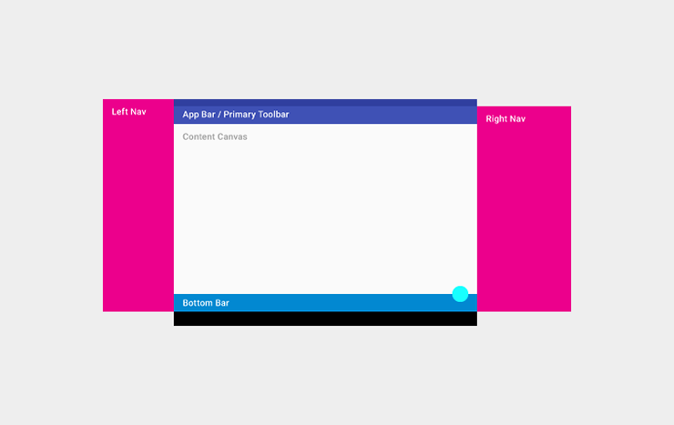

###桌上電腦

這個結構包含一個固定的選單和一個浮起的操作按鈕。這個選單擁有與平板電腦和行動裝置的底欄的元素。在允許的情況下，窗口都會放置到選單內。邊選欄可以需要時訪問或者固定在左右兩側。邊選欄菜單和內容Canvas可以擁有他們自己的次工具欄（如欄標，畫板或者次操作）。
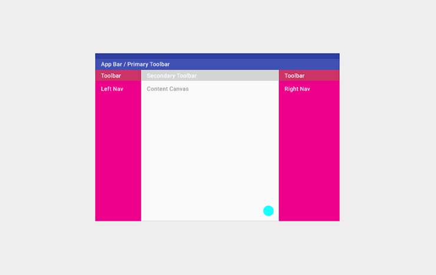

###用戶界面指南

定義基本的水平或垂直的分割線
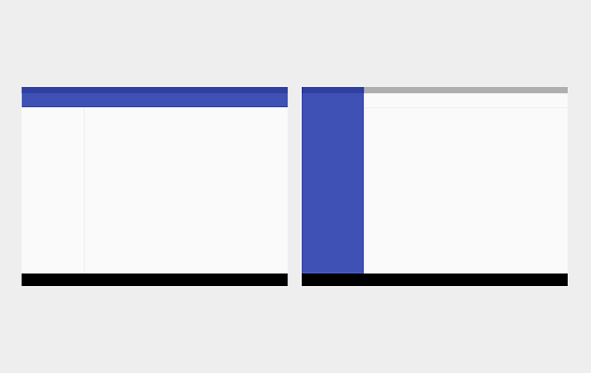

運用空白的地方勾勒出次要的應用區域，這樣可以避免把用戶界面分割出過多L shapes區域。
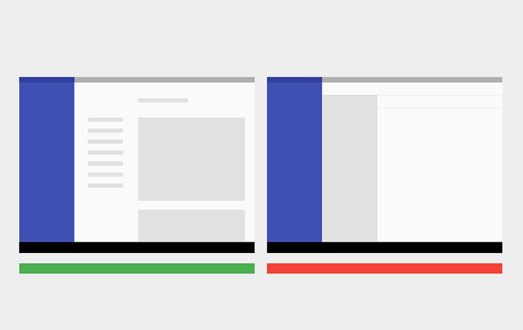

使用卡片和浮起操作按鈕越界。
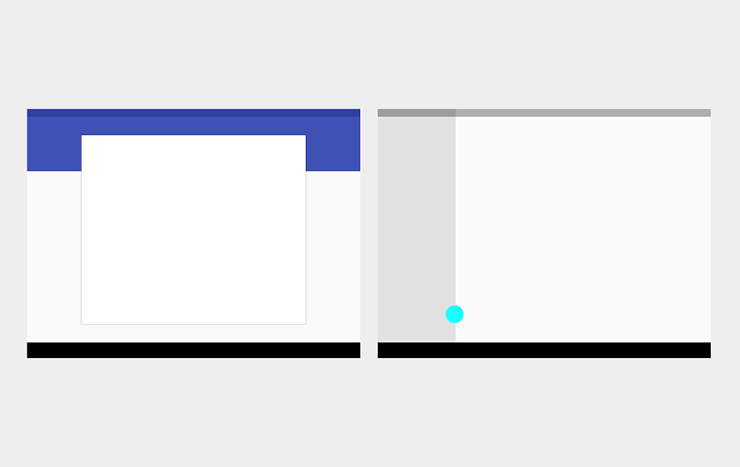

使用卡片去組織那些需要特定操作的內容，又或者使用卡片去特別區分出信息群（空白地方分割線不能有效地卻分這些內容）。

##工具欄

工具欄超有用，它可以被用在應用程式很多地方。以下的例子讓你知道哪些地方你可以顯示：

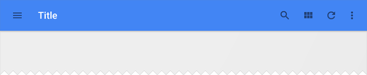

全寬度，默認高度的選單

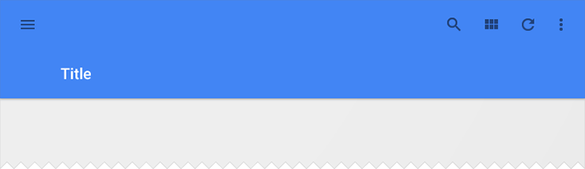

全寬度，拉高了的選單，並且生成了不同的列寬度。

具有列寬的工具欄，並與視圖不同層。

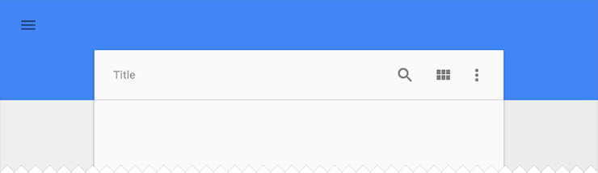

靈活的工具欄和卡片工具欄。

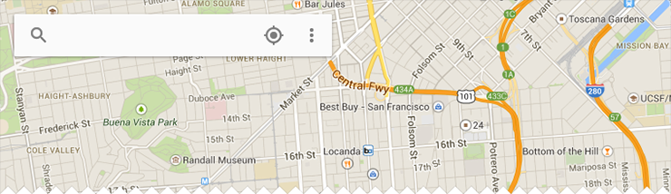

浮起的工具欄

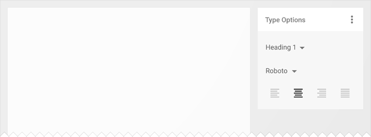

分離的工具欄調色板

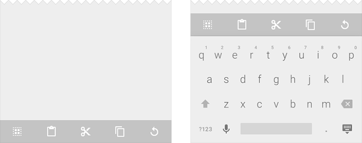

展示一個架的底部工具欄，工具欄本身附在軟鍵盤或者其他元素上

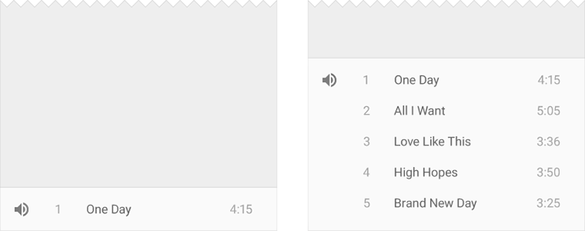

底部工具欄架

##選單

###選單結構

選單用來顯示應用的標識，應用導航，內容搜索以及其他操作（在以前的Android版本中，我們叫它操作欄。）

假如你的應用需要用到邊選欄，標題（Title）可以是應用的名字，頁面標題或者頁面過濾器。

右邊的圖標都是應用本身相關的操作。菜單圖標（Menu Icon）打開的是一個海苔條菜單，這個菜單裡面有贊，幫助，設定和反饋等內容。

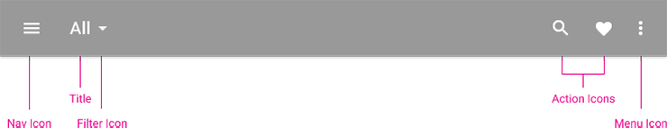

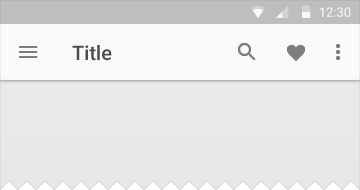
淺色
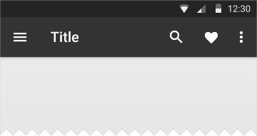
深色

彩色
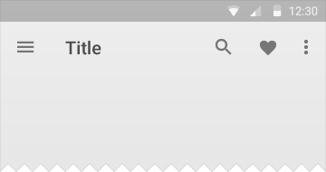
透明

###度量

###默認高度
* 行動裝置風景（Landscape）:48 dp
* 行動裝置人像（Portrait）:56 dp
* 平板電腦/桌上電腦（Tablet/Desktop）:64 dp

對於拉高了的選單，它的高度等於默認高度加上內容高度。

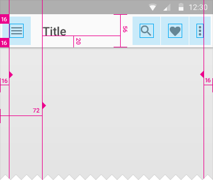  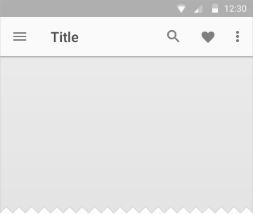  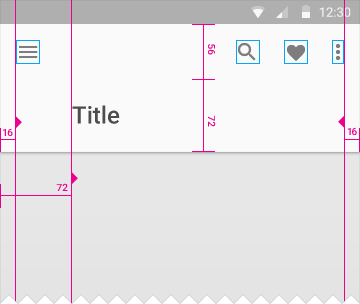  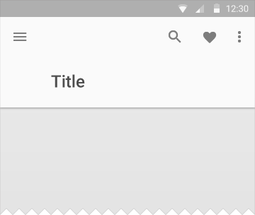  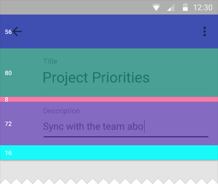  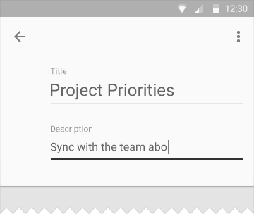

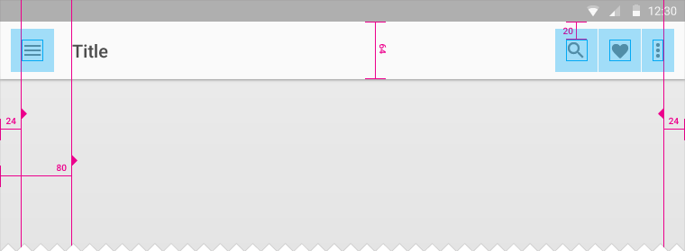

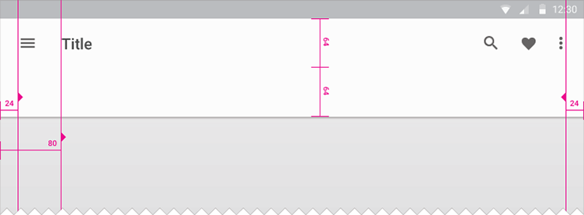

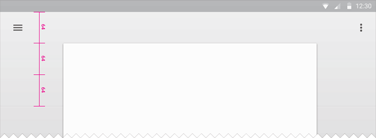

###菜單

菜單是一個總是部分遮蓋選單的表，它並不會通過拉伸選單顯示出來。

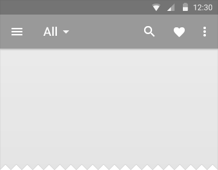  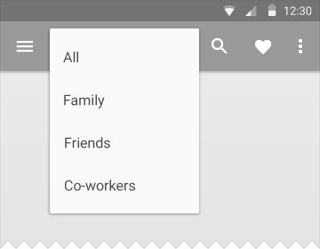  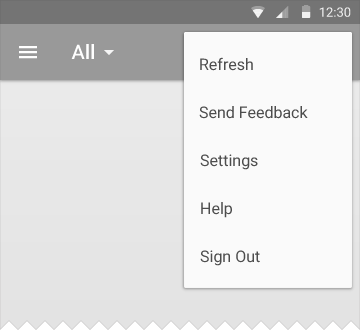  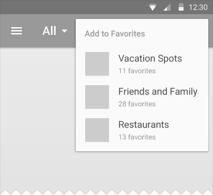  

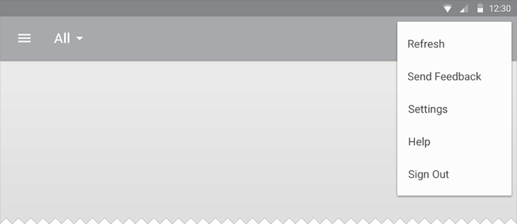

##側欄

若側欄出現，左右邊選欄將會被固定顯示或者暫時覆蓋部分主視圖。左邊選欄的內容應該是基於導航或者基於用戶身份的。而右邊選欄內容則是對主視圖內容的深層描述。

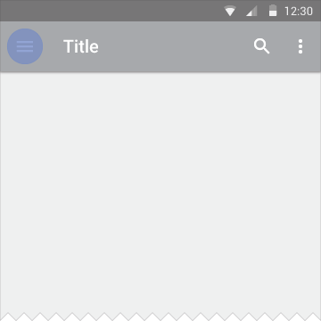  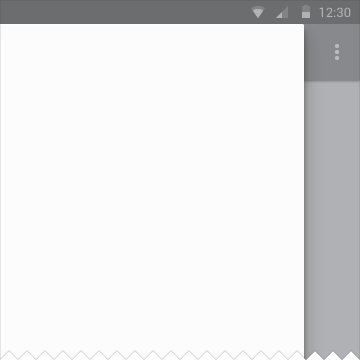

###結構

邊選欄暫時覆蓋內容視圖。邊選欄會釘在內容視圖側邊或者後面。

###度量：
* 行動裝置： 邊選欄寬度 = 屏幕寬度 - 選單高度

例子：
* Nexus 4: 304 dp
* Nexus 5: 288 dp
* iPhone: 264 dp
* 桌上電腦： 左邊選欄最大寬度為 400 dp, 右側則按內容而定。
* 桌上電腦或平板電腦： 假如是釘着的，寬度與列對齊。
* 浮起最大跨度： 304 dp

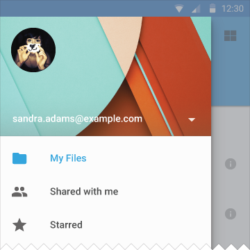  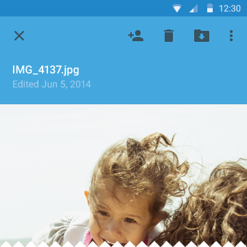

行動裝置

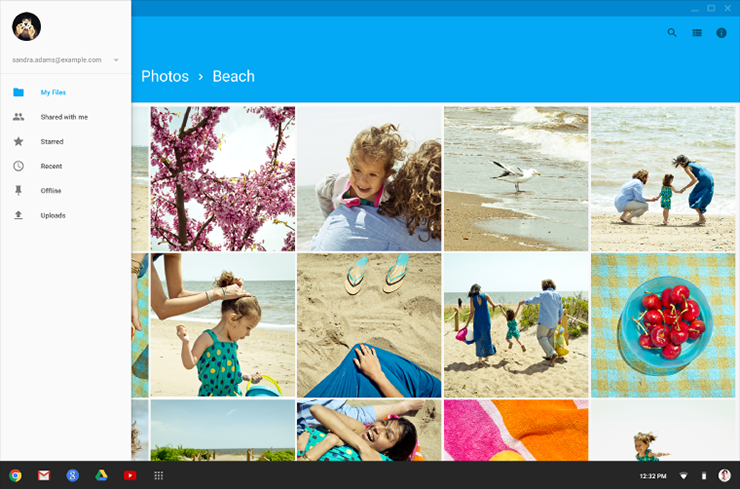

左邊選欄的桌上電腦。

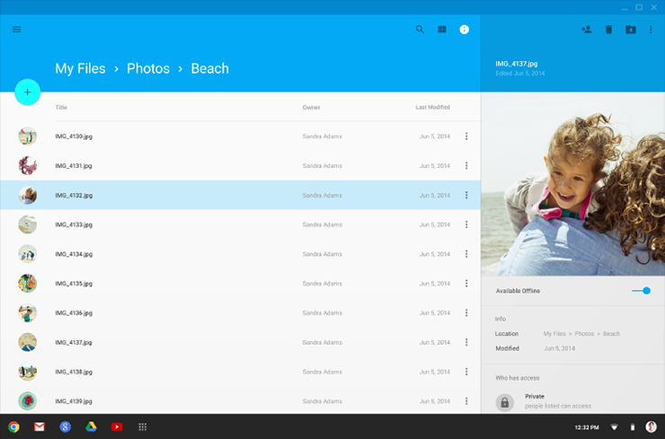

右邊選欄的桌上電腦。

===============

##白框

白框提供各種不同佈局結構，其運用到面，層和陰影。

下载：
[Whiteframes](http://material-design.storage.googleapis.com/downloads/Whiteframes.ai)
15 MB (.ai)

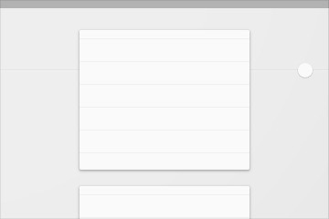
可拓展和折疊內容卡片

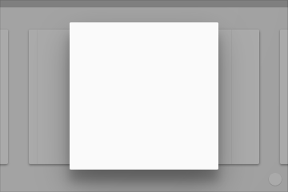
在行動裝置上覆蓋內容細節的聚焦選單（例如日曆）

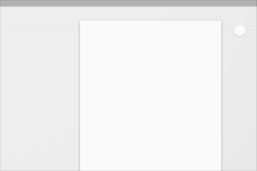
在行動裝置上具有多個工具欄和背景圖的越界內容卡片（例如聯繫人）

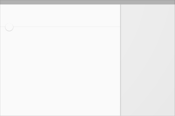
拓展選單和右邊選欄

在行動裝置上的左邊選欄，邊選欄具有一式屬性（例如Gallery）

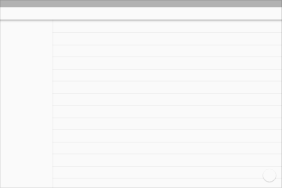
資源列表（例如郵箱頁面）

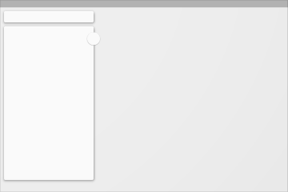
具有搜索欄和卡片式搜索結果單和全屏背景圖（例如google地圖）

可伸展頁腳邊選欄（例如音樂播放列表）