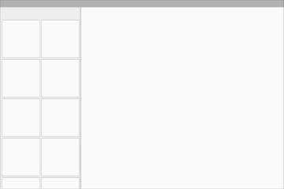

结构
===============

#### 本章内容
* 用户界面区域和指南
* 工具栏
* 选单
* 侧栏
* 白框

##用户界面区域和指南

这章涵盖了从移动应用到桌面应用的高层次结构和包含几点指引。

不同种类的应用需要处理不同的需求。例如：

* 拥有单一屏幕只聚焦一个Activity的应用程式（如计算器，相机和游戏）
* 主要用来切换两个Activity而不需要更深一层进行浏览的应用程式（如语音拨号，最爱，最近电话历史和联系人）
* 糅合广泛数据视图，并需要深层浏览的应用程式（如一个拥有不同文件夹的邮件应用程式或一个拥有商品分类的购物应用程式）

你的应用程式结构将会极大依赖于你所呈现给用户的内容及任务。

### 从最顶层开始
你需要特别关注你应用程式的启动页面。这是用户打开你应用程式所看到的第一个页面，所以对于新用户或者频繁使用的用户来说，启动页面都应该给这些用户很正的体验。

问一下自己：“通常是哪一类的用户可能想用我的应用程式呢?” 根据这个问题，设计出启动页面的体验效果。

#### 呈现应用程式的内容

很多应用程式关注所显示的内容。避免应用程式只能枯燥地浏览一堆屏幕，相反，通过把最核心的内容放到你的启动页面可以让用​​户了解你的应用最核心的功能和内容。

#### 内嵌式导航和操作。

正如任何的工具栏，选单可以组织重要的那些操作。它的位置在屏幕的上方，这样使它理想地呈现出导航控制操作，如切换栏标（tab）或者打开左侧的边选栏。如果应用的内容是可以查找的，在选单上放置一个查找操作，这样能让用户直接访问他们想看的内容。

#### 坚持应用的功能

当你的应用程式有大量的内容或者功能时，你应该让用户关注到你产品最为重要的功能上。在内容区域内高亮这些目标功能。把最有特色的操作链接的凸出操作按钮上。减少在应用程式内不必要的操作路径。

### 顶层视图策略
通过向用户介绍主要的功能区域，顶层与应用功能通信。有些应用程式具有。其他应用程式里，顶层会包含多个视图，你必须保证用户能够高效地浏览这些不同的视图。

选择最适合你应用浏览需要的方法。

#####关注一个内嵌导航栏的单一视图。
直接内联应用的内容到相应的导航栏选项上，这样，用户对你的应用程式内容一目了然。这方法适合那些具有简易的导航模型的应用程式。不过，如果用这方式去呈现大量导航路径将会减少显示内容的空间，同时，相对于共置这些路径到一个便捷的地方来说，这方式会彻底分散整个屏幕。

若使用内嵌导航：

* 你的应​​用程式有一个优良的主要视图，并无其他可以替代这个视图的视图。
* 在主要视图内你的用户可以便捷地执行最常用的任务。
* 潜在用户并非经常使用你的应用程式，他们更喜欢直接的内容访问路径。

#####使用栏标切换少量同等重要的视图。
如果你的应用程式只拥有少量功能区域，并且每个功能区域是浅层次的，使用栏标增加用户对这些同等顶层视图的关注。这样也使这些功能通过一次点击或一次滑动快速转换。但是，对于小屏幕来说栏标会很占地方，并且栏标只适合具有简洁标签名的少量顶层视图。

若使用栏标：

* 使用你应用程式的用户将会频繁切换这些视图。
* 应用程式有数量有限的顶层视图。
* 你需要用户高度关注每一个栏标的视图。

#####通过边选栏管理复杂的结构。
左侧的导航面板可以同时显示大量导航项。这特别适用于你的应用程式只有一个主页面，而边选栏则用来存储那些不是经常访问的内容。如果你的应用需要让底层视图切换到应用程式的其他重要部分，滑动出左边选栏能够让用户高效地切换他们想要访问的内容。但是，因为边选栏的功能可见性不强，用户或者需要时间去熟悉整个应用程式的内容。

若使用边选栏：

* 你的应​​用程式拥有大量的顶层视图。
* 你需要实现通过导航的快速切换视图（这些视图无直接联系）。
* 应用程式内包含一些深层浏览分支但在需要时，可快速回到应用程式的顶层。
* 你想减少程式中的不经常访问内容对用户可见性。

即使你使用了某一个顶层视图策略，情景导航依然是访问相关数据的有力方式。例如直接关联：一首歌曲和演绎这首歌艺人的其他歌曲、最近使用项和整个使用历史，又或者某个用户的一个贴子和他们的个人资料。这些直接关联可以把一个主要任务延伸到其他相关的任务操作。

###行动装置

这个结构包含一个固定的选单和一个浮起的操作按钮。有一个可选实现的底栏用于添加额外功能和更多操作。左右两侧的边选栏可以用于隐藏所有其他结构的元素，用户需要的时候才访问到。

###平板电脑

这个结构包含一个固定的选单和一个浮起的操作按钮。这个选单拥有与平板电脑和行动装置的底栏的元素。有一个可选实现的底栏用于添加额外功能和更多操作。左边选栏可以用于隐藏所有其他结构的元素，用户需要的时候才访问到。右边选栏可以固定在右侧又或者需要时才访问。

###桌上电脑

这个结构包含一个固定的选单和一个浮起的操作按钮。这个选单拥有与平板电脑和行动装置的底栏的元素。在允许的情况下，窗口都会放置到选单内。边选栏可以需要时访问或者固定在左右两侧。边选栏菜单和内容Canvas可以拥有他们自己的次工具栏（如栏标，画板或者次操作）。

###用户界面指南

定义基本的水平或垂直的分割线

运用空白的地方勾勒出次要的应用区域，这样可以避免把用户界面分割出过多L shapes区域。

使用卡片和浮起操作按钮越界。

使用卡片去组织那些需要特定操作的内容，又或者使用卡片去特别区分出信息群（空白地方分割线不能有效地却分这些内容）。

##工具栏

工具栏超有用，它可以被用在应用程式很多地方。以下的例子让你知道哪些地方你可以显示：

全宽度，默认高度的选单

全宽度，拉高了的选单，并且生成了不同的列宽度。

具有列宽的工具栏，并与视图不同层。

灵活的工具栏和卡片工具栏。

浮起的工具栏

分离的工具栏调色板

展示一个架的底部工具栏，工具栏本身附在软键盘或者其他元素上

底部工具栏架

##选单

###选单结构

选单用来显示应用的标识，应用导航，内容搜索以及其他操作（在以前的Andr​​oid版本中，我们叫它操作栏。）

假如你的应用需要用到边选栏，标题（Title）可以是应用的名字，页面标题或者页面过滤器。

右边的图标都是应用本身相关的操作。菜单图标（Menu Icon）打开的是一个海苔条菜单，这个菜单里面有赞，帮助，设定和反馈等内容。

浅色

深色

彩色

透明

###度量

###默认高度
* 行动装置风景（Landscape）:48 dp
* 行动装置人像（Portrait）:56 dp
* 平板电脑/桌上电脑（Tablet/Desktop）:64 dp

对于拉高了的选单，它的高度等于默认高度加上内容高度。

     

###菜单

菜单是一个总是部分遮盖选单的表，它并不会通过拉伸选单显示出来。

   

##侧栏

若侧栏出现，左右边选栏将会被固定显示或者暂时覆盖部分主视图。左边选栏的内容应该是基于导航或者基于用户身份的。而右边选栏内容则是对主视图内容的深层描述。

 

###结构

边选栏暂时覆盖内容视图。边选栏会钉在内容视图侧边或者后面。

###度量：
* 行动装置： 边选栏宽度= 屏幕宽度- 选单高度

例子：
* Nexus 4: 304 dp
* Nexus 5: 288 dp
* iPhone: 264 dp
* 桌上电脑： 左边选栏最大宽度为400 dp, 右侧则按内容而定。
* 桌上电脑或平板电脑： 假如是钉着的，宽度与列对齐。
* 浮起最大跨度： 304 dp

 

行动装置

左边选栏的桌上电脑。

右边选栏的桌上电脑。

===============

##白框

白框提供各种不同布局结构，其运用到面，层和阴影。

下载：
[Whiteframes](http://material-design.storage.googleapis.com/downloads/Whiteframes.ai)
15 MB (.ai)

可拓展和折叠内容卡片

在行动装置上覆盖内容细节的聚焦选单（例如日历）

在行动装置上具有多个工具栏和背景图的越界内容卡片（例如联系人）

拓展选单和右边选栏

在行动装置上的左边选栏，边选栏具有一式属性（例如Gallery）

资源列表（例如邮箱页面）

具有搜索栏和卡片式搜索结果单和全屏背景图（例如google地图）

可伸展页脚边选栏（例如音乐播放列表）
