#手势

手势控制分为触发动作 Touch Mechanics（用户手指在屏幕上如何动作）和触发行为Touch Activities （在界面上以某种动作操作，造成了与当前情境相关的结果）两大类别。

这是因为同样的碰发动作（如单次点击）可能会在不同情境下造成不同的结果（如轻触，取消，启用／关闭光），并且单次行为（如放大）可能是由多种触发动作（如捏放，双次触击，双次触击拖拽等）实现

## 触发动作

触发动作是用户的手指在界面上做了什么

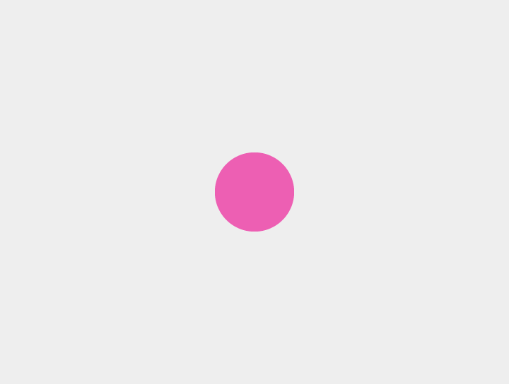
####单次触击(Touch)
一只手指按下，提起
例如：选择

####双次触击(Double Touch)
两只手指按下， 提起，其中一只手指按下，提起
例如：放大

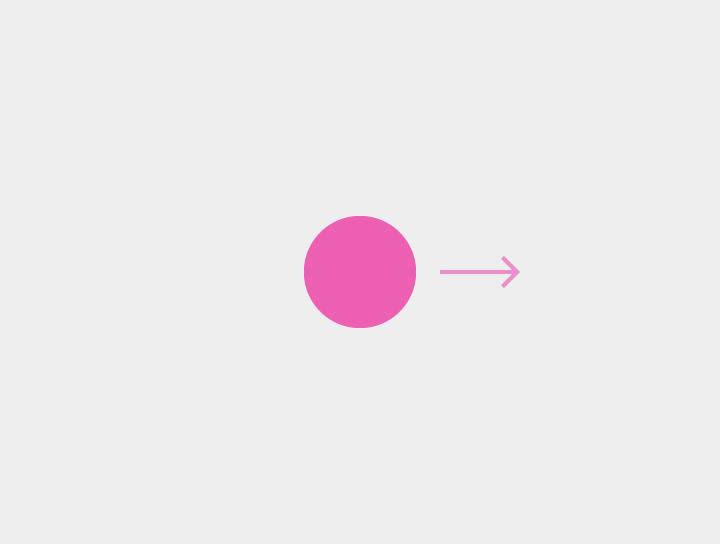
####拖拽(Drag)，轻扫(Swipe)和快掷(Fling)
一只手指按下，移动再提起
例如取消， 滑动，倾斜

####长按
一只手指按下，稍后再提起
例如：选择列表中的某项之类的单个元件

长按不能用来展示一个情境菜单

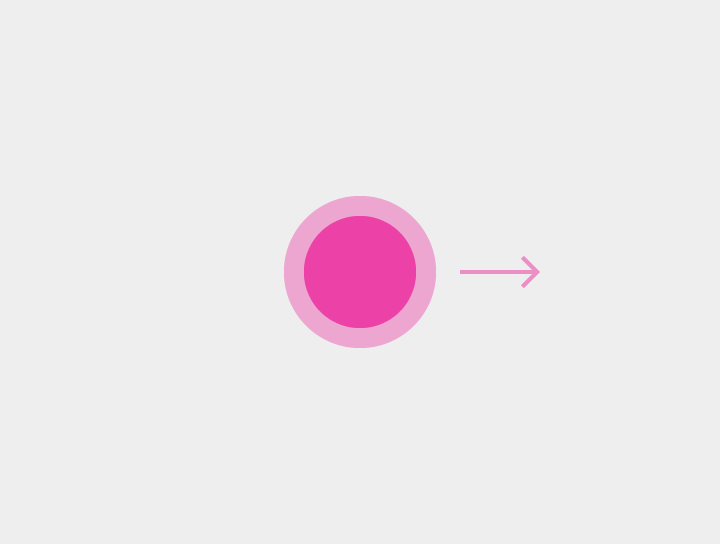
####长按拖动
一只手指按下后稍后，移动，再提起
如：选择后移动某项，或是选择多项

####双触拖动
一只手指按下后提起，快速重复该动作
例如：放大，缩小

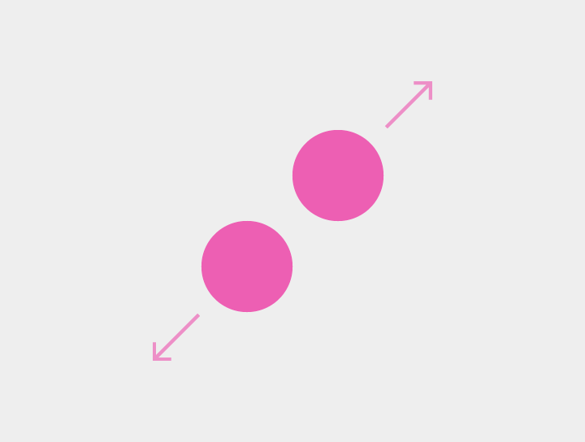
####捏放(Pinch Open)
双指按下，向外移动，再提起
例如：放大

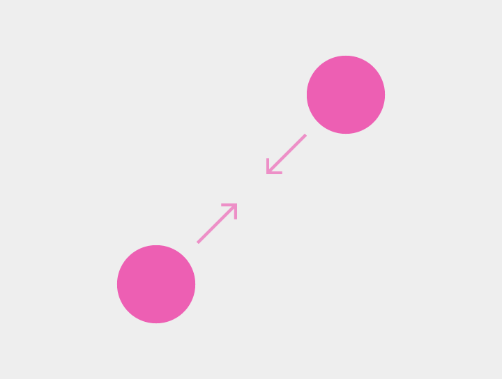
####捏合
双指按下，向内移动，再提起
例如：缩小

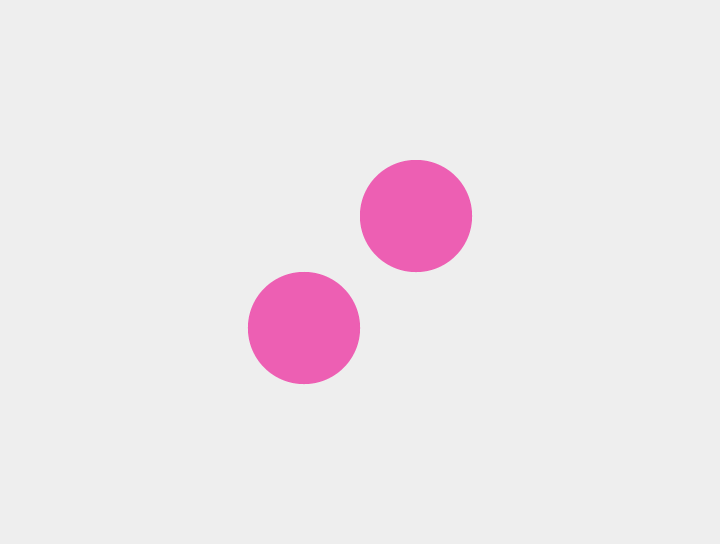
####双指触击
双指快速按下，提起
例如：放大

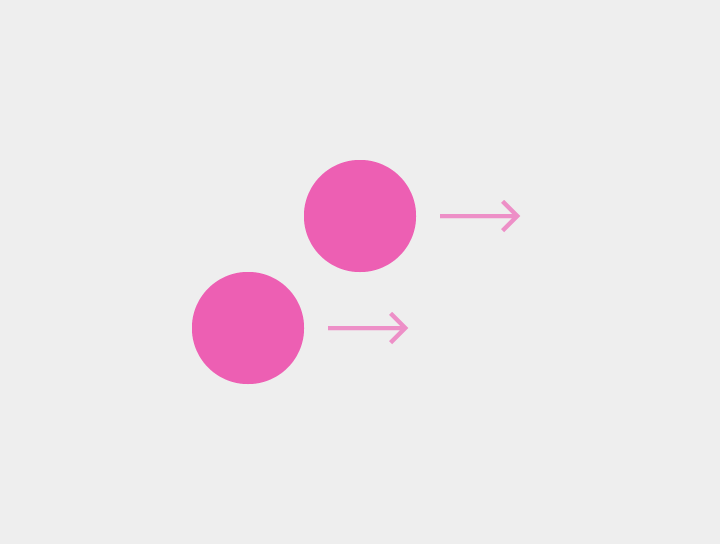
####双指拖拽，轻扫和移动
两指按下，移动后提起
例如：选择多项条目，拖拽(Pan)，倾斜(Tilt)

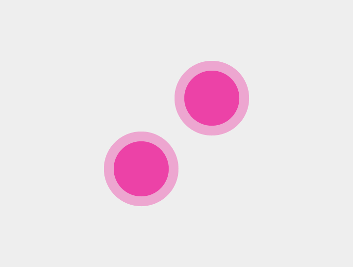
####双指长按
双指按下，稍后提起
例如：暂无

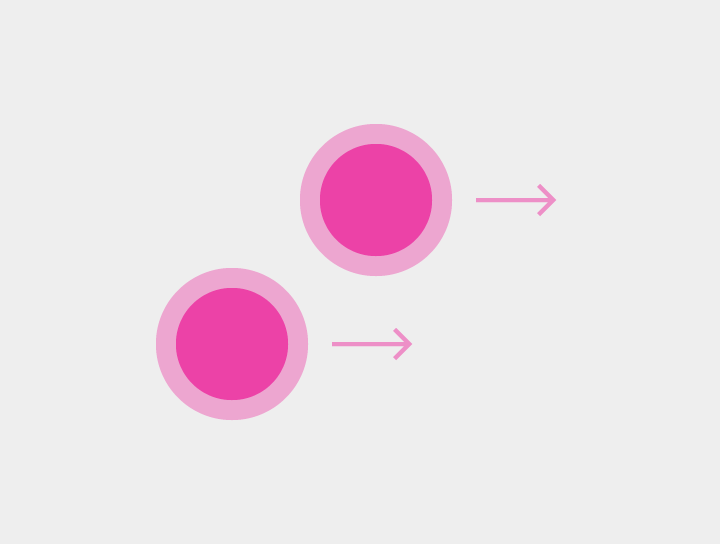
####双指长按拖动
双指按下，稍后移动，再提起
例如：选择后移动

####双指双次触击
双指快速按下提起，重复一次该动作
例如：放大

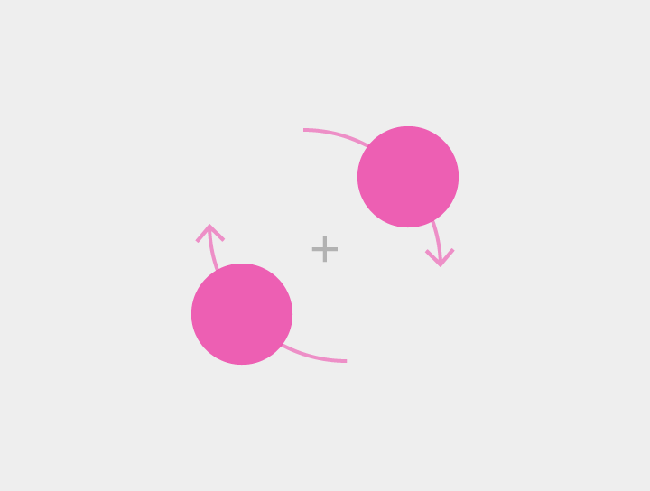
####旋转
双指按下，以任意点为圆心快速转动，再提起
例如：在地图中旋转内容

##触发行为

特定手势在界面操作时引发了针对某个情境的结果

####点触（Tap）
激活如按键之类的某个屏幕元件

####取消或退出（Cancel or Escape）

取消或退出当前任务，如对话或菜单
触发动作：单次触击

####开启／关闭指示灯（Enable/Disable lights out）
隐藏或显示一个窗口
触发动作：单次触击

####拖拽（Drag)，轻扫(Swipe)和快掷(Fling)
参照下文中对这些行为的区分：滚动，滚动显示，取消，拉拽更新，从边缘滑动，页面滑动等

####内容选择（Data selection ）（当前没有选中项时）
选择某个元件
触发动作：长按，双指触击
####内容选择（已有项目被选中时）
在选择状态下，选择更多的元件。可以和任何其他单指或双指手指结合使用。
触发动作：长按，双指触击

####多项内容选中拖移 （Data multi-selection drag）
在手势发起方向显示选择框。选择框的高度和宽度可以由手指位置进行调整。选框尺寸和手指提起的情况决定最终选择。
触发动作：双指轻扫或拖动，在没有项目选中时长按拖动

####选择后移动 (Pick up and Move)
对于已选的单个或多个项目生效。可用于：
- 在一个视图内重新安排内容。
- 将某个元件移动到一个目标内
- 将列表里的项目重排
触发动作：两指长按拖动，对于已选项长按拖动

####放大（Zoom in）
将内容的尺寸放大
触发动作：
- 双次触击
- 双触拖动（下）
- 捏放

####放大至可用（Zoom in to fit）

作用于缩略图，将最小尺寸的图片放大
触发动作：双次触击

####缩小（Zoom out）

将内容的尺寸缩小
触发动作：
- 在元件最大尺寸时双次触击
- 双次触击拖动
- 捏合
- 双指触击
- 双指双次触击

####展开（Expand）

展开被折叠了的内容
触发动作：
捏放

####折叠（Collapse）
折叠被展开的内容
触发动作：捏合

####旋转 （Rotate）
旋转目标内容
触发动作：旋转

####拖拽(Drag)，轻扫(Swipe)和快掷(Fling)
由于滑动的手势动作可能因为情景的不同而产生不同效果，这里将对一些主要的滑动手势和他们的区别进行描述。

手势的速率（由小至大）是拖拽，轻扫和快掷的主要区别。根据使用的情景，手势的速率会产生不同的效果：
- 拖拽：精确手势，较慢，更为细致，通常是针对屏幕的某个特定目标进行操作
- 轻扫：粗放手势，略快，通常没有一个特定的屏幕目标
- 快掷：粗放手势，没有特定屏幕目标

轻扫的行为也可能因为动作结束时过大速率或是作用元件的速率达到某个阀值而成为快掷行为。

通常手势的速率会决定该动作在超过一定范围时是否可逆：一次拖拽行为中手指会和元件保持接触，而反向操作会将元件拖回到原位；一次快掷行为会在达到阀值时与元件脱离接触，此时反向操作也不会取消上次操作。

####滚动（Scroll）
对主题内容水平或垂直方向的滑动
滑动的程度根据手势的速度来决定： 拖拽（慢）VS 滚动 VS 抛掷 fling（快）

通常情况下： 
- 滚动的方向只有上下或左右（mutually exclusive）
- 适用于内容尺寸为100％

####滚动显示（Reveal upon Scroll)

向当前内容页面滚动的反方向滚动可以快速显示在这个应用里隐藏的元件。比如在chome浏览器里，向下展开会显示地址栏。 

往正常方向滚动可以恢复原有状态

####拖拽（Pan）

任意方向，一或两只手指

通常应用于内容是无边界时（如地图）
内容比屏幕显示尺寸大（如放大查看网页或图片时）

两只手指拖拽会形成内容的倾斜

拖动（drag）就是运用了拖拽的典型

快掷会保持手势的速率，在该快掷方向上形成一个比拖拽更为明显的效果
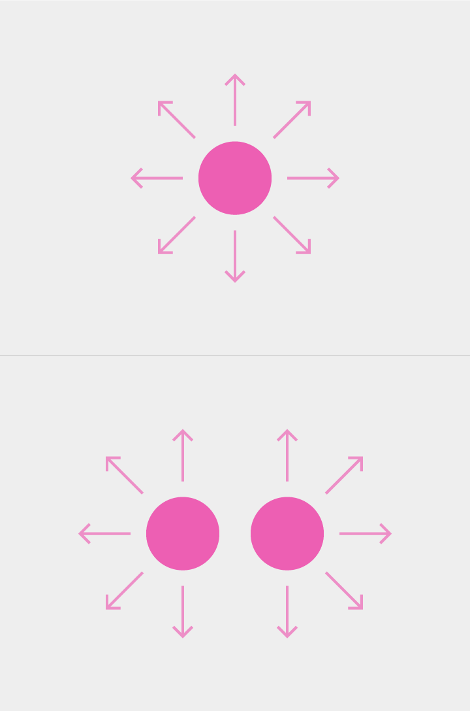

####消除（Dismiss）
从一个可以扫动的元件开始，比如列表中的一项或是卡片状原件

方向于滚动的方向垂直
一般是水平的某个方向，对称使用。
消除手势要达到某个阀值才会生效
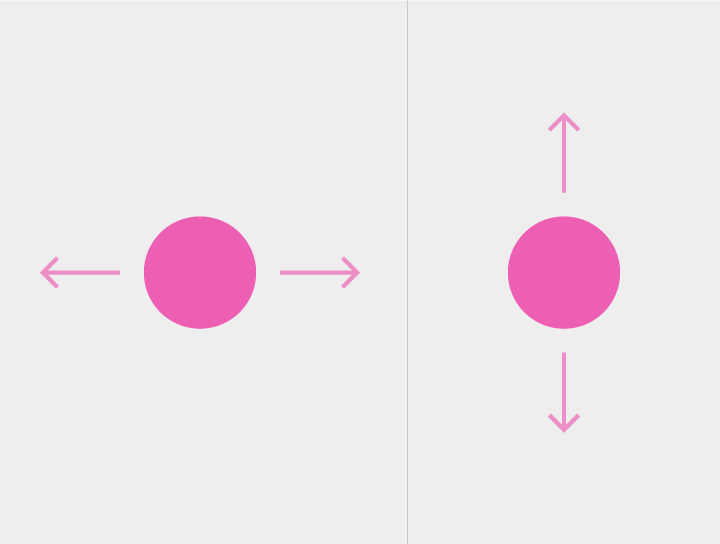

####拉动刷新（Swipe to Refresh)

作用于列表的起始项上面，或者是界面内容开始的那头的空白的边缘

方向通常是垂直向下

####边缘滑动（Edge Swipe)

边缘滑动从屏幕外开始的滑动动作。用于激活与当前场景不相关或有区别的内容

在没有定义边缘滑动的情况下，边缘滑动动作的效果默认为和页片滑动一致

边缘滑动要达到某个阀值才会生效
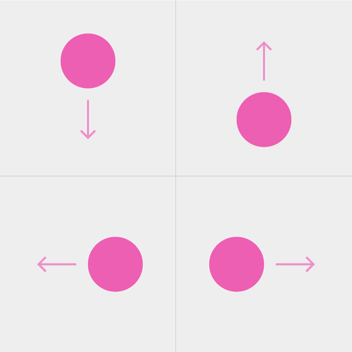

####页片滑动 (Paging Swipe)

页片滑动是在屏幕内容上的滑动，用来显示剩下的内容。

如果有单独元件是可以滑动的，则不要使用页片滑动。每一次页片滑动是用来显示下一个页片／标签。

如果当前页片内容是放大过的，首次页片滑动只会显示剩余的内容，再一次页片滑动才会切换页片。

参见：滑动折叠
页片滑动要达到某个阀值才会生效
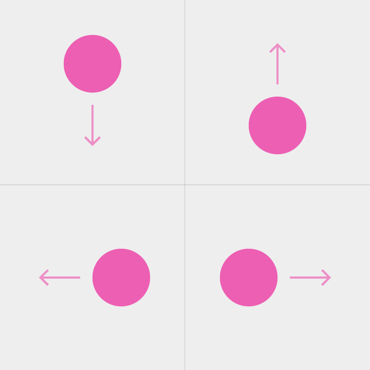

####滑动折叠（Overscroll Collapse）

在滚动页面的顶部或底部使用页片滑动可以切换到上一级内容。
要达到某个阀值才会生效
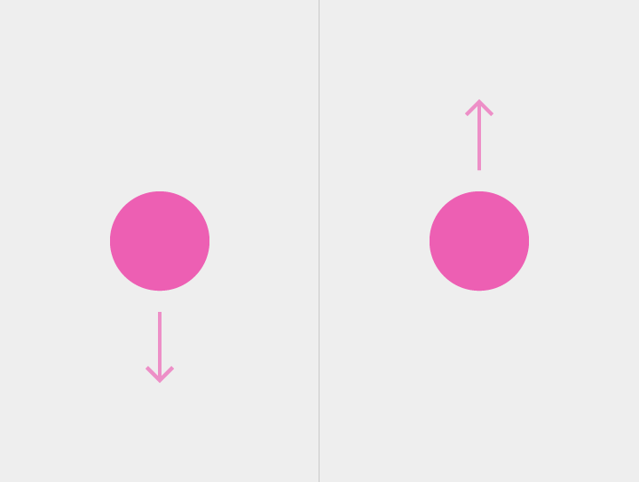

####菜单打开(Menu Open)
从一个菜单或选项中拖拽出现内容。 菜单栏中相对当前项目的一项高亮显示。

菜单通过触击出现
菜单打开的动作通过拖拽实现（drag）

####倾斜（Tilt）
倾斜3D 内容使之前进或后退

在地图之类的应用中，其他的两指操作手势（如捏放或旋转）会形成两指的缩放

倾斜会使用拖拽动作
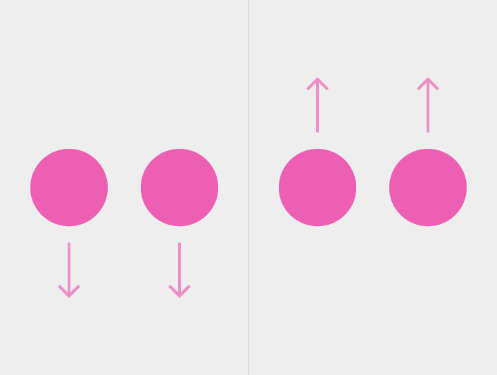

参照了Daqian.Dong对于折叠，展开的解释 http://www.ui.cn/project.php?id=19050 
