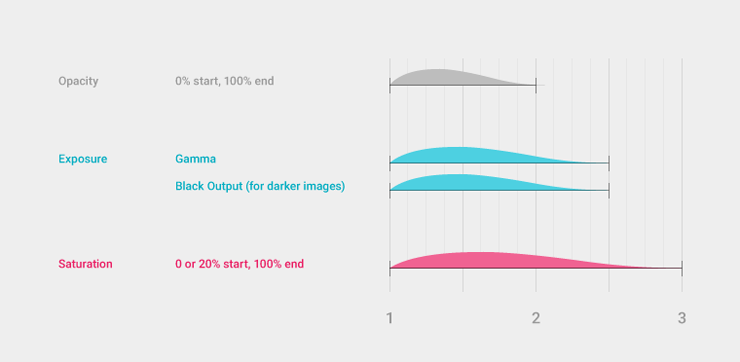
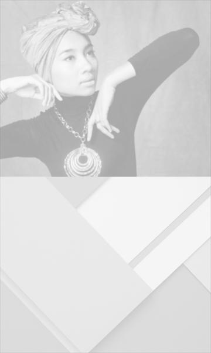
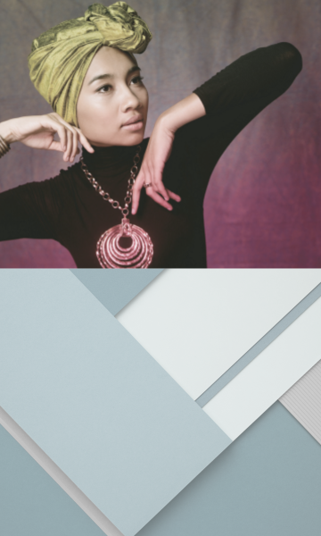
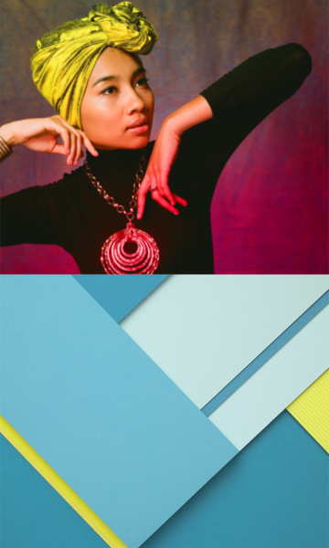
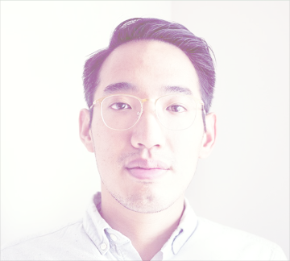
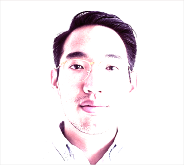

# 影像处理

## 图片载入

###图片载入

在交错的期间，插图和照片可以在三个维度下载入和过渡，而不是只依靠透明度的改变。调节等级是为了达到曝光上的低对比度和颜色上的低饱和度。在最后的阶段，图片只有在透明度已经达到100%之后，才会达到一个全彩色的饱和度。较暗图像的低对比度的效果是伽马值的升高和黑色通道输出的升高组合产生的。   

          

    
低透明度和低对比度                        

    
全透明度和完全曝光       

    
全色彩饱和度（感觉这里少了full）   

###光圈与显影

不要用那种会把白色部分去除的方式调节等级，因为这会造成一种通过相机镜头光圈过度曝光的效果。最好把照片想成是在照片显影过程中逐渐浮现。    
  
    
要这样    

    
不要这样   
  
###载入和过渡

用上面图中画出的三个维度（透明度、对比度和饱和度）的比例来满足你载入和过渡时的需求。建议载入时变换的持续时间长一些，过渡时变换时间短一些。     

<video crossorigin="anonymous"  loop  controls width="720" height="720">
<source src="http://materialdesign.qiniudn.com/videos/patterns-imagerytreatment-load-transition_large_xhdpi.webm" type="video/webm">
</video>   

####在大屏幕上载入

这个过程在大屏幕上是最理想的，就像这个载入chrome操作系统的壁纸的例子。      
 
<video crossorigin="anonymous"  loop  controls width="1120" height="743">
<source src="http://materialdesign.qiniudn.com/videos/patterns-imagerytreatment-load-transition-desktop_large_xhdpi.webm" type="video/webm">
</video> 
 
####加入动画

在如账号切换的情况下，可在这里说的图像处理之上再加一些位置的变化。   
     
<video crossorigin="anonymous"  loop  controls width="720" height="720">
<source src="http://materialdesign.qiniudn.com/videos/patterns-imagerytreatment-adding-animation_large_xhdpi.webm" type="video/webm">
</video>

> 原文：[Imagery Treatment](http://www.google.com/design/spec/patterns/imagery-treatment.html)  翻译：[ZeroLu](https://github.com/ZeroLu)  校对：[尚未校对](http://design.1sters.com)

