# 抽屉式导航 #

**抽屉式导航是Google应用程序中一种常见的模式。抽屉导航从左侧滑出，它遵循列表的关键设计线和标准。**

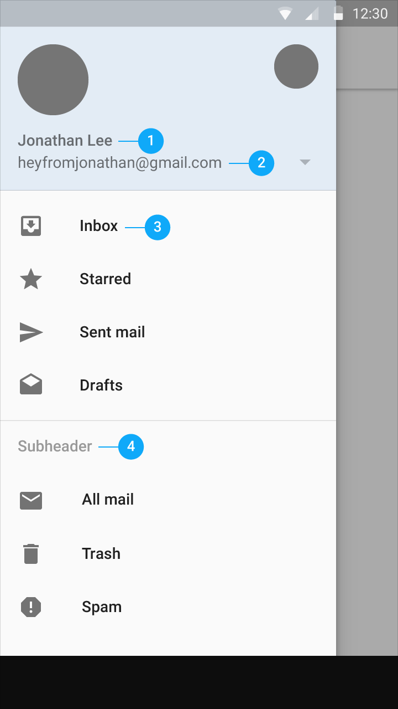 

**排版样式**  
字体，字号，颜色：  
1. Roboto Medium, 14sp, #FFFFFF  
2. Roboto Regular, 14sp, #FFFFFF  
3. 列表项: Roboto Medium, 14sp, 87% #000000  
4. 副标题: Roboto Medium, 14sp, 54% #000000。对其到16dp关键设计线。 

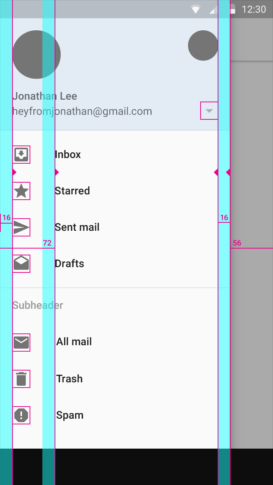   

**垂直关键设计线和水平间距**

图标的垂直关键设计线是距侧边导航左右边缘均为16dp的设计线，并且图标颜色为不透明度为54%的黑色（#000000）。

与图标或头像对应的文本内容距导航左侧边缘72dp。

侧边导航的宽度等于屏幕的宽度减去actionbar的高度，或者是距屏幕右侧边缘56dp。侧边导航的最大宽度是5倍于标准增量（手机上是56dp，平板上是64dp）。

在手机上使用16dp的水平距离，在平板则上使用24dp。

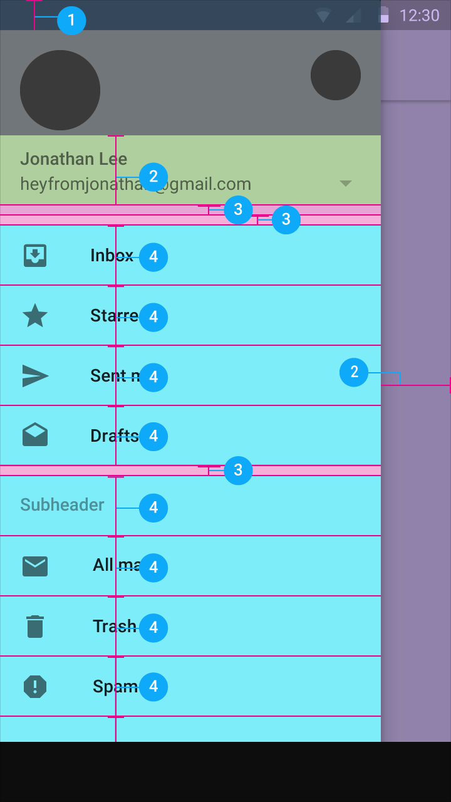 

**垂直间距**

1. 24dp  
2. 56dp  
3. 8dp  
4. 48dp  
 
在每个列表组的顶部和底部添加8dp的间距。一个例外的情况是，当这个列表组有一个副标题的时候顶部不需添加8dp的间距，因为副标题包含有他自己的间距设定。

##**高度**##

抽屉导航的占据了屏幕的全部高度，并且抽屉导航在状态栏的下方。抽屉下方所有的东西会覆盖一层阴影（scrim）而变暗。阴影下的所有内容依然是可见的。

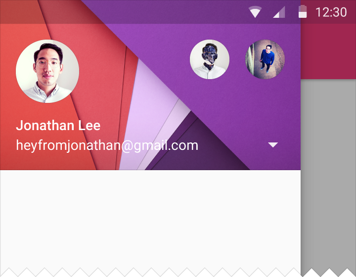 

**Android上的抽屉导航**

## **选择状态** ##

当列表中的一项被选择后，那一项会变为应用程序的主色调，或者是不透明度为100%的黑色，以此来凸显此项被选中。触摸纹波也是一种高亮，进一步凸显列表项被选中。

如果这种颜色触摸纹波/高亮不能与程序主色调形成足够的对比，那么就使用的程序主色的暗色调。

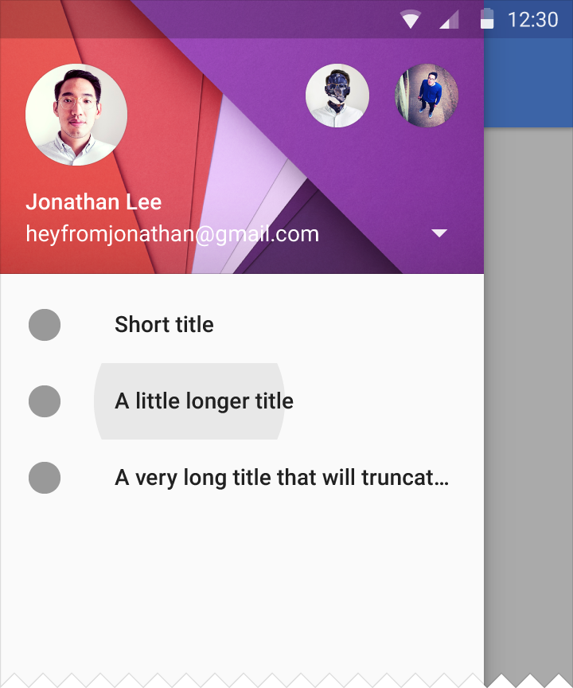 
 
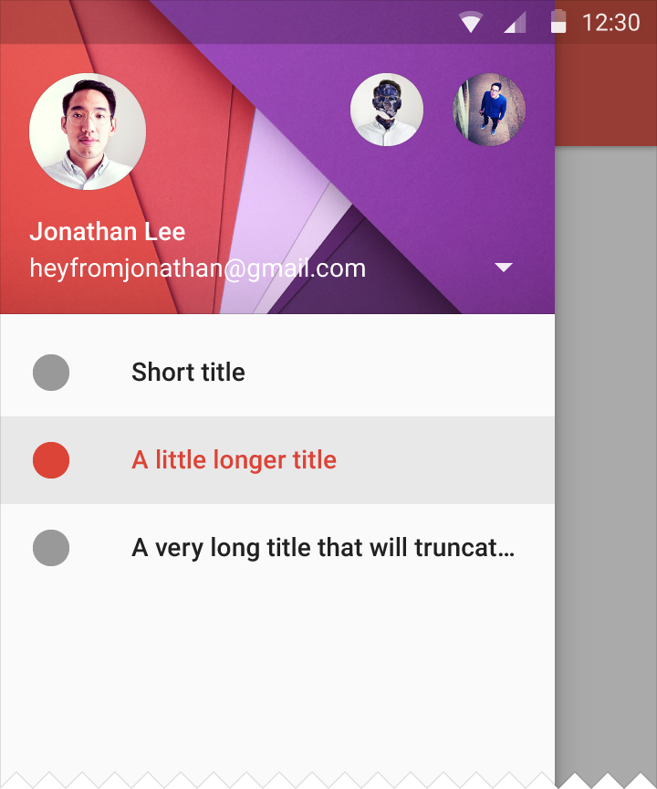 
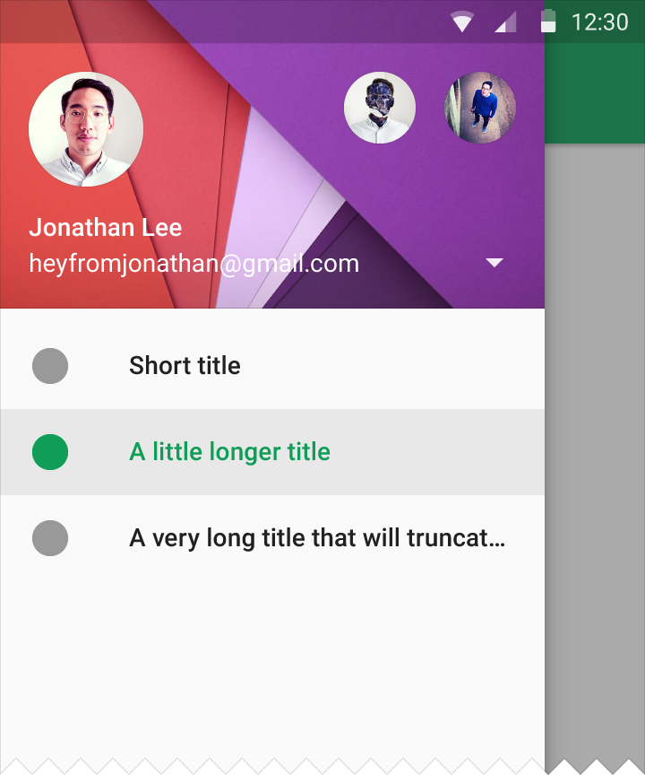 
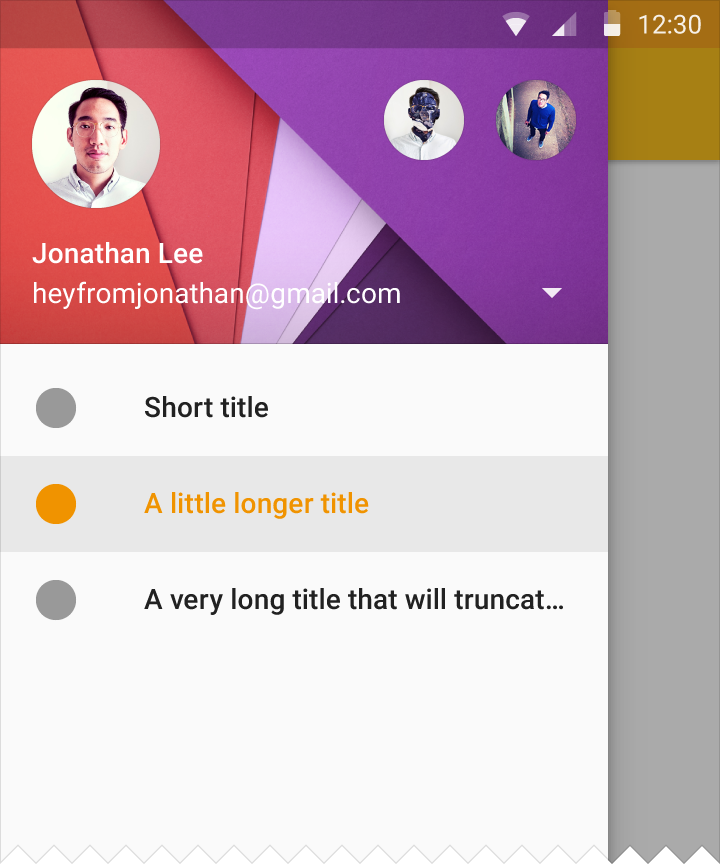 
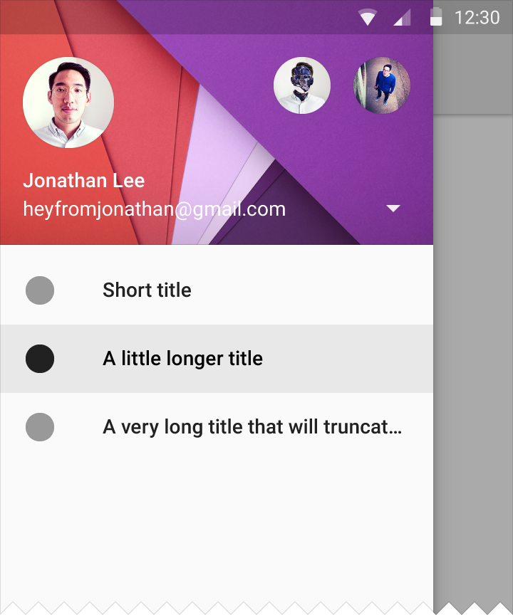 

##**分隔线**##

在导航抽屉里所有分割线都是完全在抽屉面板内部。此外，在分隔线上方和下方均有8dp的间距。

 

**上下文**

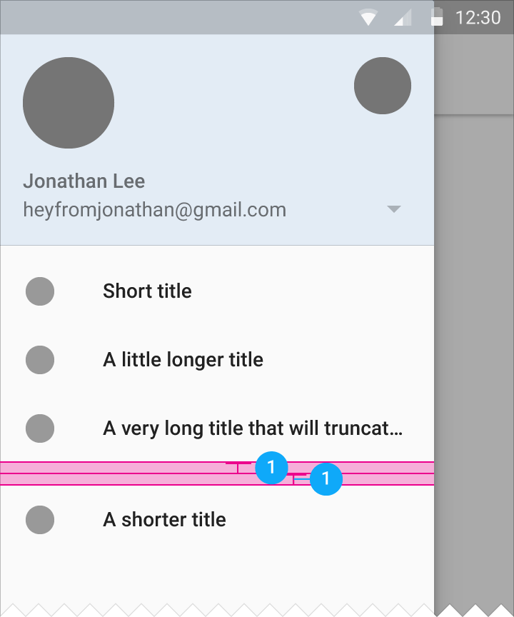 

**8 dp 垂直间距**

##**滚动**##

抽屉导航可以像任何普通视图一样滚动。

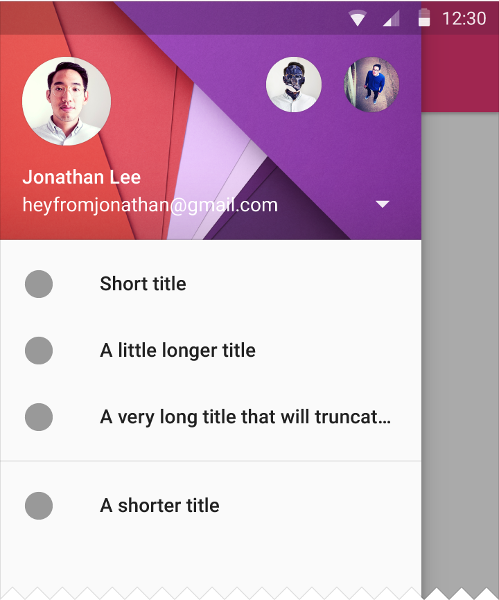 
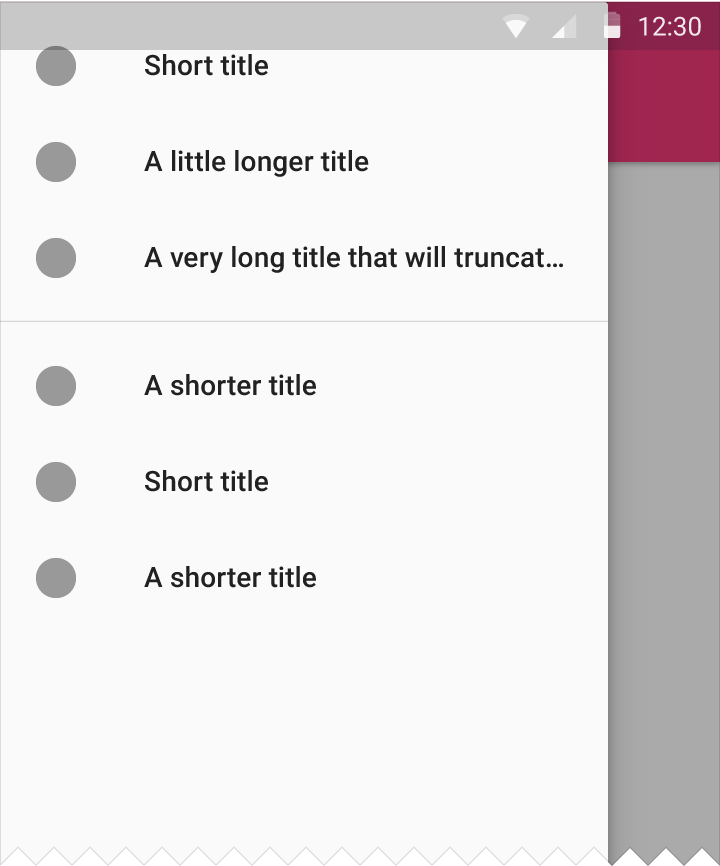 
 

##**设置和支持**##

设置和支持位于滚动列表的底部，与列表内容的其余部分排成列。 

如果在导航抽屉中的内容列表很长，设置和支持这两项可以被钉在导航抽屉的底部（译者：非列表底部）较高一层的视图上。该视图层（显示设置和支持的视图层）只有在列表显示顶部的时候才显示;任何在其他的位置的滚动会立即使该视图层消失，并且把设置和支持这两项加到列表底部，与列表内容的其余部分排成列。当关闭和重​​新打开抽屉式导航的时候，抽屉导航保持其滚动到的位置。（译者：其实现在的Play商店和Gmail都没有严格按照这个标准来。从Inbox上倒是可以看到一点影子。2014-12-10）

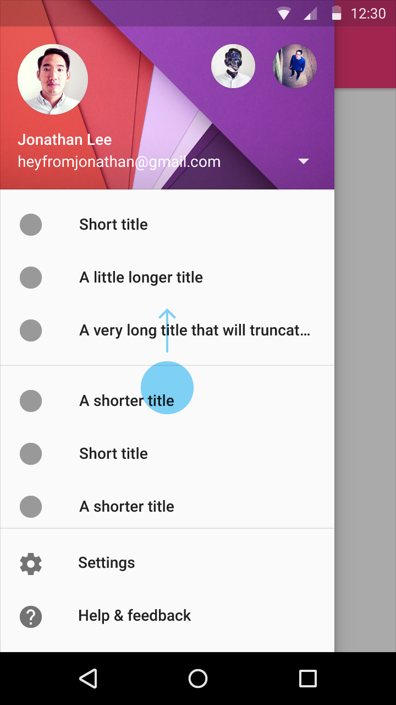
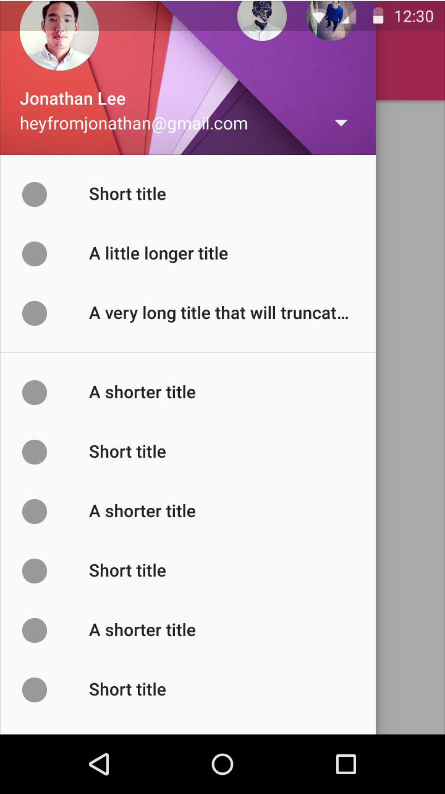

如果列表不用滚动，那么设置和支持项会在列表底部显示，而且不用被钉在底部。

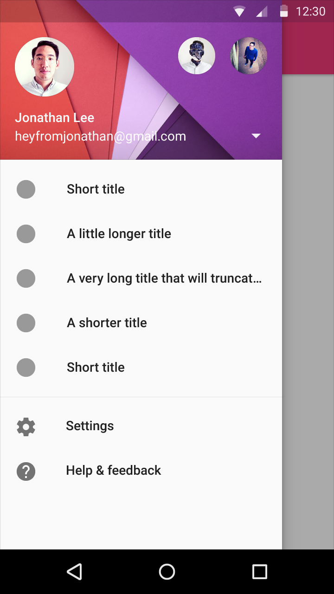