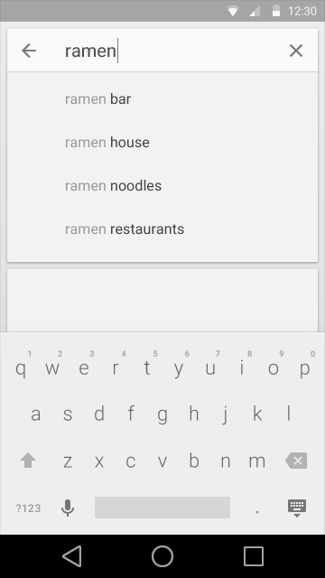
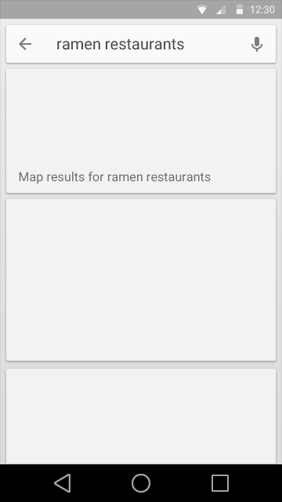
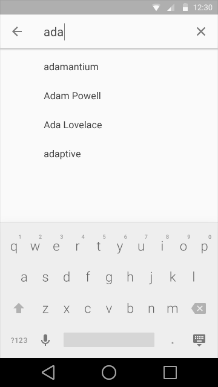
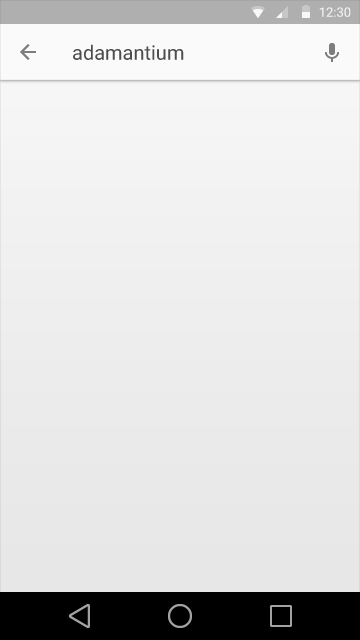

#搜索(Search)

## 应用内搜索

当应用支持大量信息的时候，用户希望能够通过搜索快速地定位到特定内容。

在其最基本的形式中，搜索包括：

* 打开一个搜索文本框
* 输入查询并提交
* 显示搜索结果集

然而,通过加入一些增强功能显著提升搜索体验:

* 启用语音搜索
* 提供基于用户最近查询的历史搜索建议,即使是在输入查询之前
* 提供满足应用数据中实际结果的自动完成搜索建议

应用内搜索中有两种主要的模式:**持久性搜索(persistent search)**和**可扩展搜索(expandable search)**。

##持久性搜索(persistent search)

持久性搜索适用于当搜索是你应用中的主要关注点时。

一个已准备好接受焦点的文本框显示在内嵌的搜索框中。

用户可以点击耳机行为(microphone action)来激活语音搜索。

 

  
当搜索文本框活动焦点的时候,搜索框展开出历史搜索建议。如果需要，屏幕键盘也会显示。选择任意建议提交搜索。点击上箭头(up arrow)来离开搜索，关闭建议和屏幕键盘。

  
当用户开始输入查询，搜索建议转换为自动补全。

搜索框中的“X”操作来清除查询。

选择一个建议或者按回车键(return key)提交搜索。

  
当显示搜索结果的时候,搜索框仍然可见但默认不具有焦点。屏幕键盘将会消失以显示更多的搜索结果。

搜索结果被格式化为卡片的样子来和搜索框内嵌样式想匹配。这种风格可以不同类型的搜索结果。

##可扩展搜索(Expandable Search)

可扩展搜索适用于搜索不是应用中的主要关注点时。

搜索框被一个工具条中搜索操作(标记为一个放大镜图标)所代替。

  
点击搜索按钮时工具条清除其他内容改为显示一个搜索框.如果支持语音搜索,话筒图标也会随之显示。

搜索文本框自动获得输入焦点，并且如果需要，屏幕键盘也会显示。搜索建议显示在工具条的下面，代替之前显示在此处的内容。选择任意建议提交搜索。

点击上箭头关闭搜索模式，工具条回到之前的样子。 

  
当用户开始输入查询，搜索建议转换为自动补全。

搜索框中的“X”操作来清除查询。

选择一个建议或者按回车键(return key)提交搜索。
 
  
当显示搜索结果的时候,工具条的搜索状态仍然保持但默认不具有焦点。屏幕键盘将会消失以显示更多的搜索结果。

搜索结果和上一步中的的建议相同，显示在工具条下的页面主体中。
