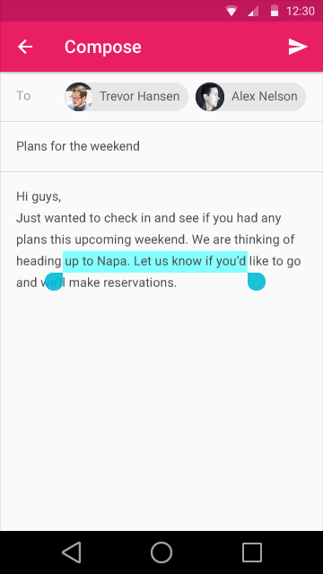
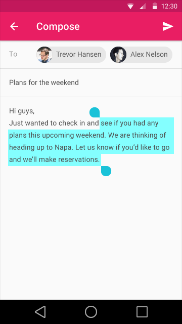
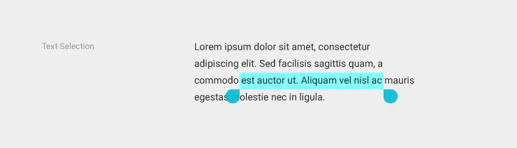
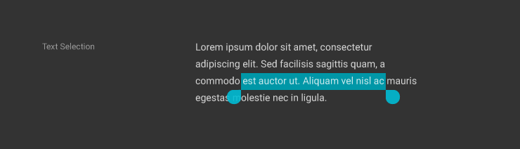
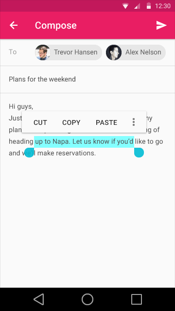
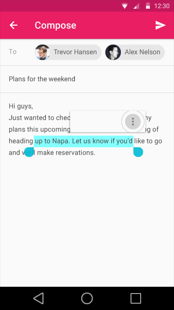
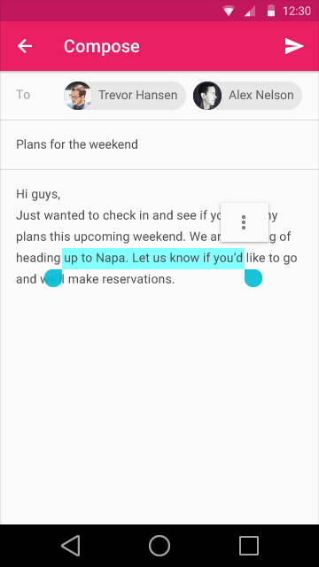
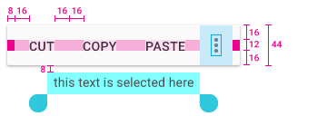

# 内容选取

## 项目选取

虽然强烈建议对列表和网格容器支持多项选择功能，但在下列情况时这并不是必须的：

- 唯一的操作仅仅是针对单个选项（例如电话号码列表中，拨号就是唯一的操作，且只针对一个号码）
- 在执行环境中很明显的表现为单项操作（例如在 Android 的主屏上移动图标）

在初始化选择时，可以通过拖拽手势来选择多个项目，从而代替长按和双指点击。在拖拽起止点间的项目也会被选中。在桌面系统中，一个始发与所有项目边界之外的拖动也经常被用来初始化多选（例如，从一个列表的左边开始拖动，向下延伸到右边以从列表中选择项目）。

初始化选择完成后，可以通过以下方式进行修改：

- 点击未选中项加入选择或者点击已选中项来取消选择
- Shift + 点击项目来将其和中间的项目加入已选项

## 文本选取

文本选取表现为高亮所选文字范围。

在移动平台上，所选文本的前后两端各会添加一个选择操作钮。对于文字相关操作的弹出菜单，所选文本的上方是理想的位置（但最好不要重叠）。

文本选择操作钮

文本选择-明亮主题

文本选择-深邃主题

包含“剪切”、“复制”、“粘贴”和“更多”操作的弹出菜单显示在所选区域的上方。当用户选择“更多”按钮时，弹出菜单先收缩到“更多”图标，然后以该图标为中心展开更多菜单项。文本选择菜单的字体用Roboto Medium 14 sp，一律大写。

因为选择必须是连续的文本块，所以文本选择事实上是单选操作。不过选区可以通过以下几种用户行为改变：

- 初始化选择的过程中拖动来增加选区
- 拖动选区两端的选择操作钮来增加或者减少选区
- 在选区内多次点击来增加选区（单词 > 段落 > 全文）
- 键盘快捷键：
    - Shift + 左/右方向键 => 逐字符的更改选区
    - Shift + 上/下方向键 => 逐行的更改选区
    - Ctrl/Command + A => 全选

> 原文：[Selection](http://www.google.com/design/spec/patterns/selection.html)  翻译：[lhyqy5](https://github.com/lhyqy5)  校对：[PoppinLp](https://github.com/poppinlp)
