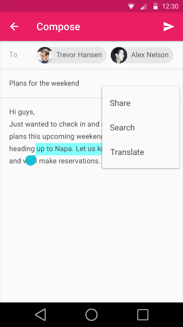

#选择(Selection)

##项选择

强烈推荐实现对列表(list)和网格(grid)容器的多项选择支持。但这不是必须的如果针对单个选项只要一种行为的时候(比如一个电话号码列表，拨号就是唯一的行为)，或者在当前上下文中很明显的表现为单项操作(比如在Android的主屏(home screen)上移动图标）。

在初始化选择的时候长按和双指点击(touch)都可能通过拖拽手势来选择多个项目。位于拖动起始点和终止点间的项目也会被选中。在桌面系统中,一个始发于所有项边界以外的拖动也经常被用来初始化多选(比如，从一个列表的左边开始拖动，向下延伸到右边以从列表中选择项目)。

一旦出初始化了一次选择操作，它能通过以下几种用户行为进行修改：

* 点击(touch)项目来选中未选中项或者取消选择已选中项。
* Shift+点击(touch/click)项目来增加选中位于起始选中项和当前点击项间的所有项。

##文本选择

文本选择表现为高亮所选文字范围。

在移动平台上，所选文本的前后两端会各添加一个选择把手(selection handle)。
所选文本的上方用于显示浮动菜单中的文本标准行为是一个理想的位置(理想并不意味着重叠)

  
文本选择把手

  
文本选择-明亮主题

  
文本选择-昏暗主题

 

“剪切”,“复制”,“粘贴”和“更多”的弹出菜单显示在所选区域的上方。当用户选择“更多”按钮时，弹出菜单收缩到“更多”图标，并且从该图标区域中心增长出溢出菜单项(overflow menu items)。
文本选择菜单的字体用Roboto Medium 14 sp，一律大写。 

 
文本选择是典型单选操作,因此选择必须是连续的文本块。不过选区可以通过以下几种用户行为改变:

* 初始化选择的过程中拖动来增加选区。
* 拖动选区两端的把手(handle)来增加或者减少选区。
* 在选区内多次点击来增加选区(单词>段落>全文)。

键盘快捷键:

* Shift+左/右方向键 逐字符的更改选区。
* Shift+上/下方向键 逐行的更改选区。
* Ctrl/Command+A 全选。
