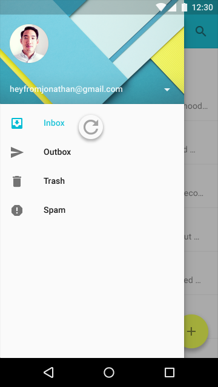
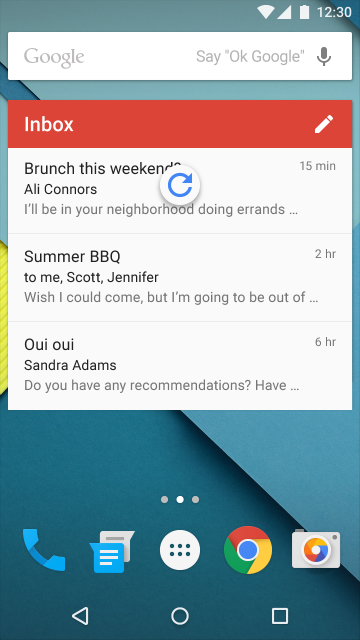
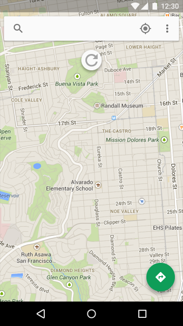
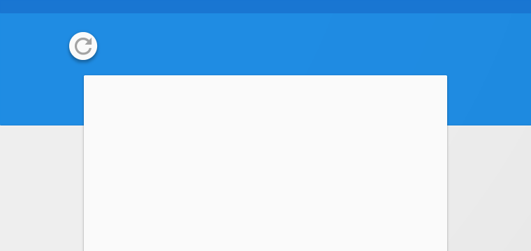
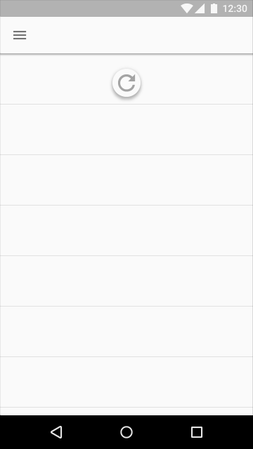
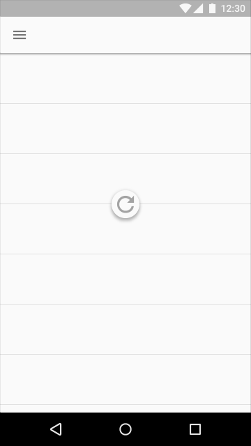

   ---
layout: page
title: 滑动刷新
permalink: swipe-to-refresh.html
---

<!-- # Swipe to refresh -->
# 滑动刷新

<!-- ## Updating content -->
## 更新内容

<!--
There are two methods for updating content in an app. The preferred method is to automatically update content using [sync](http://developer.android.com/training/sync-adapters/index.html). Syncing keeps app content automatically updated because it doesn’t require user action.
-->

在应用里有两种更新内容的方法。较好的方法是用[sync](http://developer.android.com/training/sync-adapters/index.html)自动更新内容。Syncing能保持内容自动更新，因为它不需要用户操作。

<!--
Alternatively, the manual refresh method requires users to initiate content updates via an action or gesture. Manual refreshing can supplement syncing while maintaining a current scroll position, as when checking for new mail in a Gmail account.
-->

另外一种，手动刷新需要用户通过动作或者手势启动内容更新。手动刷新提供同步的同时保持当前的滚动位置。例如在Gmail里检查新邮件。

<!-- ## Swipe to refresh -->
## 滑动刷新
<!--
Swipe to refresh is a [swipe gesture](http://www.google.com/design/spec/patterns/gestures.html#gestures-gestures) available at the beginning of lists, grid lists, and card collections where the most recent content appears (Index 0).
-->

滑动刷新是一个[滑动手势](http://www.google.com/design/spec/patterns/gestures.html#gestures-gestures)。可用在普通列表，方格列表的开始处和卡片集合的最近内容出现的位置（Index 0）。

<!-- Location: -->
位置：

<!--
Typically, this gesture is available at the top of content collections, but it can also be at the bottom (for example, in chat applications).
-->

典型的，手势在内容集合的顶部使用。但是它也可以在底部使用（例如，在聊天应用）。

<!-- Usage: -->
用法：

<!--
The refresh indicator appears only in conjunction with a refresh gesture or action. Syncing does not display a refresh indicator. It’s best to use this gesture with dynamic content that has frequent updates surfacing from a consistent location, where users have a high probability of seeing new content after initiating the gesture.
-->

刷新图标仅仅与刷新手势或者动作一起出现。Syncing不显示刷新图标。手势最要用在动态内容在固定的位置，并且频繁更新的情况。固定的位置也是用户用手势刷新后最可能关注的位置。

<!--
Changes may not be immediately obvious to users when this gesture is used in views that can change significantly upon refresh. For example, the refresh may non-sequentially delete, reorder, modify, and insert items or change only off-screen items.
-->

当手势用在刷新后视图会显著改变的情况下，变化可能不是立即明显有效。

> [滑动刷新布局](https://developer.android.com/reference/android/support/v4/widget/SwipeRefreshLayout.html)  
> 通过一个垂直方向的滑动手势刷新视图的内容。

**add video**  
<!-- Animation showing swipe to refresh -->
动画，显示滑动刷新

<!-- 
Swipe to refresh should not be used in the following situations:
* Navigation drawers
* Home screen widgets
* Pannable content
-->

滑动刷新不应该用在以下的情景：
* 抽屉式的导航栏
* 主屏幕小插件
* Pannable内容

不要  
<!-- Navigation drawers (if present in an app) contain navigation destinations, not dynamic content. -->
抽屉式导航栏（如果在应用中存在）包括导航选项，不是动态内容。

不要
<!-- Home screen widgets should update content automatically.-->
主屏幕小插件应该自动更新内容。

不要   
<!-- Pannable content, like in maps, have no primary direction or content origin from which users can presume the swipe to refresh gesture will originate. -->
Pannable内容，像地图，没有一个主要的方向或者内容起点，用户能认做滑动刷新的起点。

<!-- ### Refresh indicator positioning and behavior -->
### 刷新图标位置和行为

<!-- Position: -->
位置：

<!-- The refresh indicator, when resting, is centered horizontally relative to refreshing content. -->
刷新图标，当下拉停止时，在刷新内容的垂直正中间位置。

  
要  
  
不要     

不要

<!--The refresh indicator is located near the top of refreshing content.-->
刷新图标位置靠近刷新内容的顶部

<!--
Its exact vertical resting position can be adjusted to promote visual harmony with the underlying layout. For example, the indicator may fall on a material edge or grid line, as long as it’s located near the top of the refreshing content.
-->

准确的垂直下拉停止位置可以被调节以促使和下来的布局和谐。例如，图标可以落在材质边缘或者网格线上，只要它位于刷新内容的顶部。

    
要  
   
不要  

<!-- Behavior: -->
行为：

<!-- As the refresh indicator translates and/or scales into view, the circular spinner fades in while rotating.-->

刷新图标过渡进视图，圆形spinner逐渐增强同时旋转。

<!--
The refresh indicator remains visible until the refresh activity completes and any new content is visible, or the user navigates away from the refreshing content.
-->

刷新图标保持可见，直到刷新活动完成，并且任何新内容是可见的，或者用户从刷新内容导航出去。

**add video**  
要
  
<!--Keeping the refresh indicator in view until the activity is completed provides feedback on the status of the refresh activity.-->

保持刷新图标在视图上直到活动完成，并且反馈刷新后的状态。

**add video**  
不要   
<!--
Scrolling the refresh indicator off-screen hides the status of the refresh activity and may imply that the refresh activity is associated with a specific component within the view, such as a card, instead of the entire view.
-->

滑动刷新图标离开屏幕隐藏刷新活动的状态并且可能意味着刷新活动和视图内一个特定的相关连，如一个卡片而不是整个视图。

<!-- ## Refresh indicator transitions -->
## 刷新图标过渡

<!--
When another surface is positioned in front (in z-space) of the material with refreshing content, the refresh indicator translates from underneath that surface and is clipped until it is fully visible.
-->

当另一个界面是在内容的material的前面（在z-space），刷新图标从界面底下过渡，并且被夹住直到全部可见。

<!-- The refresh indicator scales up in size as it translates when: -->

以下情况刷新图标增加大小作为过渡：

<!--
* The refreshing material is in front of every other surface (in z-space)
* A content refresh is initiated via an app bar or overflow menu action
-->

* 刷新material是在所有其他界面的前面（在z-space）
* 内容刷新开始从app bar或者菜单扩展操作。

**add video**   
<!-- Refreshing content that is above every other surface in z-space. -->
刷新内容是在所有其他界面之上，在z－space空间。  
**add video**   
<!-- Refreshing content that is coplanar with another surface.-->
刷新内容是另一个界面在同一个面上。   
**add video**   
<!-- Refreshing content that is below another surface in z-space.-->
刷新内容是在z－space里另一个界面之下。   
**add video**   
<!-- Refreshing content via app bar action.-->
刷新内容通过app bar操作。

<!-- ### Implementation details -->
### 实现细节

<!--
To ensure intentional usage of the swipe to refresh gesture, the refresh indicator must pass a threshold before the app will begin to refresh. This threshold is indicated through a number of cues:
-->

确保滑动刷新手势的有意使用，在应用开始将要开始刷新之前，刷新图标必须通过一个阈值。这个阈值是通过一些状态表示：

<!--
* The circular spinner reaches 100% opacity.
* The rotation of the circular spinner slows down.
* The rate of translation of the refresh indicator slows down.
-->

* 圆圈旋转控件100%不透明
* 圆圈控件旋转变慢
* 刷新图标的过渡速率变慢

<!--
Completing the gesture at any point after passing the threshold will initiate the refresh action.
-->

完成手势只要任何一条达到阈值，并且启动刷新操作。

<!--
Reversing the gesture past the threshold will cancel the initiation of the refresh action.
-->

相反的手势通过阈值将取消刷新操作。

> 原文：[Swipe to refresh](http://www.google.com/design/spec/patterns/swipe-to-refresh.html)  翻译：[awong1900](https://github.com/awong1900)  校对：