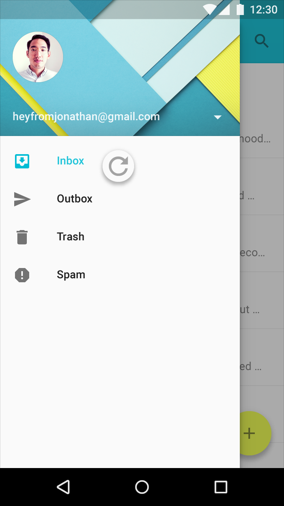
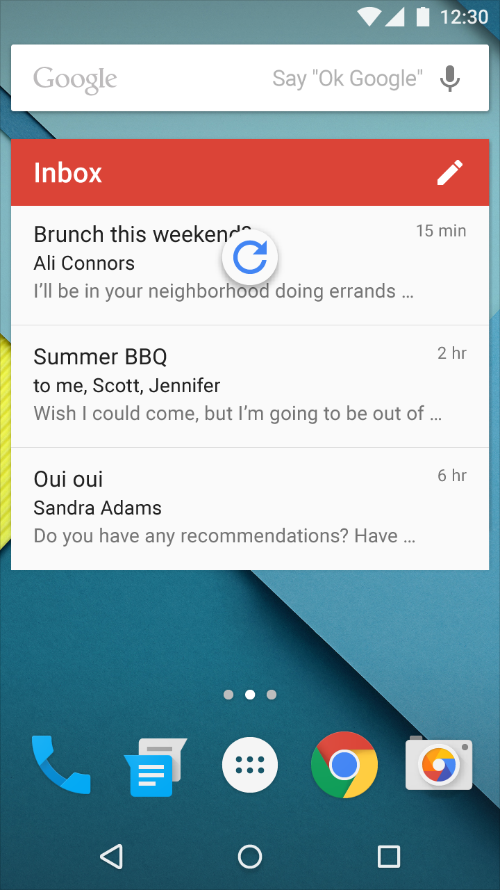
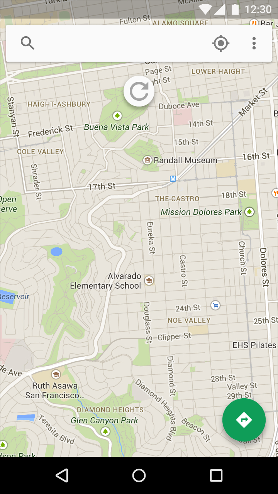
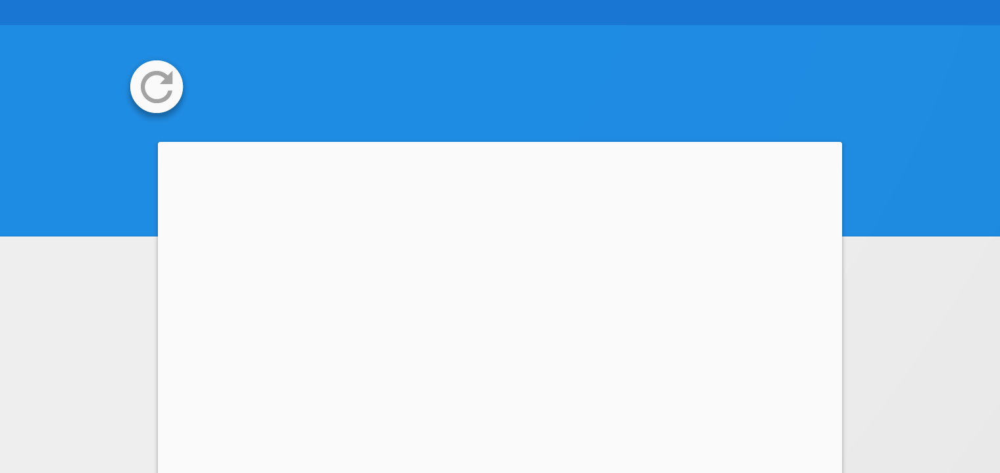
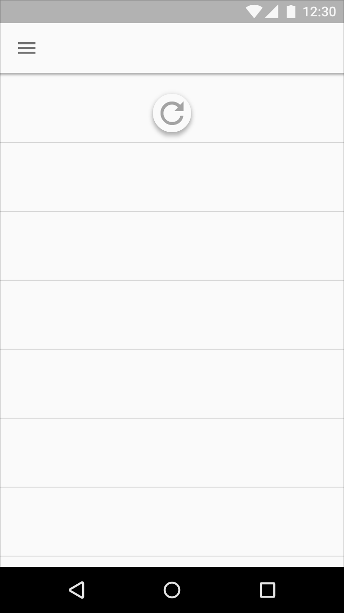
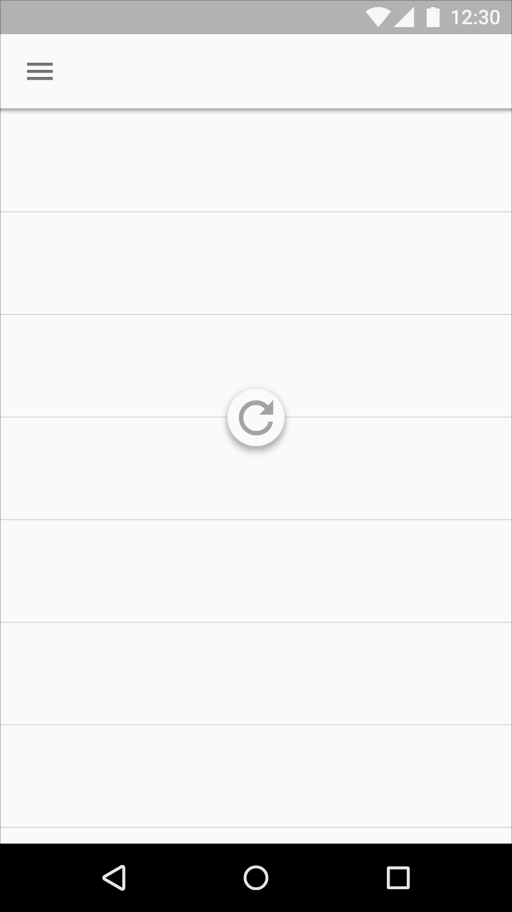

# Swipe to refresh

## Updating content

There are two methods for updating content in an app. The preferred method is to automatically update content using [sync](http://developer.android.com/training/sync-adapters/index.html). Syncing keeps app content automatically updated because it doesn’t require user action.

Alternatively, the manual refresh method requires users to initiate content updates via an action or gesture. Manual refreshing can supplement syncing while maintaining a current scroll position, as when checking for new mail in a Gmail account.

## Swipe to refresh

Swipe to refresh is a [swipe gesture](http://www.google.com/design/spec/patterns/gestures.html#gestures-gestures) available at the beginning of lists, grid lists, and card collections where the most recent content appears (Index 0).

Location:

Typically, this gesture is available at the top of content collections, but it can also be at the bottom (for example, in chat applications).

Usage:

The refresh indicator appears only in conjunction with a refresh gesture or action. Syncing does not display a refresh indicator. It’s best to use this gesture with dynamic content that has frequent updates surfacing from a consistent location, where users have a high probability of seeing new content after initiating the gesture.

Changes may not be immediately obvious to users when this gesture is used in views that can change significantly upon refresh. For example, the refresh may non-sequentially delete, reorder, modify, and insert items or change only off-screen items.

> [Swipe to refresh layout](https://developer.android.com/reference/android/support/v4/widget/SwipeRefreshLayout.html)  
> Refresh the contents of a view via a vertical swipe gesture

**add video**  
Animation showing swipe to refresh

Swipe to refresh should not be used in the following situations:

* Navigation drawers
* Home screen widgets
* Pannable content

Don't.   
Navigation drawers (if present in an app) contain navigation destinations, not dynamic content.

Don't.  
Home screen widgets should update content automatically.

Don't.  
Pannable content, like in maps, have no primary direction or content origin from which users can presume the swipe to refresh gesture will originate.

### Refresh indicator positioning and behavior

Position:

The refresh indicator, when resting, is centered horizontally relative to refreshing content.

Do.   

Don't.   

Don't.

The refresh indicator is located near the top of refreshing content.

Its exact vertical resting position can be adjusted to promote visual harmony with the underlying layout. For example, the indicator may fall on a material edge or grid line, as long as it’s located near the top of the refreshing content.

  
Do.  

Don't.

Behavior:

As the refresh indicator translates and/or scales into view, the circular spinner fades in while rotating.

The refresh indicator remains visible until the refresh activity completes and any new content is visible, or the user navigates away from the refreshing content.

**add video**  
Do.
Keeping the refresh indicator in view until the activity is completed provides feedback on the status of the refresh activity.

**add video**  
Don't.
Scrolling the refresh indicator off-screen hides the status of the refresh activity and may imply that the refresh activity is associated with a specific component within the view, such as a card, instead of the entire view.

## Refresh indicator transitions

When another surface is positioned in front (in z-space) of the material with refreshing content, the refresh indicator translates from underneath that surface and is clipped until it is fully visible.

The refresh indicator scales up in size as it translates when:

* The refreshing material is in front of every other surface (in z-space)
* A content refresh is initiated via an app bar or overflow menu action

**add video**  
Refreshing content that is above every other surface in z-space.   
**add video**   
Refreshing content that is coplanar with another surface.   
**add video**   
Refreshing content that is below another surface in z-space.   
**add video**   
Refreshing content via app bar action.

### Implementation details

To ensure intentional usage of the swipe to refresh gesture, the refresh indicator must pass a threshold before the app will begin to refresh. This threshold is indicated through a number of cues:

* The circular spinner reaches 100% opacity.
* The rotation of the circular spinner slows down.
* The rate of translation of the refresh indicator slows down.

Completing the gesture at any point after passing the threshold will initiate the refresh action.

Reversing the gesture past the threshold will cancel the initiation of the refresh action.

> 原文：[Swipe to refresh](http://www.google.com/design/spec/patterns/swipe-to-refresh.html)  翻译：[awong1900](https://github.com/awong1900)  校对：