# 色彩

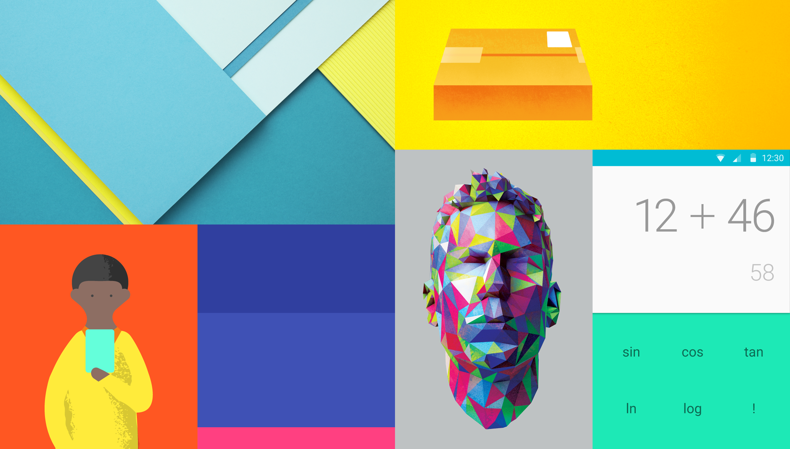

色彩从当代建筑、路标、人行横道以及运动场馆中获取灵感，由此引发出大胆的颜色表达激活了色彩，与单调乏味的周边环境形成鲜明的对比。强调大胆的阴影和高光。引出意想不到且充满活力的颜色。

[色样 - 0.13 MB(.zip)](http://materialdesign.qiniudn.com/downloads/color_swatches.zip)

## UI调色板

调色板以一些基础色为基准，通过填充光谱来为Android、Web和iOS环境提供一套完整可用的颜色。基础色的饱和度是500。

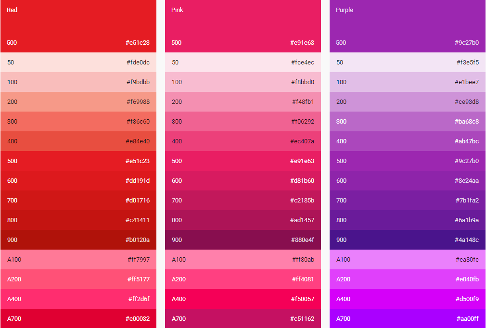
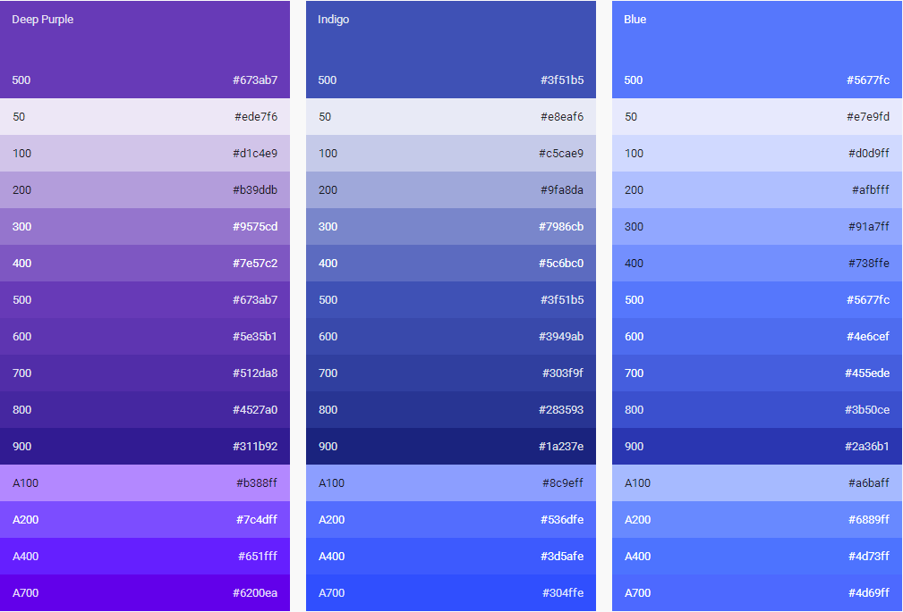
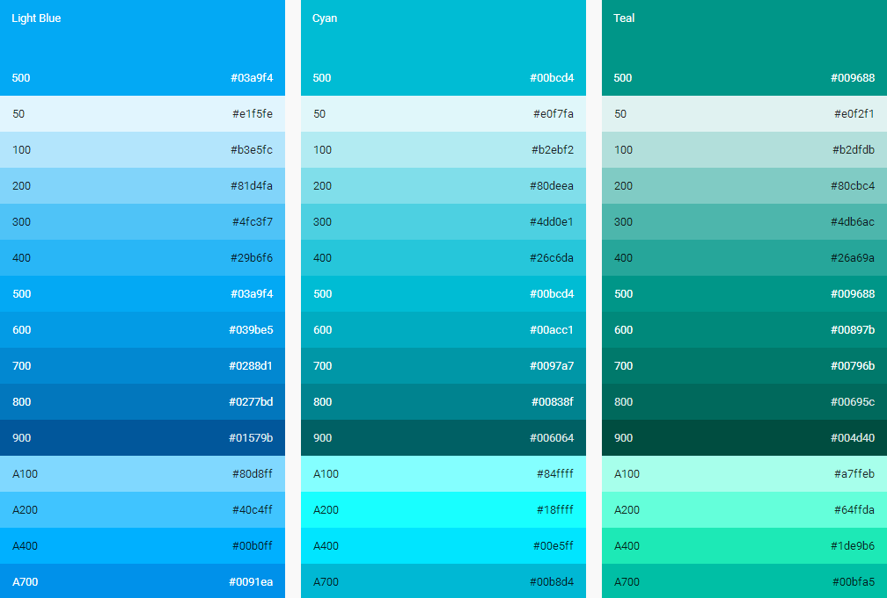
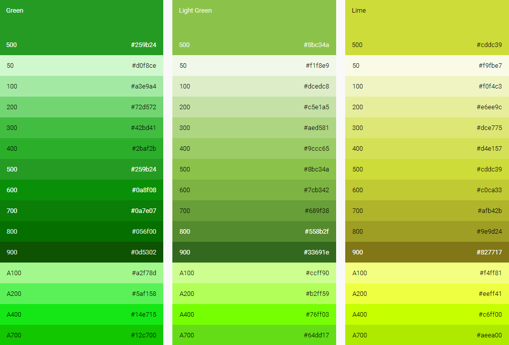
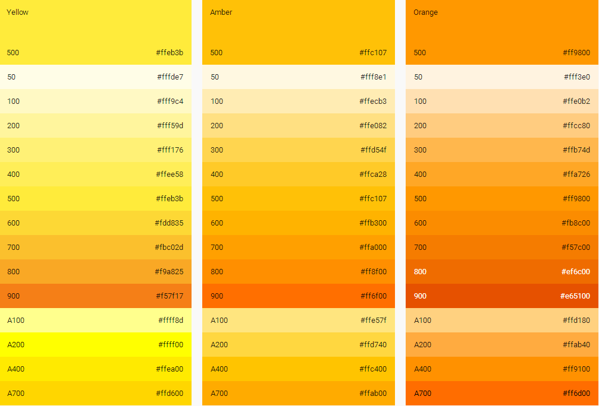
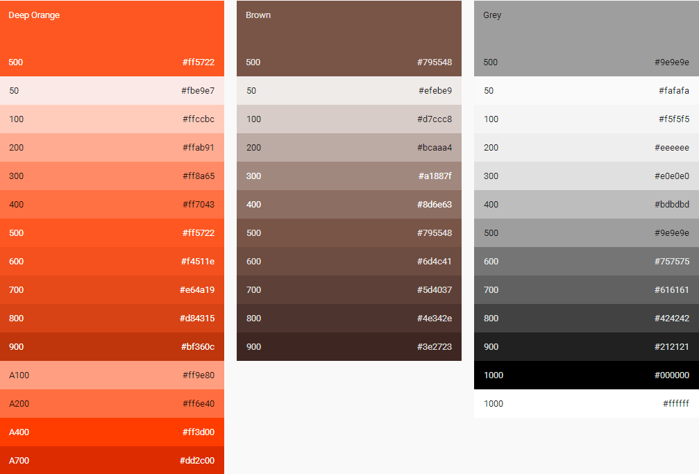
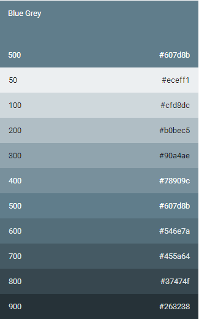

## UI颜色使用

### 选择你的调色板

限制颜色的数量，在众多基础色中选出三个色度以及一个强调色。强调色用于后背，可有可无。

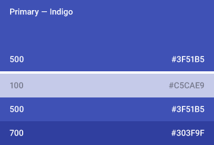
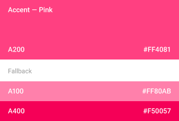

### 为灰色的文字、图标和分隔线加上alpha值

为了有效地传达信息的视觉层次，应该使用深浅不同的文本。对于白色背景上的文字，标准alpha值为87%（#000000）。视觉层次偏低的次要文字，应该使用54%（＃000000）的alpha值。而像正文和标签中用于提示用户的文字，视觉层次更低，应该使用26%（#000000）的alpha值。

其它元素，如图标和分隔线，也应该具有黑色的alpha值，而不是实心颜色，以确保他们能适应任何颜色的背景。

对于彩色背景上白色或黑色文字，可以通过表格中的调色板找到合适的色彩对比度和alpha值。

我们十分鼓励在UI中的大块区域内使用醒目的颜色。UI中不同的元素适合主题中不同的色彩。工具栏和大色块适合使用饱和度500的基础色，这也是你应用的主要颜色。状态栏适合使用更深一些的饱和度700的基础色。

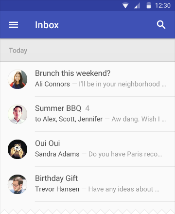
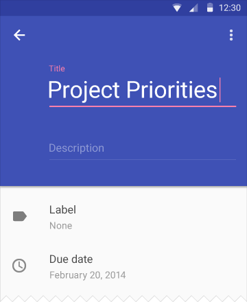

### 强调色

鲜艳的强调色用于你的主要操作按钮以及组件，如开关或滑片。左对齐的部分图标或章节标题也可以使用强调色。

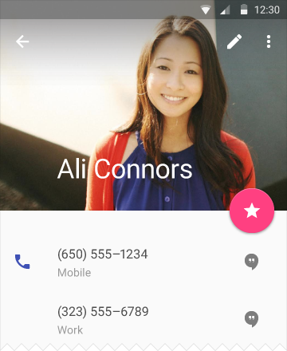
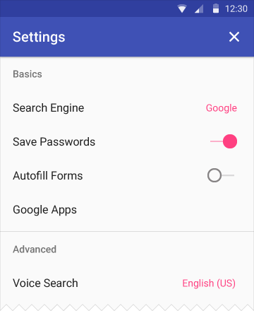

### 备用强调色

如果你的强调色相对于背景色太深或者太浅，默认的做法是选择一个更浅或者更深的备用颜色。如果你的强调色无法正常显示，那么在白色背景上会使用饱和度500的基础色。如果背景色就是饱和度500的基础色，那么会使用100%的白色或者54%的黑色。

## 主题

主题是对应用提供一致性色调的方法。样式指定了表面的亮度、阴影的层次和字体元素的适当不透明度。为了提高应用间的一致性，提供两种主题选择：

- 浅色
- 深色

[主题 - 1.3 MB(.ai)](http://materialdesign.qiniudn.com/downloads/stickersheet_uielements.ai)

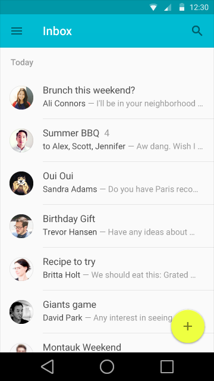
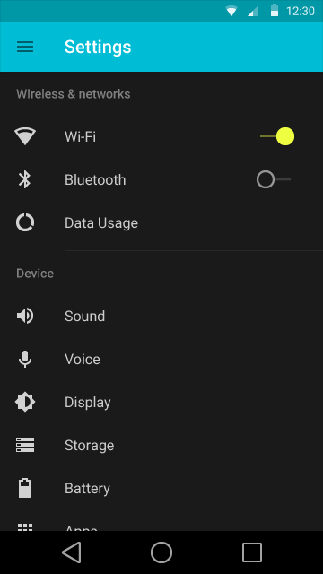

> 原文：[Color](http://www.google.com/design/spec/style/color.html)  翻译：[arjinmc](https://github.com/arjinmc)  校对：[PoppinLp](https://github.com/poppinlp)
