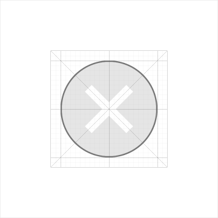
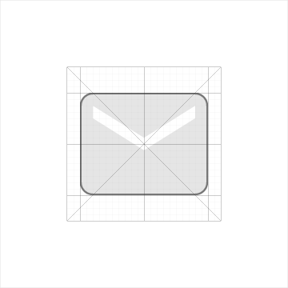
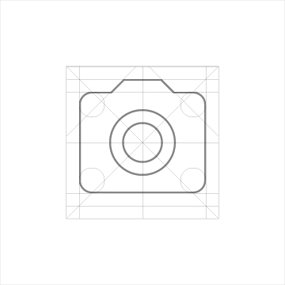
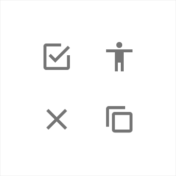
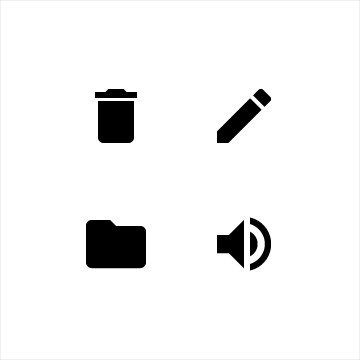

# 图标

## 系统图标

### 定义

系统图标或者UI界面中的图标代表命令，文件，设备或者目录。系统图标也被用来表示一些常见功能，比如清空垃圾桶，打印或者保存。

系统图标的设计要简洁友好，有潮流感，有时候也可以设计的古怪幽默一点。要把很多含义精简到一个很简化的图标上表达出来，当然要保证在这么小的尺寸下，图标的意义仍然是清晰易懂。  

    

### 设计原则 

展示一些黑体的几何形状。 
  
一个简洁的黑体图形在采用对称一致的设计时，一样能够拥有独一无二的品质。  

  
  
  
  

### 网格, 比例和大小

图标网格是所有图标的基准网格并且具有特定的组成和比例。图标由一些对齐图标网格的平面几何形状组成。基本的平面几何形状有四种，具有特定尺寸以保证所有图标有一致的视觉感和比例。
两种形状相同尺寸不同的图标集供您在应用程序中使用：状态栏、上下文图标集和操作栏、桌面图标集。   

   
  
   
   
   
   

### 圆角

正方形和矩形都应该添加圆角，也可以同时使用圆角和尖角，这样更具凸凹感。所有由笔划或线条组成的图标都有尖角。

  
   
   
  

每一个尺寸的系统图标集使用不同大小的圆角以保证视觉的一致性。  

  
   

### 一致性

一致性非常重要，尽可能使用系统中提供的图标，在不同的app中也一样。

   
   

### 上下文和应用中的图标

图标网格决定了图标位于一个固定大小(24dps)的区域内。

   
   
