#图像

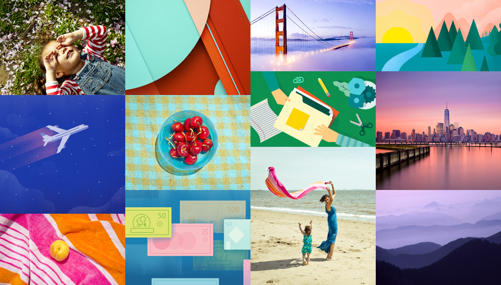

**在material design中，图像（无论是绘画还是摄影）都应该是组建而成而并非人为策划的，看起来神奇并且不显得过度制作。这种风格乐观，愉悦，并且坦率。这种风格比较强调场景的实质性（Materiality），质感，深度，让人意想不到的色彩运用， 以及对环境背景的关注。这些原则都旨在创建目的性强，美丽又有深度的用户界面。**

##原则

当使用绘画和摄影提升用户体验时，选择能够表达个人关联、信息和令人喜悦的图像。

  
**个人关联**  
使用能够唤起回忆的影像来建立用户与应用程序的情感联系。

  
**信息**  
传达特定的信息。以辅助理解的方式来创建智能的感官体验。
  
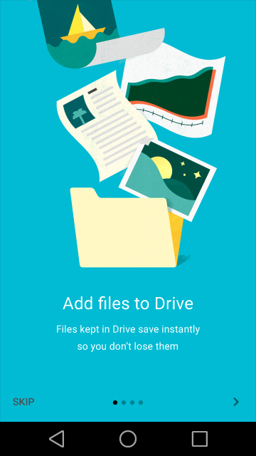  
**闪光点**  
用相关图像以一种意想不到的方式来取悦用户，让用户觉得不可思议。

###场景赏析
加入逻辑，确保图像是动感的，并且显示出场景智能性和相关性。带有预测性的视觉效果能够彰显出智能的水准，从而能大大改善用户体验。

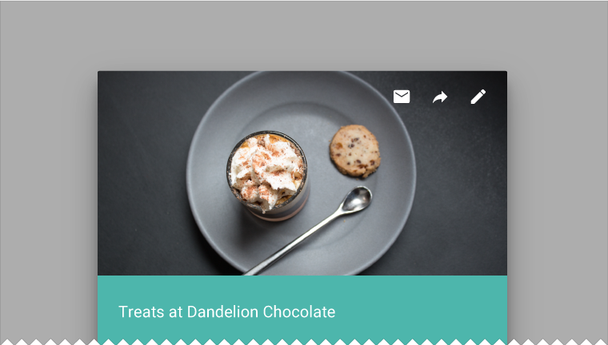

###身临其境

要勇于运用遮盖的方法，或是对色彩和内容的叠加来构成对画面主角的印象，抑或是构成一幅缩略图。

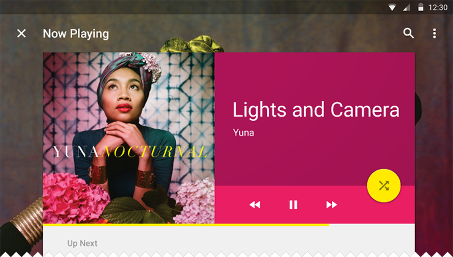

##最佳实践

##使用多种媒体

插画和摄影可以运用在同一个产品中。摄影自动暗含了一定程度的特定性，从而应该用来展示特定的物体和故事。绘画则能有效的表现出概念和隐喻,而这一点是摄影所不具备的。

  
要  
对于特定的实物，首先考虑用摄影来表现。 

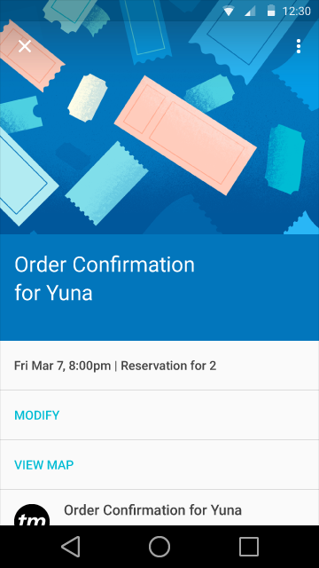  
要  
当所表达的内容并非具体实物（或者不能被具体实物所概括）时，绘画则可以传达出你的应用程序的信息，并且允许用户一目了然的理解内容。

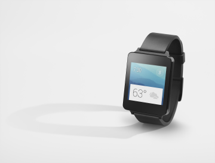  
要  
如果你使用摄影来传达一种概念，你需要创建一些具有思考性的，甚至是隐含寓意的作品。  

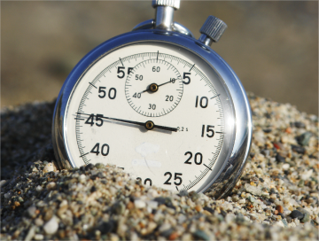  
不要  
不要局限于图片库。

###远离图片库(Stay away from stock)

利用图像可以表达一种与众不同的心声，还可以展现出绝佳的创意。

对于特定的实体或品牌内容，要用具体的图像。对于较抽象的内容，使其具有解释性。然而库存摄影(Photographic stock)和剪贴画(clipart)既不具体，又不具解释性。

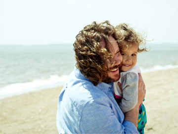  
要

 
不要

###有焦点

你的图像应当有一个标志性的焦点。小到单一物体，大到整体布局，都可以成为焦点。确保能够用一个让人印象深刻的方法，传递给用户一个清晰的概念。

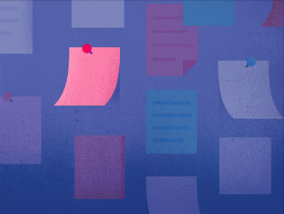  
要  

  
不要

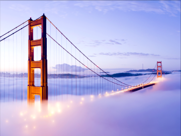  
要  

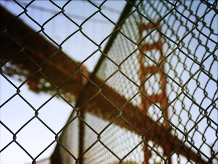  
不要

  
要  

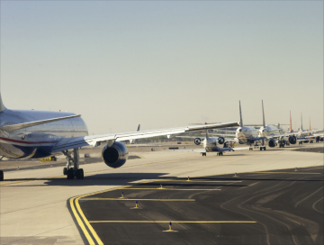  
不要

###构建叙事(Build narratives)

创建一个让人感觉身临其境的故事和上下文(context)场景。

  
要

  
不要

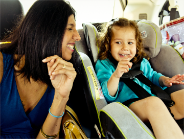  
要

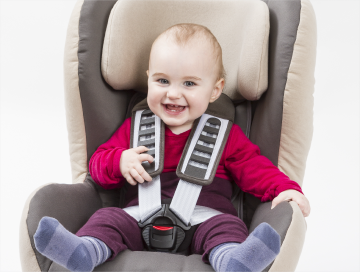  
不要

###不要过度操作

保持图像的原始完整性。不要过度使用高度滤镜或高斯模糊，尤其是当试图去隐藏劣化(degradation)的时候。

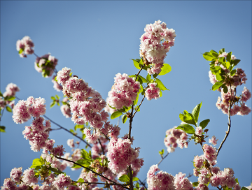  
要

  
不要

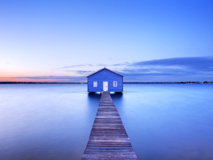  
要

  
不要

##用户界面集成(UI Integration)

###分辨率

确保你的图像大小适应其边框并且支持跨平台。该结构强调大幅图像。理想情况下，素材应该不会出现像素化。要为特定的比率和设备测试合适的分辨率大小。
	
 
  
要  
尺寸得当的图像  

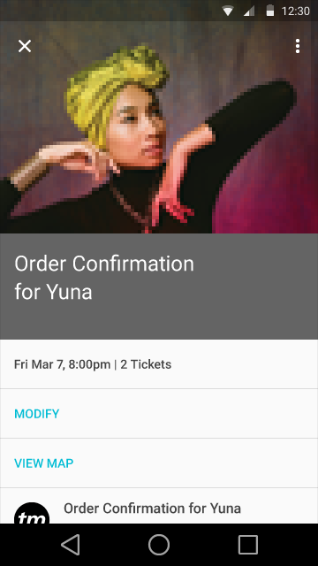  
不要  
劣化的图像

###调整大小(Introduce Scale)

利用不同的大小的图像来创造视觉上的重要性。

  
在一个画册的背景中，引入各种尺寸的缩略图来传达内容的层次结构。  

  
鼓励在同一个生态系统使用多个容器。

###文字保护

添加文字保护纱(protection scrims)来使图像上的文字显示清晰易读。

 
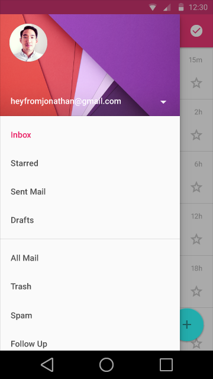  
要  
暗纱(dark scrims)理想的透明度应当在20％-40％之间,亮纱(light scrims)理想的透明度应当在40％-60％之间，都要视具体内容来定。

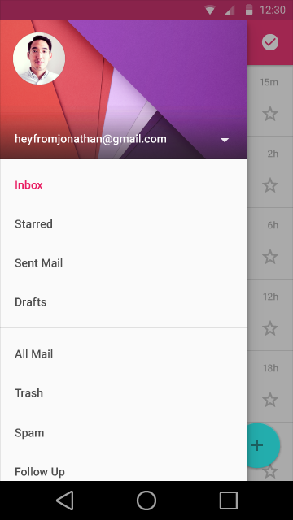  
不要  
不要过度用文字保护纱遮挡住图像内容。
 
 
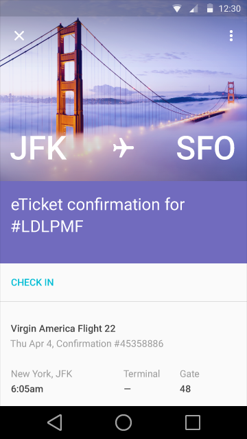  
要   
对于大一些的风景图，应该在特定的区域内加入文字保护纱， 不要覆盖住整个图像。

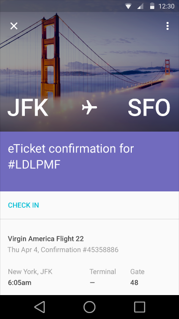  
不要  
不要过度覆盖大图像。
 
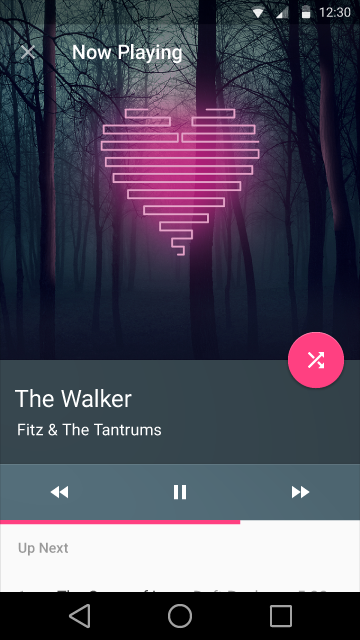  
要  
颜色叠加不同于文字保护纱(text-protection scrims)，可以用来作为设计元素。当创造互补的颜色叠加的时候，要从与其并列的内容中取样，这样才能够产生出和谐一致的色板，从而展现出良好的内容意识。   
 
  
不要

###头像和缩略图

头像和缩略图代表实体或内容，可以是摄影或者概念性的插画。 通常来讲，他们是横置目标（tap targets），可以让人对事物和内容有一个初步印象。

头像可以用来表示个人。对于个人头像，要提供个性化的选项。由于用户也可能不个性化设定自己的头像，不妨将默认效果设置得令人愉悦一些。当与一个特定的标志(logo)一起使用时，头像也可以用来表示品牌。

缩略图暗示着更多的信息，让用户一窥其内容，并协助导航。缩略图让你能把图像放在狭小的空间里。

 
   
头像使应用更具个性化而且占用的空间小。  
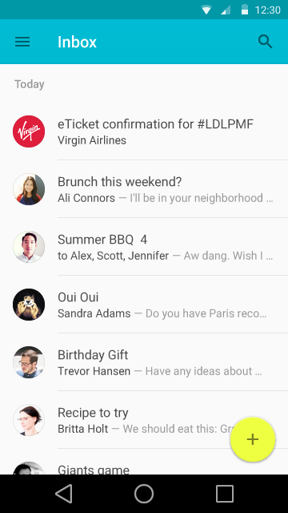  
一个品牌头像能够让人在一眼之内传达信息，缩略图也如此。

###主角图像(Hero Images)

主角图像通常被固定在很明显的位置，大小比普通大小略大，比如屏幕顶部的横幅。主角图像能够吸引用户，提供了内容相关的背景，或加强品牌。

   
**特征图像**    
特征图像是风格醒目的主要视觉焦点，并且有着特异的设计布局。

  
**合成的主角图像(Integrated hero image)**  
合成的主角图像通常在一个样式中包含着混杂特异的部分。 这些部分并不能形成首要的视觉焦点。

###图集
图集图片（gallery images）通常风格醒目，且他们的布局基本相同，比如网格（grid）布局，或是单一的图像。
 
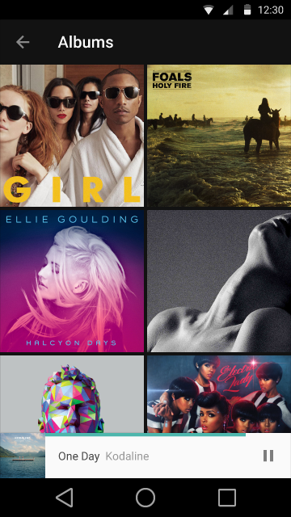  
**照片网格**
 
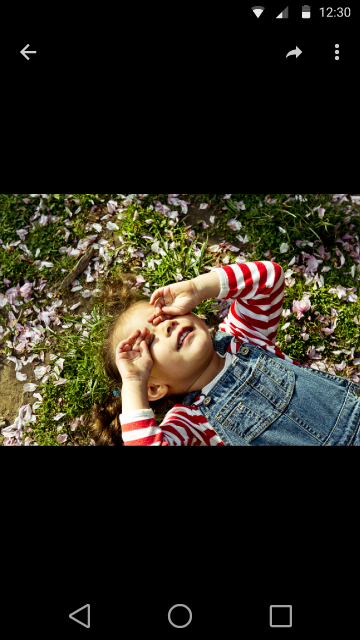  
**图集图片**
