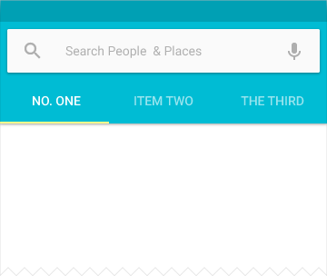
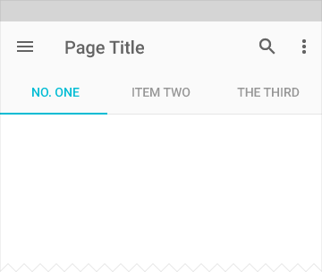

# Tabs

在一个 app 中，Tabs 使在不同的视图或功能方面探索和切换起来变得简单，或者浏览不同类别的数据集合变得简单。

## 用法

一个 tab 为显示内容相关的分组提供启示。一个 tab 标签简要地描述了相关分组的内容。

### 移动领域的 tabs

  
扩展的 app bar + tab bar  

  
加入检索 + app bar + tab bar

  
默认的 app bar + tab bar  

  
默认的 app bar + 可滚动的 tab bar

  
和 tab 指示器一样的字体颜色

  
被锁定滚动的 tab bar 

### 桌面领域的 tabs

  
默认的 app bar + tab bar

  
附加“更多”溢出下拉菜单

  
Tab 溢出标识码，第一步

  

  
展开的菜单

  
居中的 tab bar

### 何时使用

使用 tabs 将大量的关联数据或选择划分地更容易理解，专注在有助于内容导航或内容
结构为目标的组，而不需要导航出当前的上下文。

