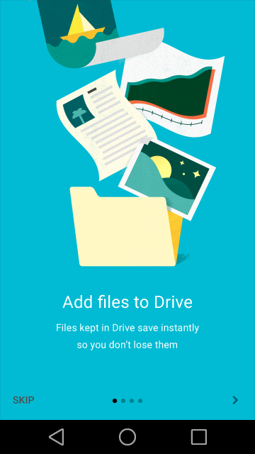
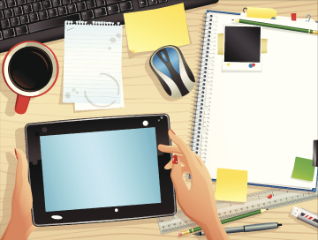
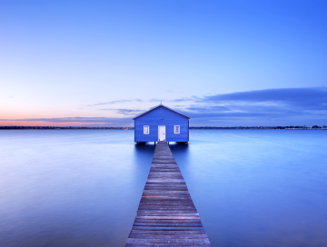
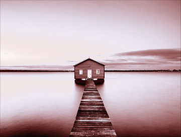
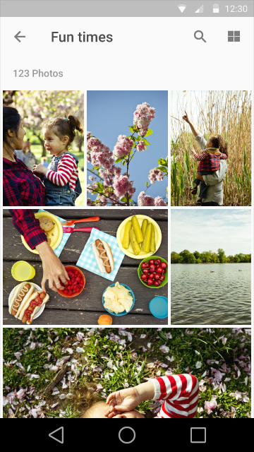
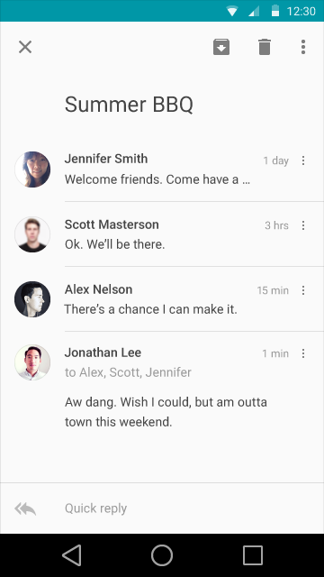

#图像

**在material design中，图像，无论是绘画或摄影都是创造性而不做作的，神奇而不过剩的(overproduced)。这种风格是乐观，诚实和令人愉快的。强调场景的实质性，质地，深度，意想不到的色彩运用，鉴赏方面的价值。图像的原则是去全面地支持具有目的性，周到和漂亮的用户界面。**

##原则

当使用绘画和摄影以提升用户体验时，选择能够表达个人相关信息和令人喜悦的图像。

  
**个人关联**  
使用令人回味的影像来建立与应用程序的情感联系。

  
**信息**  
传达特定的信息。以便于理解的方式来创建智能的感官体验。
  
  
**闪光点**  
用相关图像以一种意想不到的方式来取悦用户，使对方觉得不可思议。

###场景赏析
包括逻辑，以确保图像是动态的，上下文智能化，以及上下文相关的。预测性的视觉效果显示智力的水平能大大改善用户体验。

###身临其境

不要害怕模糊或通过色彩和内容叠加暗指集成英雄和缩略图。

##最佳实践

##使用多种媒体

插画和摄影可以同时存在于同一个产品中。摄影天然地存在着一定程度的特殊性，应该用来展示具体的实体和故事。绘画则能有效的表现出概念和隐喻,而这一点是摄影所不具备的。

  
要  
For specific entities, look first to photographic representation.    

  
要  
当具体的内容不可用或不适用时，绘画更能传达出你应用程序的信息，允许用户一目了然的理解内容。

  
要  
如果你使用摄影来传达一种观念，开发理念，甚至是隐喻作品。  

  
不要  
不要默认为文字图片库。

###远离图片库(Stay away from stock)

Use imagery to express a distinctive voice and exemplify creative excellence.

对于特定的实体或品牌内容，用具体的图像。对于较抽象的内容，使其具有解释性。图片库(Photographic stock)和剪贴画(clipart)都不具有具体的解释。

  
要

 
不要

###拥有一个关注点

使你的图像具有一个标志性关注点。关注范围从单一实体到总体组成。确保有一个清晰的概念以一种难忘的方式传达给用户。

  
要  

  
不要

  
要  

  
不要

  
要  

  
不要

###构建叙事(Build narratives)

创建一个让人感觉身临其境的故事和上下文(context)场景。

  
要

  
不要

  
要

  
不要

###不要过度修改

保持图像的原始完整性。不要使用使用高度滤镜或高斯模糊过的图像，尤其是当试图去隐藏劣化(degradation)的时候。

  
要

  
不要

  
要

  
不要

##用户界面集成(UI Integration)

###分辨率

请确保您的图像大小适应其容器并且跨平台。该框架强调高画质图像。理想情况下，素材应该不会出现像素化。为特定的比率和设备测试合适的分辨率大小。

 
  
要  
适当大小的图像  

  
不要  
劣化的图像

###引入缩放(Introduce Scale)

Introduce alternative scales to create levels of visual importance.

  
在一个画廊(gallery)上下文下，引入各种尺寸的缩略图来传达内容的层次结构。  

  
鼓励在同一个生态系统使用多个容器。

###文字保护

添加文字保护纱(protection scrims)来使图像上的文字显示清晰。

 
  
要  
根据具体的内容而定,暗纱(dark scrims)理想的透明度应当在20％-40％之间,亮纱(light scrims)理想的透明度应当在20％-40％之间。

  
不要  
Don't heavily obscure imagery with text protection scrims.
 
 
 
  
要   
For larger real estate, target specific areas for text protection instead of blanketing the entire image.

  
不要  
Don’t "over-scrim" large images.
 
 
  
要  
颜色叠加不同于文字保护纱(text-protection scrims)，可以用来作为设计元素。When creating complementary color overlays, color-sample from the juxtaposed content to create a unified palette and show content awareness.    
 
  
不要

###头像和缩略图

头像和缩略图代表实体或内容，无论是表意摄影或者概念性的插画。Generally, they are tap targets that lead to a primary view of the entity or content.

头像能够用来表示人。对于个人头像，提供个性化地选择。由于用户可能不选择个性化头像，因此提供令人愉快的默认值。当与一个特定的标志(logo)一起使用时，头像也可以用来表示品牌。

缩略图暗示更多的信息让用户一窥其内容，并协助导航。缩略图让你能把图像放在狭小的空间里。

 
   
头像使应用更具个性化而且占用的空间小。  
  
一个品牌头像能够自然地传达信息，缩略图也是一样的。

###主角图像(Hero Images)

主角图像通常是以大于普通大小显示在突出位置，如屏幕顶部的横幅(banner)。能够吸引用户，提供了上下文有关的内容，或加强品牌。

   
**特征图像**    
A feature image is a bold, primary point of focus within a heterogeneous layout.    
 
  
**集成的主角图像(Integrated hero image)**  
Integrated hero images create a setting for heterogeneous pieces of content within a layout. They are not the primary points of focus. 

###图库

Gallery images are bold visual hero images within homogeneous layouts in either a grid or as a single image.

 
  
**照片网格**
 
  
**画廊图片**
